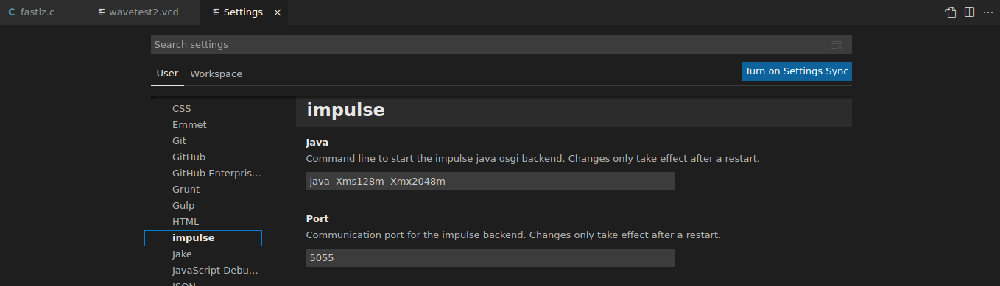

# impulse for Visual Studio Code

[**impulse**](https://toem.de/index.php/products/impulse) is a powerful event and waveform visualization and analysis workbench (simulation, traces, logs) which helps engineers to comfortably understand and debug complex semiconductor and multi-core software systems.

> This vscode extension is an early beta (non-productive) version with basic features.  
>
> THIS BETA SOFTWARE  IS BELIEVED TO CONTAIN DEFECTS. USER IS ADVISED TO SAFEGUARD IMPORTANT DATA, 
> TO USE CAUTION AND NOT TO RELY IN ANY WAY ON THE CORRECT FUNCTIONING OR PERFORMANCE OF THE SOFTWARE.

## License

see [LICENSE.md](LICENSE.md)

see [Licensing options](https://toem.de/index.php/pricing/pricing-options)

**Our guiding principle for this and all subsequent versions is:**

* Non-commercial use is free - including all features.
* Commercial use is free only for essential features.

*This beta version does not require any license keys.*

## Requirements

impulse requires a java Runtime environment (at least JRE8). For communication to the osgi impulse server, a socket interface is used.

## Preferences

The current beta release, allows to configure the java command options, and the communication port for the osgi impulse server.

## Quick Start

* Select a file to view.
* Use the context menus 'Open with' and select the impulse Viewer (You may select the impulse Viewer as the default option at this point).
* On activation, it may take a while (a few secs) to load the backend java server. The OS may ask you for approval.
* Have fun !

## Documentation
 
Enter [https://toem.de/index.php/resources/documentation](https://toem.de/index.php/resources/documentation) for more information about impulse. 
 
The exstisting documentation currently only convers the eclipse version of impulse - although the principles and usage are quite similar.

## Sources

Find the source code of the vscode extension at [https://github.com/toem/impulse.vscode](https://github.com/toem/impulse.vscode/issues). 

## Issues and Proposals

Use [https://github.com/toem/impulse.vscode/issues](https://github.com/toem/impulse.vscode/issues) for issues and proposals.

You may use [support@toem.de](mailto:support@toem.de) for further information.

## Features

### File Formats

* recMl/ recMZ

    impulse main xml based signal format (un-compressed/compressed).

* recJs (Script)

    recJs files are signal script files. You might prepare signal references, define test vectors for your design or script a custom reader. Everything is based on the same simple api that is used in signal scripts and serializer.

* recTr (flux trace)

    recTr (flux) is an open trace format. Emitters can be downloaded in source form from toem git hub or imported with from eclipse.

* Scripted Reader

    Use JS scripts to define your own stream reader.

* VCD

    The Verilog Value Change Dump can be seen as a standard format and is supported.

* Test Line Reader

    Reader for debugging purpose. Extract lines from the input stream.

* Test Block Reader

    Reader for debugging purpose. Extract bytes blocks from the input stream.

### Plot types

* Logic

* Vector

    Decimal,Hexadecimal,Octal

    Binary,ASCII,Text

    Index,Value Delta,Domain Delta

* Line

    Combined (multiple lines in one row)

    Annotated,Interpolated

    Linear/Log10,XY Cursor

* Transaction

    Multiple layers

* Log

* Event

* Image

* Area

    Combined, Stacked, Transparent

    Annotated, Interpolated

    Linear/Log10

* Gantt

    Multi-color

* Charts

    Combined

    Javascript charts

### Axis & Cursors

* Supports multiple domains

    Time,Frequency

    Index, Volts, Amps,...

* Multiple axes in one view

* Multiple cursors

* Cursor details area shows deltas

* Quick measurements (XY) & zoom

* Linear/Log10 domain axis (e.g frequency)

