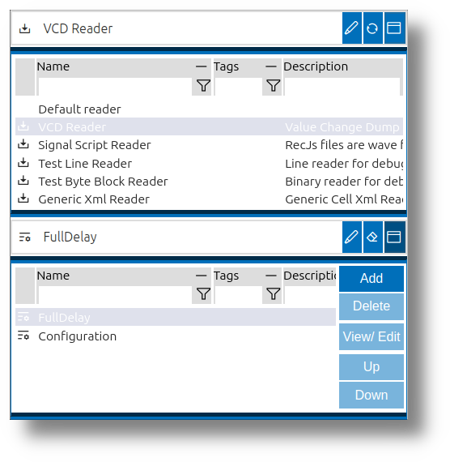
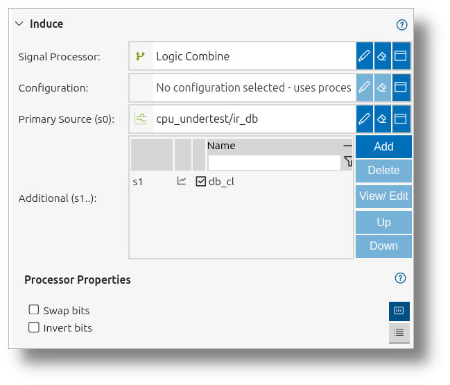

<!---
title: "Expressions"
author: "Thomas Haber"
keywords: [impulse, expressions, syntax, operators, literals, variables, filters, processors, search, time domain, logic operations, type casting, precedence, Java methods, signal manipulation]
description: "This document provides a comprehensive guide to the expression language in the impulse system. It covers syntax, including literals, variables, and operators, and explains domain-specific features like time and logic operations. The document also details implementation aspects, such as Java method access and type coercion, and offers best practices for using expressions effectively in filtering, processing, and analyzing signal data. Examples and operator precedence are included to aid understanding and application."
category: "impulse-manual"
tags:
  - manual
  - api
  - reference
docID: 1171
--->
# Functional Blocks

Functional blocks are the core building elements of impulse, enabling flexible data acquisition, processing, visualization, and analysis. Each functional block type serves a specific role in the workflow, and impulse’s architecture allows users to extend, configure, and combine these blocks to suit their unique requirements.

## Types of Functional Blocks

Impulse provides several types of functional blocks, each designed for a particular aspect of the signal analysis workflow:

- [**Serializers**](#serializer): Read and write external content, supporting import/export in various formats.
- [**Signal Processors**](#signal-processor): Create new signals from existing ones, perform mathematical operations, extract patterns, and decode protocols.
- [**Diagrams**](#diagram): Visualize signals in different forms, such as time-domain or frequency-domain charts.
- [**Producers**](#producer): Generate new data elements (signals or records) from existing content using rules and algorithms.
- [**Adaptors**](#adaptor): Interface with external systems, hardware, or data sources for seamless data acquisition.
- [**Search Engines**](#search-engine): Locate samples or patterns within signals efficiently.
- [**Formatters**](#formatter): Convert signal values into human-readable text for logs, tables, or reports.

These blocks can be extended and configured to match the needs of any workflow, making impulse highly adaptable for a wide range of engineering and analysis tasks.

---

## Functional Block Integration

Impulse supports multiple integration patterns for functional blocks, allowing users and developers to choose the most suitable approach for their needs. The main integration types are:

### Singleton
A singleton functional block is a unique, specific implementation provided by impulse. These blocks are typically built-in and serve a dedicated purpose, such as a VCD reader for handling Value Change Dump files. Singletons are not intended to be duplicated or customized by users, but rather offer a ready-to-use solution for common tasks.

**Use case:** When a standard, well-defined implementation is required (e.g., reading a specific file format).

**Conversion to Java:** Many singleton implementations support conversion to a Java-based block. This feature allows users to create a new Java functional block initialized with the same implementation as the singleton. Users can then fix issues or enhance the functionality as needed, providing a path for customization and extension.

### Multiton
Multiton integration allows users to create and manage multiple specific versions of a functional block. For example, a "Pattern Log Reader" can be instantiated several times, each with its own configuration (such as different regular expressions for parsing various log formats). Each instance appears as a distinct block (e.g., "MyPatternLogReader") and can be selected and configured independently.

**Use case:** When users need to define and reuse multiple customized variants of a block for different data sources or workflows.

### Java
The Java integration type enables developers to implement a functional block as a single Java class directly within the impulse environment. This approach allows for rapid development, testing, and debugging of new blocks without the need for a separate development environment or build process. Java-based blocks can be used for advanced customization or prototyping.

**Use case:** When custom logic or advanced processing is needed, and the user wants to implement and debug the block within impulse itself.

**Repository Integration:** The UI supports pulling Java block implementations from a shared repository and pushing user enhancements or proposals back to the provider. This collaborative workflow enables users to contribute improvements and share customizations with the broader community or the original provider.

---

## Selecting Functional Blocks

Impulse provides a unified UI for selecting, configuring, and managing functional blocks throughout the application. When loading files, choosing diagrams, or setting up data processing, users interact with this interface to tailor the system to their needs.

The functional block selection UI consists of:
- **Text Field**: Type the name of the functional block, with suggestions as you type.
- **Edit Button**: Opens configuration options for the selected block.
- **In-Place Dialog**: Provides a detailed interface for selection and configuration.

The image above shows the typical UI for customizing and managing functional blocks, including the text field, edit button, and in-place dialog for both the block and its configuration.

If left blank, impulse selects a default block based on context.

---

## Customizing Functional Blocks

Impulse allows you to tailor functional blocks to your needs, whether you want to make quick adjustments or set up detailed configurations for reuse. Customization is available through several features in the user interface.

### Preferences Dialog
Each block has a Preferences dialog where you can set all available options. This dialog groups related properties and provides descriptions to help you understand each setting. You can adjust parameters, enable or disable features, and see the effect of your changes immediately in many cases.

### User Configurations
Most blocks support user-defined configurations. These are named sets of settings you can save and reuse. When you select a block, you can pick from your saved configurations or create a new one. This makes it easy to switch between different setups or share configurations with others.

### In-Place Editing
If you don't select a configuration, you can edit block properties directly in the context where you use them. For example, in the View Signals dialog, you can change diagram settings right there. This is useful for quick, context-specific adjustments.

---

## Property Tab Folder

When configuring functional blocks, the Property Tab Folder offers two ways to view and edit properties:

- **Property Table Tab**: Shows all available properties in a table, with in-place editing and type-specific controls. Useful for advanced or comprehensive configuration.
- **UI Fields Tab**: Presents only the most important properties in a streamlined, user-friendly layout, with contextual grouping and visual aids. Ideal for quick setup and new users.

The image above illustrates the Property Tab Folder, highlighting the difference between the comprehensive property table and the streamlined UI fields tab.

You can switch between these tabs to balance detailed control and ease of use.

---

## Functional Block Types in Detail (plus details about the core blocks)

### Serializer
A serializer enables reading and writing of external content, supporting import and export in various formats. Serializers are essential for integrating impulse with external tools and workflows. The UI for managing serializers is organized as a tree, allowing users to add or modify serializers and their configurations.

Serializers are used whenever data needs to be imported into or exported from impulse, such as loading waveform, log, or trace files, or including external data via the Includes element in records. The dedicated serializer dialog allows you to  adjust properties, and optionally choose or create user configurations for specific needs.

#### Reader
A serializer with reader capability can import data into impulse. Use a reader when you want to load files such as waveforms, logs, or other supported formats. The UI will show only reader serializers when you are importing data. You can adjust reader settings to match the structure of your source files.

#### Writer
A serializer with writer capability can export data from impulse. Use a writer when you want to save or export signals, records, or other data to an external file or system. The UI will show only writer serializers when you are exporting data. Writer settings let you control the format and structure of the exported files.

#### Core readers and writers

The impulse core packages contains the following readers and writers:

- **XML Serializer (recMl/recMz)**: Generic XML reader/writer for preferences and records, supports compressed and uncompressed XML.
- **flux Trace Reader**: Binary flux trace reader for hierarchical, compressed trace data (reader only).
- **Signal Expression Reader (recJx)**: Generates records from expressions; useful for scripted example records (reader only).
- **Test Readers**: Simple Test Line Reader and Test Byte Block Reader for quick import of text lines or binary blocks (reader only).

### Signal Processor
Signal processors create new signals from existing ones or from scratch. They combine signals, extract patterns, and decode data using protocol parsers. Signal processors are vital for advanced analysis, debugging, and deriving insights. The UI for processors is a hierarchical tree, listing all processors and their configurations.

Signal processors are used in multiple contexts: as part of View Signals (to derive or combine signals for visualization) or in the Deduce section of View Signals (to provide additional context or breakdowns). The dedicated processor dialog allows users to select a processor, configure its properties, and save or reuse configurations. Typical use cases include mathematical transformations, protocol decoding, and extracting statistics or features from raw data.

#### Core processors
The impulse core packages provides the following signal processors:

- **Logic Combine**: Combines multiple logic signals (single-bit or vectors) into a single logic vector signal.
- **Array Combine**: Groups multiple signals of the same type into a single array signal.
- **Logic Extract**: Extracts, swaps, or inverts bits from logic signals to produce transformed logic outputs.
- **Member Extract**: Extracts a named member or indexed element from a struct or array signal as a new signal.
- **Expression Filter**: Filters samples using a user-defined expression, keeping only matching samples.
- **Logic Splitter**: Splits a logic signal into individual bit/channel components as child signals.
- **Struct Splitter**: Splits a struct signal into its member child signals for deduce operations.
- **Array Splitter**: Splits an array signal into individual element child signals for deduce operations.
- **Expression Processor**: Computes a user-defined expression per sample using one or more input signals.

### Diagram
Diagrams provide specialized visual representations for signals, such as time-domain plots, frequency-domain charts, or custom visualizations. Users can customize diagram properties to tailor their analysis needs.

Diagrams are selected in the Visualize section of View Signals, determining how the signal data is displayed. The diagram UI allows users to pick a diagram type (e.g., line, bar, logic, chart) and configure its appearance, axes, and overlays. Diagrams support both predefined and user-defined configurations, enabling consistent visual styles or custom layouts for specific analysis tasks. Diagrams are central to making complex data interpretable and actionable.

#### Core diagrams
The impulse core packages provides the following diagram types:

- **Logic Diagram**: Visualizes digital logic signals, showing bit states and transitions (supports 1-bit logic signals).
- **Vector Diagram**: Displays multi-bit or multi-channel vector signals for complex data analysis.
- **Image Diagram**: Renders image signals from packed binary data (e.g., PNG) within traces.
- **Event Diagram**: Highlights discrete events, triggers, or markers (supports enumeration and struct-event members).
- **Gantt Diagram**: Visualizes timing and scheduling of states/tasks (supports enumeration/struct state members).
- **Line Diagram**: Plots continuous or sampled float/integer data as line plots for trends and time-series.
- **Table Diagram**: Presents struct and array signals in tabular form for structured analysis and comparison.
- **BarChart Diagram**: Visualizes categorical or grouped data as bars (supports struct, arrays, and numeric signals).
- **PieChart Diagram**: Shows proportions of categories as pie slices (supports struct, arrays, and numeric signals).
- **LineChart Diagram**: Plots data points connected by lines for trends and continuous signals.
- **RadarChart Diagram**: Displays multivariate data on radial axes for variable comparison.

### Producer
Producers generate new data elements (signals or records) from existing content, applying rules and algorithms for automated content creation. The UI for producers is a tree view, showing all producers and their configurations.

Producers are used in record Analysis elements and other automation scenarios, where new signals or records need to be generated based on rules, templates, or algorithms. Producers can automate repetitive data transformations, generate reference signals, or synthesize test data. The producer UI allows users to select, configure, and manage producers, supporting both default and user-defined configurations.

The impulse core packages do not provide dedicated producers.

### Adaptor
Adaptors connect impulse to external systems, hardware, or data sources, enabling seamless data acquisition and interaction. The UI for adaptors is structured as a tree, presenting all adaptors and their configurations for easy management.

Adaptors are used in record Interface elements to connect to live data sources such as hardware devices, TCP/serial ports, or external libraries. The adaptor UI allows users to select the appropriate adaptor, configure connection parameters, and manage user configurations. Adaptors are essential for integrating impulse into test benches, lab setups, or real-time monitoring environments.

### Search Engine
Search engines help locate specific samples, events, or patterns within signals, even in large datasets. The UI for managing searches provides a list of previous searches and allows users to define new ones.

Search engines are used in the search dialog (Ctrl+F) to find samples matching specific criteria within selected signals. Users can select a search engine (e.g., expression search), configure its properties, and optionally use or save configurations for recurring searches. Search engines streamline the process of finding events, anomalies, or patterns in complex datasets, supporting both simple and advanced search scenarios.

#### Core Search Engines
The impulse core packages provides the following search engines:

- **Expression Search**: Allows users to search for samples that match a user-defined expression within selected signals. This engine is ideal for locating specific values, patterns, or conditions in large datasets, supporting both simple and complex search criteria.

### Formatter
Formatters convert signal values into text for logs, tables, or reports. The UI for formatters lists all available formatters and their properties, which can be customized for different use cases.

Formatters are used throughout impulse wherever signal values need to be displayed in a human-readable form, such as in sample tables, logs, or reports. The formatter UI allows users to select or configure how values are rendered, supporting custom formats for different data types or domains. Formatters enhance clarity and communication by adapting raw data to the needs of the user or audience.

#### Core formatters
The impulse core packages provide the following sample formatters:

- **Hex Formatter**: Format numeric values in hexadecimal representation.
- **Bin Formatter**: Format numeric values in binary representation.
- **Oct Formatter**: Format numeric values in octal representation.
- **Dec Formatter**: Format numeric values in decimal representation.
- **Domain Formatter**: Format and display domain (time/index) values using preferred units.
- **KeyValue Formatter**: Display structured values as key:value pairs (member name and value).
- **ValuesOnly Formatter**: Display only raw values without keys or labels for compact output.
- **Html Formatter**: Render sample content as HTML, preserving markup and styling where applicable.
- **Label Formatter**: Use defined labels for enumerations or mapped values instead of raw numeric values.
- **Bytes Formatter**: Display binary data as hexadecimal byte sequences or selectable encodings for inspection.

---

Impulse’s functional block system provides the flexibility and extensibility needed to address a wide range of engineering challenges, from data acquisition to advanced analysis and visualization.