  
# Preferences

Preferences in **impulse** provide a structured way to customize and configure various aspects of the workbench, enabling users to tailor the tool to their specific needs. From defining serializers and adaptors to setting up views and processors, preferences allow for seamless integration and efficient management of data sources, visualizations, and workflows. This section outlines the available preference categories and their functionalities, helping users optimize their experience with **impulse**.

## Preference location and format

The location and format of preferences in **impulse** are platform-dependent, as the tool is designed to support various IDEs and operating systems. Preferences are stored in configuration files or system-specific directories, ensuring compatibility with the underlying platform. Additionally, the availability of certain preferences may vary depending on the IDE or platform being used, as **impulse** integrates with multiple development environments to provide tailored functionality.

## Preference Editor

You can open the Preference Editor using the main menu over the impulse Viewer **impulse Preferences**.

### Action Buttons

Each tab in the Preference Editor includes a set of action buttons to manage preferences effectively:

- **Store**: Saves the current set of preferences to the external location, ensuring that all changes are preserved.
- **Discard**: Reverts all changes made during the current session, restoring the preferences to their previous state.
- **Reload**: Loads a fresh copy of the preferences from the external location, overwriting any unsaved changes.
- **Reset**: Clears all preferences and restores them to their initial default state.

These buttons provide users with flexibility and control over their preference configurations, making it easier to manage and maintain settings.

*impulse specific Preferences:*

### Serializers
Serializers in **impulse** enable users to import and export external content in various formats, facilitating seamless integration with external tools and workflows. By defining custom serializers, users can adapt **impulse** to handle specific data formats required for their projects.

The UI for managing serializers is organized as a tree structure. This interface displays all available serializers and their configurations, allowing users to add new serializers or modify existing ones by adjusting their properties and settings. This design ensures an intuitive and efficient way to manage and customize serializers to suit project needs.

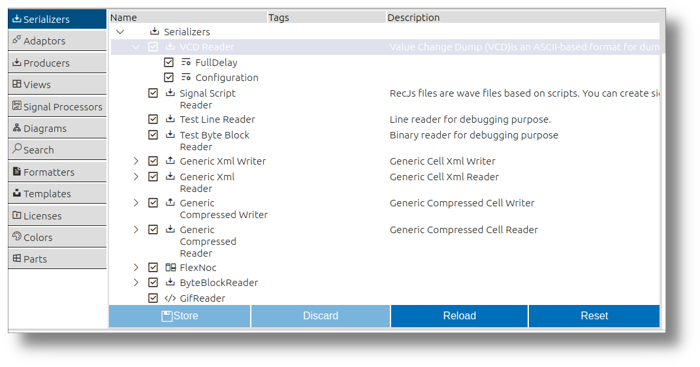

### Adaptors
Adaptors in **impulse** act as bridges to external systems, enabling the tool to connect with hardware devices, libraries, or data sources. They facilitate seamless data acquisition and interaction, ensuring compatibility with a wide range of external applications and hardware.

The UI for adaptors is structured as a tree, presenting all available adaptors and their configurations. Users can effortlessly add new adaptors or fine-tune existing ones by modifying their settings. This approach simplifies the process of managing adaptors and ensures they can be tailored to specific project requirements.

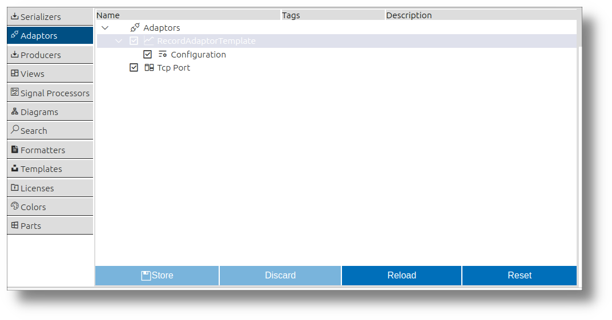 

### Producers
Producers in **impulse** are responsible for generating new data elements, such as signals or records, from existing content. By applying predefined rules and algorithms, they enable automated content creation and enhance the system's adaptability.

The UI for producers is designed as a tree view, showcasing all producers and their respective configurations. Users can introduce new producers or adjust the properties of existing ones to align with their project needs.

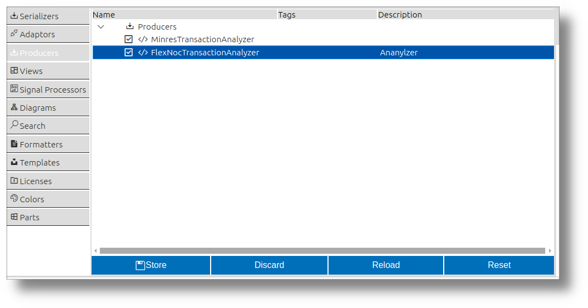

### Views
Views in **impulse** provide a presentation layer for signals, offering tailored visualizations to analyze data effectively. Users can switch between different views to interpret signals in various domains.

The UI for managing views is organized as a tree structure. This interface displays all available views and their components, allowing users to add new views or customize existing ones by modifying their properties and settings. 

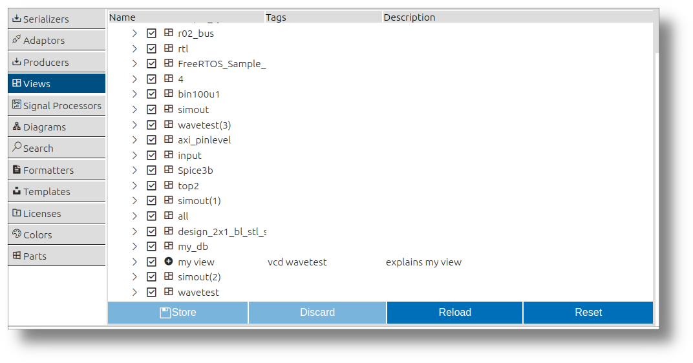 

### Processors
Processors in **impulse** are tools for deriving new insights by creating signals from existing ones or generating them from scratch. They combine signals, extract patterns, and decode data using protocol parsers, making them essential for advanced data analysis.

The UI for processors is organized as a hierarchical tree, listing all processors and their configurations. Users can add new processors or refine existing ones by tweaking their settings. 

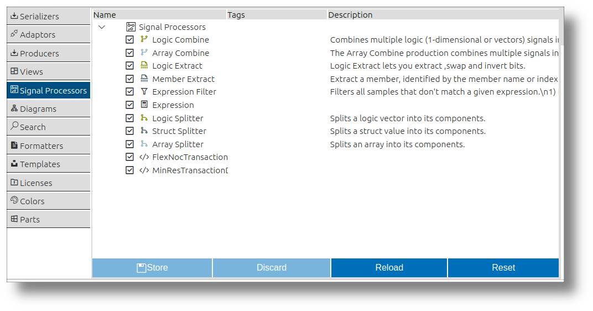

### Diagrams
Diagrams in **impulse** provide specialized visual representations for signals, such as time-domain plots, frequency-domain charts, or custom visualizations. They play a crucial role in helping users interpret signal data effectively and gain meaningful insights.

The UI for managing diagrams lists all available diagrams and their default properties. Users can customize these properties to tailor the diagrams to their specific analysis needs. 

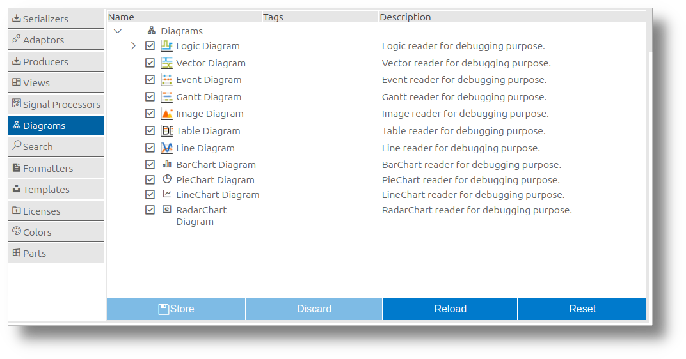

### Sample Searches
Sample searches in **impulse** allow users to locate specific events, patterns, or values within signals, even in large datasets. This functionality is essential for efficiently finding relevant data points and gaining insights from complex systems.

The UI for managing sample searches provides a list of previously conducted searches, enabling users to review or reuse them. Additionally, users can define new sample searches to tailor their analysis to specific requirements.

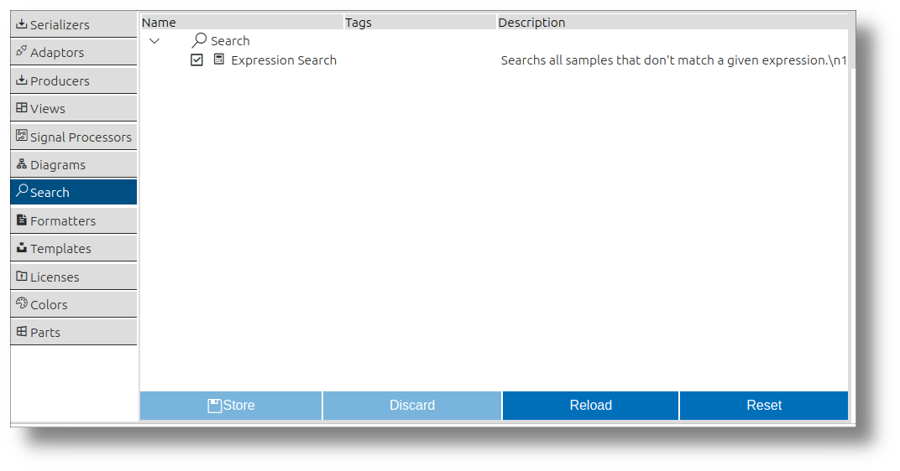 

### Formatters
Formatters in **impulse** convert signal values into text, representing signal data in a human-readable format. They are essential for logs, tables, or reports, making it easier for users to interpret and share their findings.

The UI for managing formatters lists all available formatters and their default properties. Users can customize these properties to adapt the formatters to their specific needs. This flexibility ensures that formatters can be tailored to a wide range of use cases and preferences.

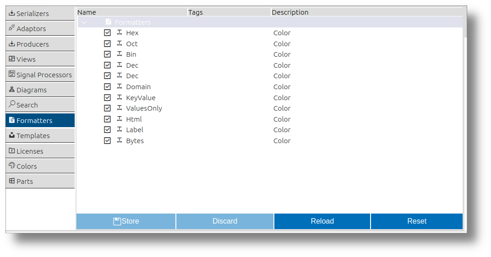 

---

*Standard Preferences:*

### Templates
Templates in **impulse** provide predefined configurations for creating new elements of various types, such as serializers, processors, views, producers, and more. They serve as a starting point, enabling users to quickly set up new components with default settings tailored to their needs.

The UI for managing templates lists all available templates and their default properties. Users can select a template from the context menu to create a new element of the desired type. This feature streamlines the process of adding new components and ensures consistency across projects.

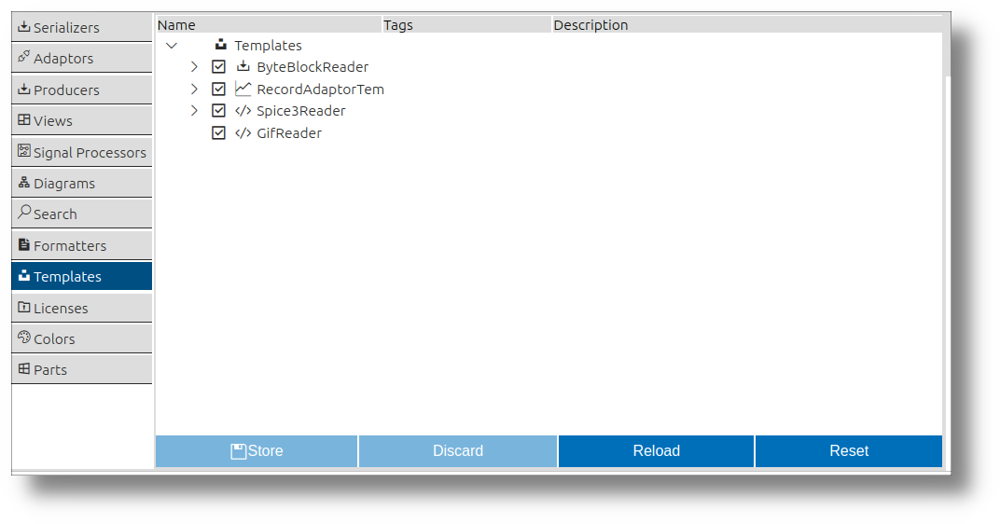 

### Licenses
The Licenses section in **impulse** allows users to manage and configure licensing information. This ensures compliance with software usage terms and provides access to licensed features.

The UI for managing licenses lists all available licenses and their details. Users can update or modify license information to ensure proper configuration and access to the required features.

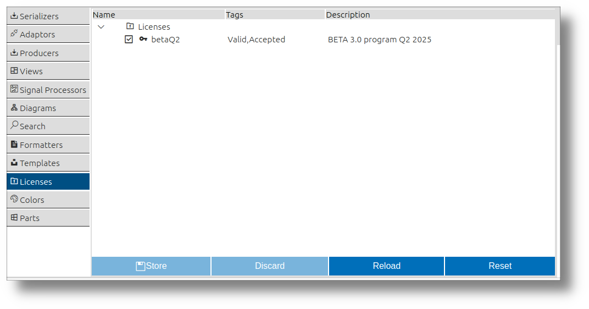

### Colors
The Colors section in **impulse** enables users to customize the color schemes used throughout the tool. This includes defining colors for signals, diagrams, and other visual elements, enhancing readability and user experience.

The UI for managing colors lists all customizable color options. Users can adjust these settings to create a personalized and visually appealing workspace.

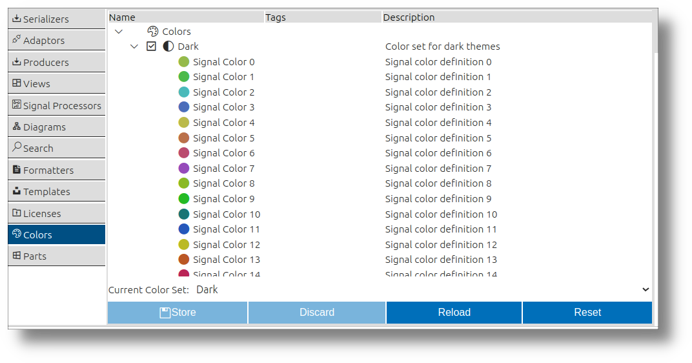 

### Parts
Parts preferences in **impulse** are dedicated to managing the visual components of the UI, such as the main  impulse viewer, complementary views, and more. These parts enhance the user experience by providing tailored interfaces for different aspects of data visualization and interaction.

Each part comes with its own UI for modifying various configurations. For example, complementary views allow users to manage configurations that define all the columns displayed. Within the parts section of the Preferences Editor, users can select from multiple configurations for each part and customize them to suit their needs. This centralized management ensures flexibility and consistency across the visual components of the tool.

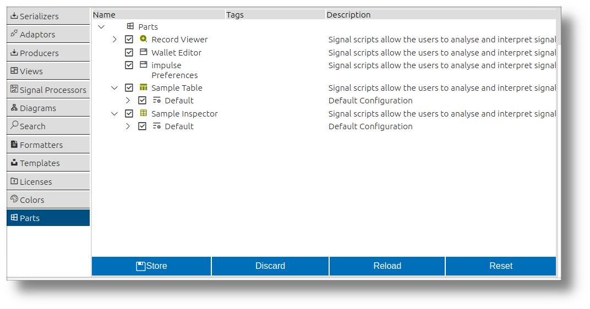 

### Preference Wallet
The Preference Wallet in **impulse** is a specialized editor designed for sharing and exchanging preferences with other users. It provides a collaborative way to manage configurations by allowing users to transfer elements between the wallet and the system's actual preferences.

The Preference Wallet editor contains the same elements as the standard Preference Editor but introduces a tree structure on the left side, representing all the elements stored in the wallet. Users can move elements, such as serializers, from the wallet tree into the system's preferences or vice versa. This functionality enables users to save a wallet file and share it with others, who can then open the file and selectively apply elements from the wallet to their own preferences.

This feature streamlines the process of sharing configurations and ensures consistency across different setups, making it easier to collaborate and maintain standardized environments.

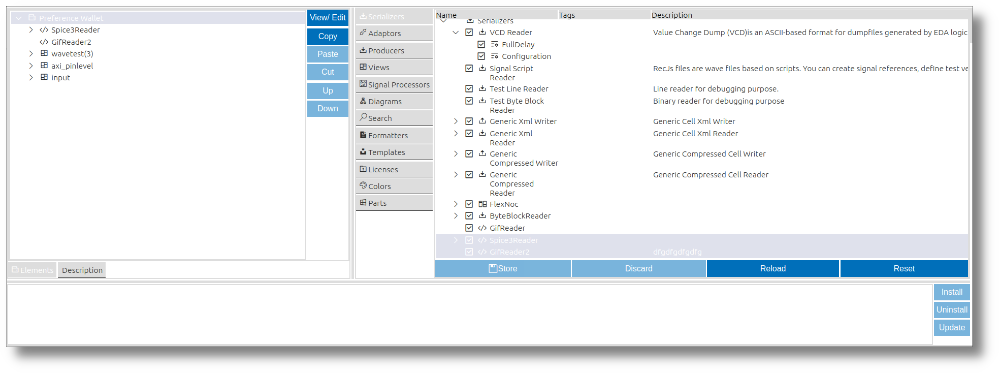

