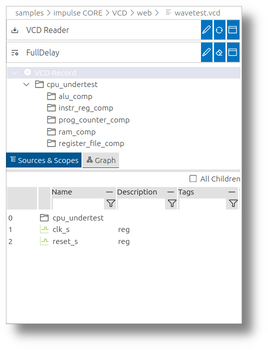
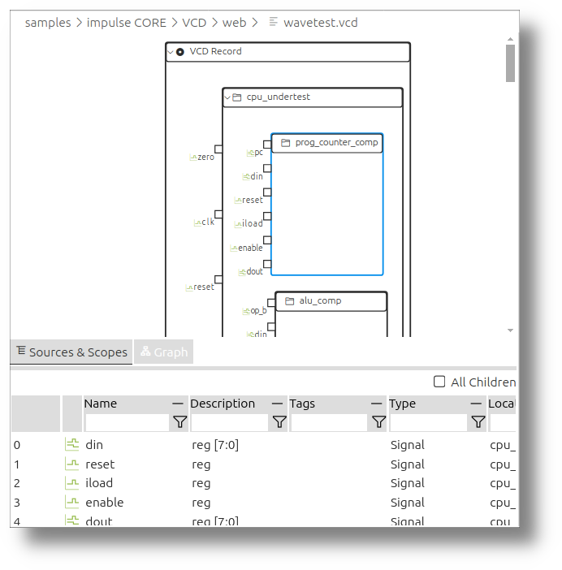
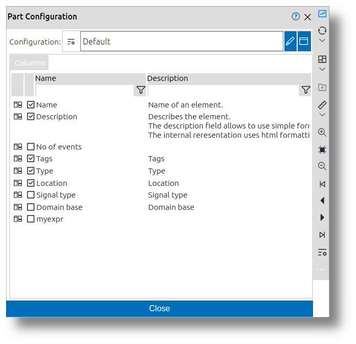
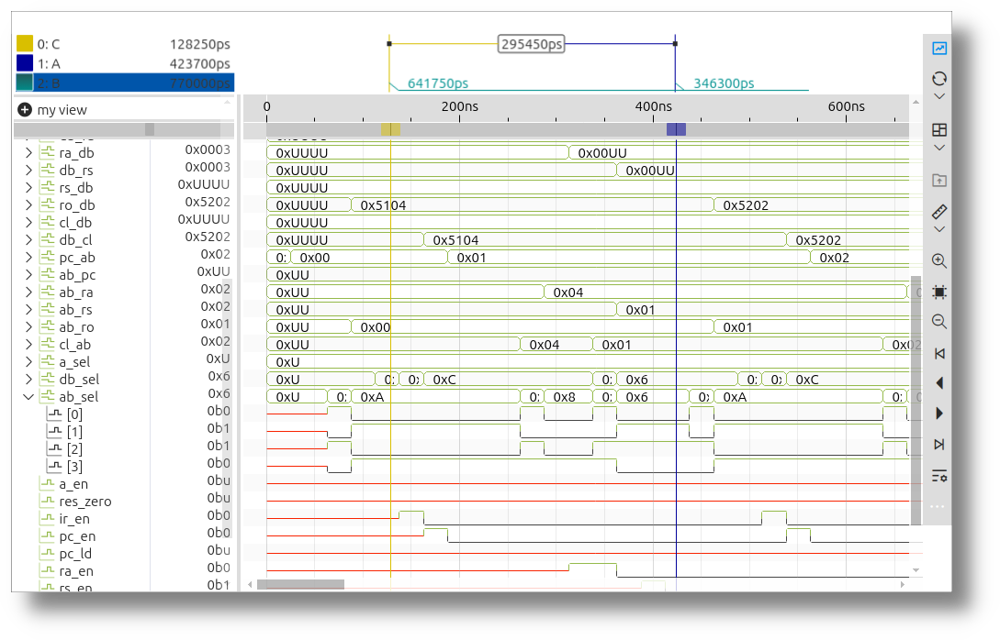
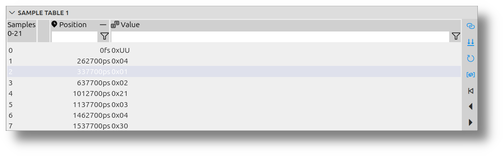
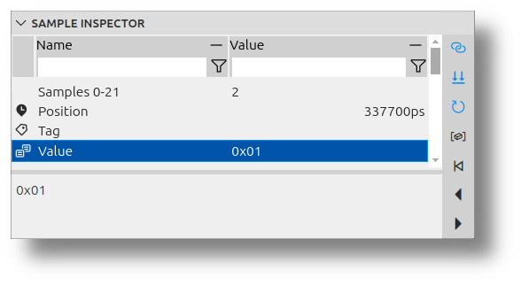
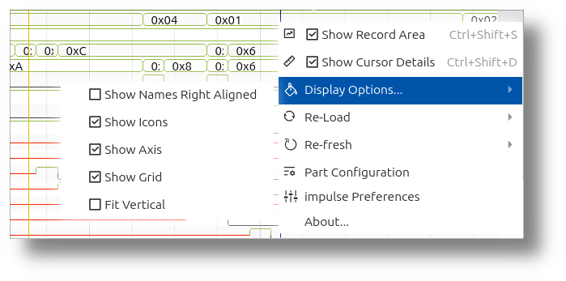

<!---
title: "impulse at a Glance"
author: "Thomas Haber"
keywords: [signal visualization, signal analysis, Record Area, View Area, Signal Table, View Tree, diagrams, signal filtering, cursors, Sample Tables, Sample Inspector, functional blocks, customization, domain axes, workflow]
description: "Comprehensive overview of the impulse Viewer's components and capabilities for signal data visualization and analysis. Details the Record Area for signal management, View Area for visualization, complementary views like Sample Tables and Inspector, customization options for functional blocks, and appearance settings."
category: "impulse-manual"
tags:
  - manual
  - overview
  - user interface
docID: 647
--->
# impulse at a Glance

The **impulse Viewer** is a comprehensive tool designed to visualize and analyze signal data, such as traces, simulation outputs, and logs. It provides a user-friendly interface for managing, filtering, and exploring signals, making it an essential tool for engineers and developers working with complex data. The viewer is divided into two main areas: the **Record Area** and the **View Area**, each serving distinct purposes to streamline the analysis process.

---

## Key Components of the impulse Viewer

### Record Area
The **Record Area**, located on the left-hand side of the viewer, is the primary interface for managing signals. It allows users to load signals from files or interfaces, organize them into hierarchical structures, and apply filters to focus on specific data. This area is particularly useful for finding and preparing signals for visualization in the **View Area**. The Record Area consists of three main sections:
 
 

#### Source Settings
  When a file is opened in the viewer, impulse automatically selects the appropriate reader for the file type. Users can modify this selection or configure the reader to suit their needs. Configuration options often include filtering signals or restricting the time range to focus on specific data.

#### Record Hierarchy
  This section displays the hierarchical structure of the loaded file, including scopes, modules, and subsystems. Users can navigate through this hierarchy to locate specific signals. A checkbox labeled "All Children" allows users to apply filters not only to the direct children of a selected scope but also to all subsequent children.

#### Graph
  When switching to the "Graph" tab in the record area, you will find a visualization of the record hierarchy. This visualization replaces the traditional tree and source settings, providing a graphical representation of the hierarchy for better clarity and understanding.

#### Signal Table
  The lower part of the Record Area contains the **Filtered Signal Table**, which lists signals based on applied filters. Users can filter signals using:  
  - **Text fragments**: For example, entering `abc` will display signals containing the text "abc".  
  - **Regular expressions**: Advanced filtering using patterns like `ab[0-9]n?` to match specific signal names.  
  - **Numeric expressions**: Filters based on signal values, such as:  
    - `0.4 < v < 2.0`: Matches signals with values in the specified range.  
    - `v < 0x400`: Matches signals with values less than `0x400`.  
    - `v == 1000`: Matches signals with values equal to `1000`.  

#### Configuring Signal Table Columns 
The columns of the Signal Table can be customized to suit the user's needs. To configure the columns:
1. Open the **Part Configuration** menu.
2. Enable or disable existing columns to show or hide specific data.
3. Reorder columns by dragging them to the desired position.
4. Add new columns to display additional information about the signals.

 

This flexibility allows users to tailor the Signal Table to their specific analysis requirements.

The Record Area can be toggled on or off using a toolbar button labeled **Show Record Area**, allowing users to maximize the workspace when needed.

---

### View Area 
The **View Area** is the primary workspace for visualizing and analyzing signals. It provides a flexible and configurable interface where users can create and manage views of their data. A "view" in impulse is a collection of signals and associated diagrams organized in a tree structure. Users can define multiple views and switch between them as needed. The View Area includes the following components:

 

#### View Tree  
  The **View Tree** (the signals in the view will be later referred to as **View Signals**) displays a hierarchical representation of signals and folders. Each element in the tree corresponds to a diagram on the right-hand side. Signals in the tree can represent:  
  - A direct 1:1 mapping to a signal from a loaded file or interface.  
  - Derived signals that combine or transform existing signals.  
  - Newly created signals that can be used as sources for further combinations.  

  The View Tree has two columns:  
  1. **Name and Icon**: The first column displays the name of the signal or folder along with an associated icon.  
  2. **Value at Active Cursor Position**: The second column shows the value of the signal at the current active cursor position, providing real-time insights into the signal's data.

#### Diagrams  
  For each **View Signals** in the tree, a corresponding diagram is displayed on the right. These diagrams are aligned along a common zoomable and scrollable axis, which can represent time, frequency, or another domain. This alignment allows users to analyze multiple signals simultaneously.  

#### Domain Axes  
  The impulse Viewer supports visualizing signals across multiple domains, such as time, frequency, or other custom-defined domains. Each domain has its own axis, allowing users to analyze data in different contexts simultaneously. Axes are fully configurable, enabling users to adjust scaling, units, and alignment to suit their analysis needs. This flexibility is particularly useful when working with records that span multiple domains, as it provides a comprehensive view of the data.

#### Cursors  
  Cursors are a powerful feature for navigating and measuring within signals. Users can add multiple cursors to the diagrams to measure distances or positions. The **Cursor Details** section provides a detailed view of all cursors, including their domain values and the deltas between them. This feature is particularly useful for precise timing or frequency analysis.

---

## Complementary Views 

### Sample Tables
Sample Tables provide a tabular representation of signal data, fully synchronized with the active viewer. This includes signals, cursors, and data streams. Key features of Sample Tables include:
- **Synchronization**: The input signal updates automatically as the viewer selection changes, and the selected sample aligns with the cursor position.
- **Real-Time Updates**: For streaming data, the table refreshes continuously to reflect the latest values.
- **Filtering and Combination**: Users can apply filters to refine results and combine multiple signals along the index order for comprehensive analysis.
- **Configurable Columns and Formats**: Columns and value formats can be customized to represent different data types effectively.

 

These features make Sample Tables an essential tool for precise monitoring, efficient debugging, and gaining deeper insights into system performance and behavior.

### Sample Inspector
The Sample Inspector complements the Sample Tables by providing detailed insights into individual samples. It allows users to:
- Inspect specific sample values in detail.
- Analyze data streams and their behavior over time.
- Monitor system performance with precision.

 

Together, Sample Tables and the Sample Inspector enhance signal inspection, enabling users to debug efficiently and gain a deeper understanding of their data.

---

## Appearance Customization

 

The impulse Viewer offers extensive customization options to tailor the interface to the user's needs. These options are accessible through the main menu and toolbar and include:  
- Show/Hide Record Area  
- Show/Hide Cursor Details  
- Show/Hide Axis, Grid, or Value Column  
- Enable **Fit Vertical**: This feature automatically adjusts the vertical height of signals to fit the viewer. If there is sufficient space, the signals are extended; otherwise, they are displayed with minimal height. This is especially useful when working with a small number of signals.  

---

## Customizing and Managing Functional Blocks

Each developer faces unique workflows and challenges, necessitating tailored setups for data acquisition, visualization, and analysis. **impulse** provides extendable and configurable functional blocks (e.g., serializers, signal processors, diagrams, views, producers, adaptors, search engines, formatters, etc.) to ensure seamless integration of all essential components.

 

The UI for customizing and managing these functional blocks is found throughout impulse. For example, when selecting a reader to load a file or choosing a diagram. The UI consists of two main parts: the functional block itself and, optionally, its configuration.

- **Text Field**: The first field is a text input where users can type the name of the functional block. As you type, the field provides suggestions based on your input.
- **Edit Button**: Next to the text field, there is an edit button that allows users to configure the selected functional block.
- **In-Place Dialog**: At the end of the field, there is a button to open an in-place dialog. This dialog provides a more detailed interface for selecting and configuring the functional block.

If the functional block is left blank, impulse will automatically select a default one based on the context.

Most functional blocks can be configured. The configuration can either be done directly in the UI (e.g., Dialog) or selected from a set of predefined configurations.  
After selecting a functional block, you can choose its configuration using the second field in the UI.  

- **Text Field**: You can type the name of the configuration in the text field.  
- **Edit Button**: This button allows you to modify the selected configuration.  
- **In-Place Dialog**: Pressing this button opens a table displaying all available configurations, making it easier to select or customize the desired configuration.  

If the configuration field is left empty, the UI will typically provide the necessary configuration options directly within the dialog as editable properties.

## Property Tab Folder

When configuring functional blocks or other components in impulse, you'll often encounter the **Property Tab Folder**. This interface element provides two different ways to view and edit properties, accommodating both comprehensive configuration and quick access to essential settings.

### Property Table Tab

The first tab presents a complete **Property Table** that displays all available properties in a tabular format:

- **Comprehensive View**: Shows every property available for the component being configured
- **In-Place Editing**: Values can be edited directly in the table
- **Type-Specific Controls**: Different property types (boolean, numeric, string, color, etc.) have appropriate editing controls
- **Advanced Settings**: Even rarely-used or advanced properties are accessible in this view

This view is particularly useful when you need to perform detailed configuration or when searching for specific properties that might not be available in the simplified UI.

### UI Fields Tab

The second tab offers a more focused interface with **UI Fields** that highlight the most important properties:

- **Streamlined Experience**: Presents only the most commonly used properties
- **Custom Layout**: Fields are arranged in a user-friendly layout optimized for the specific component
- **Contextual Grouping**: Related properties are visually grouped together
- **Visual Aids**: May include additional help text, previews, or interactive elements

This tab is ideal for quick configurations and new users who might be overwhelmed by the full property set. It provides a more guided experience focusing on the properties that matter most for typical use cases.

The Property Tab Folder allows you to switch seamlessly between these two views, combining the benefits of both comprehensive control and streamlined interaction based on your current needs.

---

## Typical Workflow Example

1. **Load a File**:  
   Open a wave, trace, or log file in the Record Area. The viewer will automatically select the appropriate reader for the file type.  

2. **Filter Signals**:  
   Use the filtering options in the Record Area to focus on specific signals. For example, apply a text fragment filter to find signals containing a particular keyword or use a numeric expression to isolate signals within a specific value range.  

3. **Visualize Signals**:  
   Drag the filtered signals into the View Area to display them as diagrams. Organize the signals into a tree structure to create a custom view.  

4. **Analyze Data**:  
   Use the zoom and scroll features to explore the signal data in detail. Add cursors to measure distances or positions within the signals. Customize the appearance of the viewer to optimize the workspace for your analysis.  

---

## Conclusion

The impulse Viewer is a versatile and powerful tool for signal visualization and analysis. Its intuitive interface, combined with advanced filtering and customization options, makes it an essential tool for engineers and developers working with complex signal data. Whether you're analyzing simulation outputs, debugging logs, or exploring traces, the impulse Viewer provides the tools you need to gain insights quickly and efficiently.