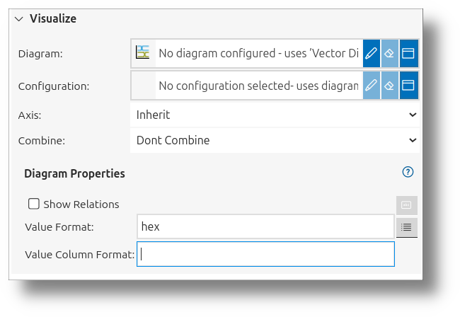

<!---
title: "View Signals and View Folders"
author: "Thomas Haber"
keywords: [view signals, view folders, visualization, signal data, induce, visualize, deduce, signal sources, signal processor, hierarchical structure, diagram types, axes, direct mapping, derived signals, combine, configuration]
description: "Comprehensive guide to View Signals and View Folders in the impulse framework, explaining their role in organizing and visualizing signal data. Details the three main sections of View Signals: Induce (defining signal sources and processors), Visualize (configuring display properties and diagram types), and Deduce (providing additional context). Covers signal mapping approaches, transformation capabilities, and visualization options for effective signal analysis."
category: "impulse-manual"
tags:
  - manual
  - visualization
  - concepts
docID: 717
--->
# View Signals and View Folders

In the impulse framework, **View Signals** and **View Folders** are essential for organizing and visualizing signal data effectively. View Signals are configurable representations of signal data that provide information on which signal to use or how to generate it, without storing the data themselves. They include customizable settings such as color, name, diagram type, and textual representation, allowing users to tailor their visualization. View Signals can represent direct mappings, derived signals, or newly created signals, offering flexibility in signal analysis.

On the other hand, **View Folders** are used to group and organize View Signals into a hierarchical structure. This helps users manage complex datasets by hiding or showing specific sections as needed, ensuring a clean and navigable view. By combining View Signals and View Folders, users can create powerful, intuitive views for analyzing and interpreting signal data.

When working with View Signals, you will encounter three main sections: **Induce**, **Visualize**, and **Deduce**. In the **Induce** section, you define what the signal is, specifying the input or source of the View Signal. The **Visualize** section focuses on how the signal is displayed, allowing you to configure its appearance and representation. Finally, the **Deduce** section determines what is presented when you expand the tree item of the View Signal, providing additional details or context for the signal. These sections work together to provide a comprehensive and flexible framework for signal visualization and analysis.

---

## Induce

The **Induce** section is where you define the input or source of a View Signal. It consists of two main components:  
1. **Signal Sources**: These define the input signals, which can either reference a signal from the record or another View Signal.  
2. **Signal Processor**: This component is responsible for creating new signals by combining or transforming existing ones or generating them from scratch.

 

### Signal Sources

Signal sources specify the origin of the data for a View Signal. They can be:  
- A direct reference to a signal in the record.  
- A reference to another View Signal, enabling hierarchical signal definitions.

### Signal Processor

The signal processor is a powerful tool that allows for:  
- Combining multiple signals using mathematical or logical operations.  
- Extracting meaningful patterns from raw data.  
- Implementing protocol parsers to decode complex data structures.  
- Creating entirely new signals without relying on existing sources.

View Signals in a view can represent:  
- **Direct Mapping**: A 1:1 mapping to a signal from a loaded file or interface. In this case, no signal processor is used.  
- **Derived Signals**: Signals created by combining or transforming existing signals. Depending on the signal processor, this can involve one or more input signals.  
- **Newly Created Signals**: Custom signals that serve as sources for further combinations. In this case, no source signal is provided, and the signal processor generates the signal entirely.

---

## Visualize

The **Visualize** section allows you to configure how a View Signal is displayed. This includes selecting a diagram type to represent the signal data visually. You can either choose a predefined configuration or set the diagram properties directly if no configuration is selected. This flexibility ensures that the visualization aligns with the specific requirements of your analysis.

 

Additionally, you can assign an axis to the view signal, ensuring it is plotted on the appropriate scale or dimension for better interpretability. Axes provide a structured framework for visualizing signals across multiple domains, such as time and frequency. Signals within the same domain can share axes, enabling clear and organized representation.

Additionally, you will find a **Combine** field in the UI. The **Combine** field allows you to combine multiple View Signals into a single representation. This is particularly useful for overlaying signals or creating composite visualizations, enabling a more comprehensive analysis of related data. The availability and behavior of the combined field depend on the type of diagram selected. For example:
- In line diagrams, signals can be overlaid to compare.
- In charts, signals can be grouped into one row.

---

## Deduce

The **Deduce** section provides additional context or details for a View Signal when its tree item is expanded. This section allows users to explore derived information, annotations, or other metadata associated with the signal, enhancing the depth of analysis.

 

To configure the **Deduce** section, you need to:  
1. **Select a Signal Processor**: Choose the processor that will generate the additional details or context for the signal.  
2. **Optionally Select a Configuration**: If the selected processor supports configurations, you can choose a predefined configuration to simplify the setup.  
3. **Set Properties for the Selected Processor**: If no configuration is selected, you can manually define the properties for the processor to customize its behavior.

Examples of processes that can be configured in the **Deduce** section include:  
- **Logic Splitter**: Extract individual bits from a logic signal to analyze their behavior independently.  
- **Struct Splitter**: Break down a structured signal into its individual members for detailed inspection.  
- **RT Deducer**: Decode and display task and process information from an RTOS trace for performance analysis.

