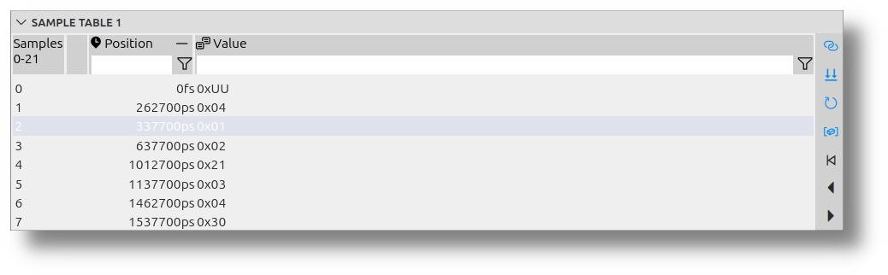

<!---
title: "Complementary Views"
author: "Thomas Haber"
keywords: [sample tables, sample inspector, synchronization, filtering, signals, data analysis, visualization, configuration, debugging, real-time, tabular analysis, monitoring, customization, inspection, data streams]
description: "Documentation of complementary views in impulse Viewer including Sample Tables and Sample Inspector. Covers key features such as signal synchronization, position synchronization, real-time refreshing, filtering options, signal combination, and column configuration. Explains how these tools enhance data analysis by providing synchronized, detailed insights with customizable formats."
category: "impulse-manual"
tags:
  - manual
  - visualization
  - user interface
docID: 867
--->
# Complementary Views

Complementary views in the impulse Viewer, such as Sample Tables and the Sample Inspector, enhance the analysis process by providing synchronized and detailed insights into signal data. These views are fully integrated with the active viewer, ensuring real-time updates and seamless interaction with signals, cursors, and data streams. They allow users to filter, combine, and inspect data with precision, making them invaluable for debugging and gaining deeper insights into system performance and behavior. Additionally, their configurable columns and formats enable effective representation of diverse data types, tailored to specific analysis needs.

Normal views are customizable collections of signals and folders, organized hierarchically to visually represent data. They focus on creating tailored diagrams and visualizations for flexible analysis. Complementary views, on the other hand, provide tools like Sample Tables and the Sample Inspector for detailed, synchronized, and tabular analysis. While normal views emphasize visual representation, complementary views enhance precision and inspection with real-time updates and filtering.

---

## Sample Tables

Sample Tables provide a tabular representation of signal data, fully synchronized with the active viewer. They include features like real-time updates for streaming data, filtering options to refine results, and the ability to combine multiple signals along the index order. The columns and value formats are configurable, allowing effective representation of diverse data types. These capabilities make Sample Tables an essential tool for precise monitoring, efficient debugging, and gaining deeper insights into system performance and behavior.

 

---

## Sample Inspector

The Sample Inspector complements the Sample Tables by providing detailed insights into individual samples. It allows users to:

- Inspect specific sample values in detail.
- Analyze data streams and their behavior over time.
- Monitor system performance with precision.

 

These features make the Sample Inspector an essential tool for debugging and gaining a deeper understanding of signal data.

---

## Common features

### Synchronize Signals
The input signal is synchronized with the selection of the active viewer, ensuring seamless interaction with the data. When you select a signal in the viewer, the table uses this signal as input.  
You can enable and disable this feature with the toolbar button **Synchronize Signals**.

### Synchronize Position
The selected sample is synchronized with the cursor position of the active viewer, providing precise alignment for analysis. When you move the cursor in the active viewer, the selection in the table is updated accordingly. Similarly, if you change the position in the table, the viewer's cursor will adjust to match.  
You can enable and disable this feature with the toolbar button **Synchronize Position**.

### Refresh
Signal data, especially for streams (online data), is continuously refreshed to reflect the latest values in real-time. You can enable and disable this feature with the toolbar button **Refresh Signal**.

### Filter
Filters can be applied to all columns, enabling users to refine the displayed data based on specific criteria. The following filtering options are available:

- **Text Fragments**: Enter text fragments to display signals containing the specified text. For example, entering `abc` will show signals with "abc" in their names.
- **Regular Expressions**: Use advanced patterns to match specific signal names. For instance, `ab[0-9]n?` matches names with "ab", a digit, and optionally "n".
- **Numeric Expressions**: Filter signals based on their values. Examples include:
  - `0.4 < v < 2.0`: Matches signals with values in the specified range.
  - `v < 0x400`: Matches signals with values less than `0x400`.
  - `v == 1000`: Matches signals with values equal to `1000`.

These filtering capabilities allow users to focus on relevant data.

### Combine
Multiple signals can be combined along the index order, allowing for comprehensive analysis of related data streams. When you select more than one signal in the viewer, the signals are combined and displayed in the order of the domain base. This feature enables users to analyze relationships between signals effectively. Additionally, the **Signals** column is available to differentiate between the sources of the combined signals.

### Configurable Columns and Formats
A value representation can be configured for all types and members, ensuring effective visualization of diverse data types.  
Users can customize the columns of the table to display specific data by performing the following actions:

- **Enable or Disable Columns**: Show or hide specific data by toggling columns on or off.
- **Reorder Columns**: Drag columns to rearrange them in the desired order.
- **Add New Columns**: Include additional columns to display more information about the samples.  
  New columns can be created for specific members of samples or based on expressions that calculate resulting values.

