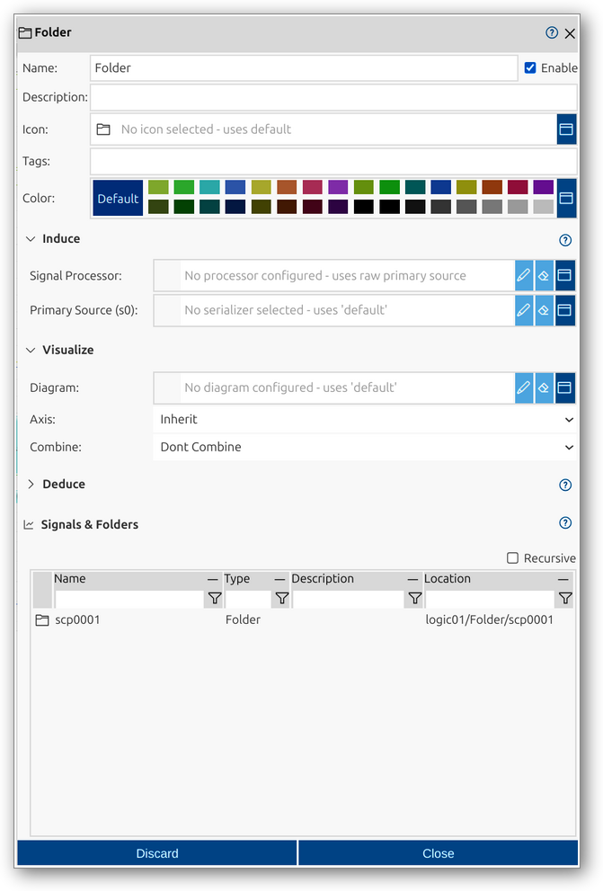

# Folder
Folders in impulse are hierarchical containers used to organize View Signals and other Folders within a view. They help structure complex datasets, making navigation and analysis more efficient. Folders can be customized with color, tags, and other properties, and support advanced configuration for signal processing and visualization.

A folder in impulse is defined by several key components:
- **Color**: Select a color for the folder for visual distinction.
- **Induce**: Configure signal processor and primary source for the folder.
- **Visualize**: Set diagram type, axis, and combine options for visualization.
- **Deduce**: Configure additional context or details for the folder.
- **Signals & Folders**: Tabular overview of contained signals and folders.
- **Recursive**: Option to display contents recursively, showing all nested elements.

For a comprehensive overview of folders and their role in views, see the [Views manual page](../impulse-manual/4_views.md).

The Folder dialog provides a user interface for viewing and editing the properties of a folder. You can configure all relevant attributes, organize signals and folders, and control advanced processing and visualization options.

## Dialog Sections and Fields

### General Section
This section contains the main identification and categorization properties of the folder. These fields help you organize and document the structure of your folders, making it easier to manage and collaborate.

- **Name**: The unique name of the folder as it will appear throughout impulse. Choose a descriptive name to clarify the folder's role.
- **Enable**: Checkbox to activate or deactivate the folder. Disabling a folder hides its effect but retains its configuration.
- **Description**: Free-form text area for documenting the folder’s purpose or any relevant notes.
- **Icon**: Select or display an icon for the folder.
- **Tags**: Keywords or labels for categorizing and filtering folders.
- **Color**: Select a color for the folder for visual distinction.

### Induce Section
This section allows you to configure signal processing for the folder. It enables you to display a signal directly in the folder's visualization space, even when the folder is not expanded. This can be used to show an important signal from within the folder as an overview, to combine or extract information from the contained signals for analysis, or to represent a scope-level signal (such as logs of a module that contains other signals).

- **Signal Processor**: Select or configure a processor for the signal (e.g., Logic Extract).
- **Processor Configuration**: Choose a predefined configuration or set processor properties directly. If a processor configuration is selected, processor properties are not visible.
- **Primary Source (s0)**: Select the main input signal or serializer for the View Signal.
- **Additional Sources (s1, ...)**: Depending on the selected processor, you may specify extra input signals for advanced processing or combination.
- **Processor Properties**: The available properties depend on the selected processor. Configure extraction, bit manipulation, or other processing options as provided by the chosen processor. If a processor configuration is selected, processor properties are not visible.

### Visualize Section
This section allows you to configure how the folder and its contents are displayed.

- **Diagram**: Select or configure the diagram type for visualization (e.g., Gantt Diagram).
- **Configuration**: Choose a predefined configuration or set diagram properties directly. If a diagram configuration is selected, diagram properties are not visible.
- **Axis**: Choose the axis for the signal (inherit or specific axis).
- **Combine**: Specify how signals are combined for display (e.g., overlay, group).
- **Diagram Properties**: Set options such as show relations, multi-color, annotated, value format, and value column format. If a diagram configuration is selected, diagram properties are not visible.

### Deduce Section
This section provides additional context or details for the View Signal, such as derived signals or signal components. If the processor in the Induce section generates deduced signals from the main signal, the Deduce option is not available. If deduced signals are created by the Induce processor or the Deduce processor option is set, these deduced signals will overshadow other signals in the folder (they will not be shown).

- **Signal Processor**: Select or configure a processor for deducing signals (e.g., Logic Splitter, Struct Splitter).
- **Processor Configuration**: Choose a predefined configuration or set processor properties directly. If a processor configuration is selected, processor properties are not visible.
- **Processor Properties**: The available properties depend on the selected processor. Configure options for deducing signals as provided by the chosen processor. If a processor configuration is selected, processor properties are not visible.
- **Deduced Signals**: Tabular overview of deduced signals, with options to add, insert, delete, view/edit, and reorder.

#### Deduced Signals
Derived signals are automatically created by the selected processor and do not have any user settings by default (such as color or display options). If you want to view or visualize these signals differently than the default, you can add a "Deduced Signal" entry. This is done by double-clicking a deduced signal to edit, which prompts you to create a custom setting. The settings you define for a Deduced Signal will be applied to the visualization of the corresponding derived signal if available. The Deduced Signals table provides an overview of which derived signals have custom settings and allows you to manage them (add, edit, delete, reorder).

### Signals & Folders Section
This section provides a tabular overview of the signals and folders contained within the folder. It allows you to inspect and manage the hierarchical structure, including recursive display of nested elements.

- **Name**: Name of the signal or folder.
- **Type**: Type (e.g., View Signal, Folder).
- **Description**: Description of the element.
- **Location**: Path or location within the folder hierarchy.
- **Recursive**: Option to display contents recursively.

### Actions
- **Discard**: Cancel changes and close the dialog.
- **Close**: Save changes and close the dialog.

This dialog allows you to fully configure and manage folders, supporting structured organization and advanced processing of signal data. The hierarchical structure, color coding, and flexible configuration options make it easy to tailor folders for efficient analysis and interpretation.
