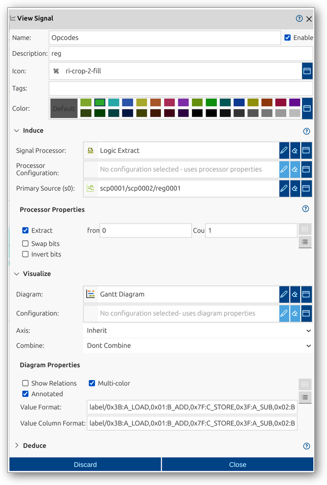
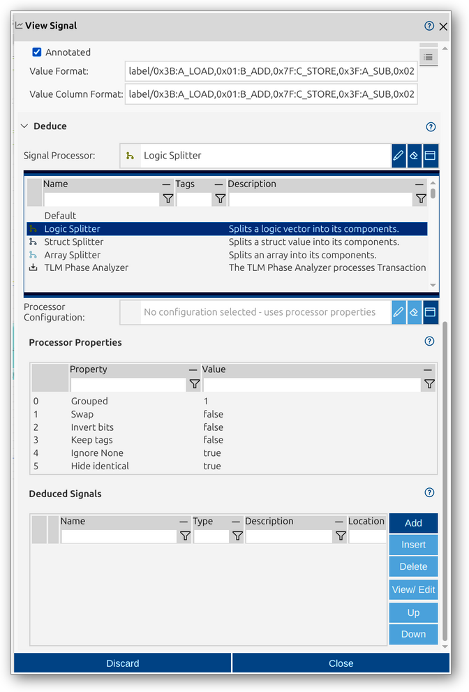

# View Signal
View Signals in impulse are configurable representations of signal data within a view. They provide information on which signal to use or how to generate it, without storing the data themselves. View Signals can represent direct mappings, derived signals, or newly created signals, and offer flexible options for visualization and analysis.

A View Signal in impulse is defined by several key components:
- **Color**: Select a color for the signal for visual distinction.
- **Induce**: Configure signal processor, processor properties, and primary source for the signal.
- **Visualize**: Set diagram type, axis, combine options, and diagram properties for visualization.
- **Deduce**: Configure additional context, derived signals, or annotations for the signal.

For a comprehensive overview of View Signals and their role in views, see the [View Signals manual page](../impulse-manual/5_viewsignals.md).

The View Signal dialog provides a user interface for viewing and editing the properties of a View Signal. You can configure all relevant attributes, set up processing and visualization options, and manage deduced signals.

## Dialog Sections and Fields

### General Section
This section contains the main identification and categorization properties of the View Signal. These fields help you organize and document the signal, making it easier to manage and collaborate.

- **Name**: The unique name of the View Signal as it will appear throughout impulse. Choose a descriptive name to clarify the signal's role.
- **Enable**: Checkbox to activate or deactivate the View Signal. Disabling a signal hides its effect but retains its configuration.
- **Description**: Free-form text area for documenting the signal’s purpose or any relevant notes.
- **Icon**: Select or display an icon for the signal.
- **Tags**: Keywords or labels for categorizing and filtering signals.
- **Color**: Select a color for the signal for visual distinction.

### Induce Section
This section allows you to configure the input or source of the View Signal, including signal processor, processor configuration, and primary source. Processor properties can be set for advanced extraction or transformation.

- **Signal Processor**: Select or configure a processor for the signal (e.g., Logic Extract).
- **Processor Configuration**: Choose a predefined configuration or set processor properties directly. If a processor configuration is selected, processor properties are not visible.
- **Primary Source (s0)**: Select the main input signal or serializer for the View Signal.
- **Additional Sources (s1, ...)**: Depending on the selected processor, you may specify extra input signals for advanced processing or combination.
- **Processor Properties**: The available properties depend on the selected processor. Configure extraction, bit manipulation, or other processing options as provided by the chosen processor. If a processor configuration is selected, processor properties are not visible.

### Visualize Section
This section allows you to configure how the View Signal is displayed, including diagram type, axis, combine options, and diagram properties.

- **Diagram**: Select or configure the diagram type for visualization (e.g., Gantt Diagram).
- **Configuration**: Choose a predefined configuration or set diagram properties directly. If a diagram configuration is selected, diagram properties are not visible.
- **Axis**: Choose the axis for the signal (inherit or specific axis).
- **Combine**: Specify how signals are combined for display (e.g., overlay, group).
- **Diagram Properties**: Set options such as show relations, multi-color, annotated, value format, and value column format. If a diagram configuration is selected, diagram properties are not visible.

### Deduce Section
This section provides additional context or details for the View Signal, such as derived signals or signal components. When you expand the signal's node, you see the deduced signals. If no deduce processor is selected, the system decides for a default processor (for example, a logic vector will show its bits). If the Induce processor already prepares deduced signals, the Deduce option is not available.

- **Signal Processor**: Select or configure a processor for deducing signals (e.g., Logic Splitter, Struct Splitter).
- **Processor Configuration**: Choose a predefined configuration or set processor properties directly. If a processor configuration is selected, processor properties are not visible.
- **Processor Properties**: The available properties depend on the selected processor. Configure options for deducing signals as provided by the chosen processor. If a processor configuration is selected, processor properties are not visible.
- **Deduced Signals**: Tabular overview of deduced signals, with options to add, insert, delete, view/edit, and reorder.

#### Deduced Signals
Derived signals are automatically created by the selected processor and do not have any user settings by default (such as color or display options). If you want to view or visualize these signals differently than the default, you can add a "Deduced Signal" entry. This is done by double-clicking a deduced signal to edit, which prompts you to create a custom setting. The settings you define for a Deduced Signal will be applied to the visualization of the corresponding derived signal if available. The Deduced Signals table provides an overview of which derived signals have custom settings and allows you to manage them (add, edit, delete, reorder).

### Actions
- **Discard**: Cancel changes and close the dialog.
- **Close**: Save changes and close the dialog.

This dialog allows you to fully configure and manage View Signals, supporting advanced processing, visualization, and analysis of signal data. The flexible configuration options and support for deduced signals make it easy to tailor View Signals for efficient interpretation and exploration.
