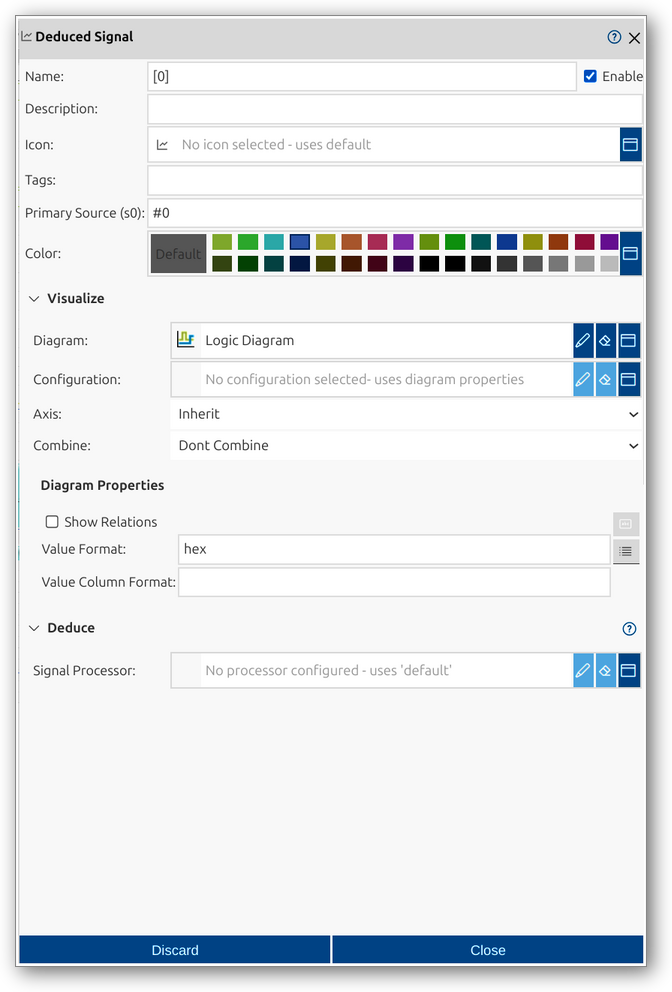

# Deduced Signal
Deduced Signals in impulse are user-defined customizations for derived signals automatically created by a processor (such as splitting a logic vector into bits or extracting struct members). By default, these derived signals have no user settings by default. Creating a Deduced Signal allows you to override the default visualization and properties for a specific derived signal, such as color, diagram type, or value format.

For a comprehensive overview of deduced signals and their role in views, see the [View Signals manual page](../impulse-manual/5_viewsignals.md).

The Deduced Signal dialog provides a user interface for viewing and editing the properties of a deduced signal. You can configure all relevant attributes, set up visualization options, and optionally further deduce the signal.

## Dialog Sections and Fields

### General Section
This section contains the main identification and categorization properties of the deduced signal. These fields help you organize and document the signal, making it easier to manage and collaborate.

- **Name**: The name of the deduced signal, typically corresponding to the derived signal (e.g., a bit index or struct member).
- **Enable**: Checkbox to activate or deactivate the deduced signal customization.
- **Description**: Free-form text area for documenting the deduced signal’s purpose or any relevant notes.
- **Icon**: Select or display an icon for the deduced signal.
- **Tags**: Keywords or labels for categorizing and filtering deduced signals.
- **Primary Source (s0)**: Reference to the underlying derived signal.
- **Color**: Select a color for the deduced signal for visual distinction.

### Visualize Section
This section allows you to configure how the deduced signal is displayed, including diagram type, axis, combine options, and diagram properties.

- **Diagram**: Select or configure the diagram type for visualization (e.g., Logic Diagram).
- **Configuration**: Choose a predefined configuration or set diagram properties directly. If a diagram configuration is selected, diagram properties are not visible.
- **Axis**: Choose the axis for the deduced signal (inherit or specific axis).
- **Combine**: Specify how signals are combined for display (e.g., overlay, group).
- **Diagram Properties**: Set options such as show relations, value format, and value column format. If a diagram configuration is selected, diagram properties are not visible.

### Deduce Section
This section allows you to perform further analysis or extraction on an already deduced signal. Even though this signal is derived, you can go deeper by selecting and configuring an additional processor to split, decode, or transform the signal further. For example, you might extract individual bits from a logic signal, break down a struct member, or apply protocol analysis. The available options and properties depend on the selected processor, enabling flexible and detailed exploration of signal components.

- **Signal Processor**: Select or configure a processor for deducing signals (e.g., Logic Splitter, Struct Splitter).
- **Processor Configuration**: Choose a predefined configuration or set processor properties directly. If a processor configuration is selected, processor properties are not visible.
- **Processor Properties**: The available properties depend on the selected processor. Configure options for deducing signals as provided by the chosen processor. If a processor configuration is selected, processor properties are not visible.

- **Signal Processor**: Select or configure a processor for further deducing the signal. If none is set, the default is used.

### Actions
- **Discard**: Cancel changes and close the dialog.
- **Close**: Save changes and close the dialog.

This dialog allows you to fully customize the visualization and properties of deduced signals, overriding the default settings for derived signals created by a processor. The flexible configuration options make it easy to tailor deduced signals for efficient interpretation and exploration within views.
