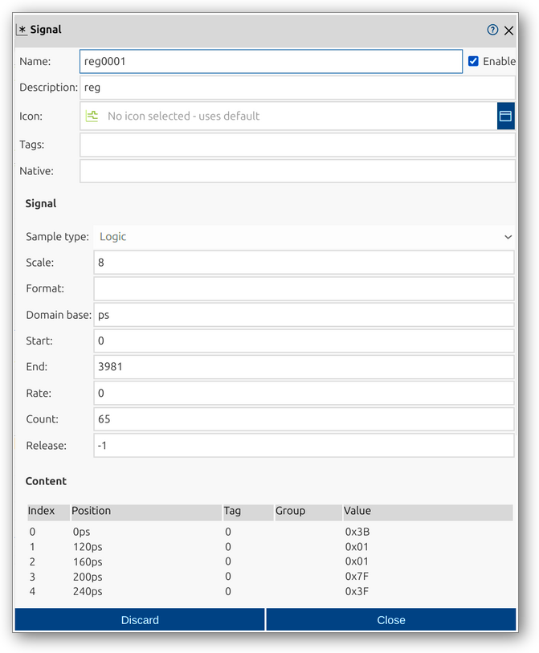

<!--895-->
# Signal
Signals are fundamental data structures in impulse, used to represent streams of values over time. Each signal can have attributes such as name, type, tags, scale, and format, allowing flexible modeling of digital, analog, or structured data. Understanding signals and their properties is essential for effectively visualizing and analyzing data in impulse.

A signal in impulse can contain up to 2^31 samples and is defined by several key components:
- **Process Type**: Specifies if the signal is discrete (samples at arbitrary positions) or continuous (samples at regular intervals).
- **Signal Type**: Categorizes the signal (e.g., logic, float, integer, event, text, structure, binary).
- **Tags**: Metadata describing the signal's purpose or meaning (e.g., state, event, transaction).
- **Scale**: Dimension of the signal, such as bit width or array size.
- **Format Specifier**: Defines how values are represented textually (e.g., binary, decimal, hex, label).
- **Domain Base**: Minimum distance between two samples, typically in time units.
- **Start/End**: Define the range of the signal.
- **Rate**: Progression rate for continuous signals.
- **Samples**: Value changes that capture the dynamic nature of the signal.
- **Attachments**: Relations and labels for each sample, enhancing descriptive power.

For a comprehensive overview of signals, including advanced topics like attachments, grouped samples, and best practices, see the [Understanding Signals manual page](../impulse-manual/8_signals.md).

The Signal dialog provides a user interface for viewing and editing the properties of a signal. Through this dialog, you can configure all relevant attributes of a signal, such as its name, type, tags, scale, and format specifier, ensuring the signal is correctly defined for your analysis and visualization needs.

## Dialog Sections and Fields

### General Section
  This section contains the fundamental identification and categorization properties of the signal. Here, you define how the signal will appear and be referenced throughout impulse, including its name, visibility, and descriptive metadata. The fields in this section help you organize signals within your workspace, making it easier to manage large sets of signals, apply filters, and provide meaningful context for yourself and collaborators. Properly filling out these fields ensures that signals are easily recognizable and their purpose is clear in any analysis or visualization.

  - **Name**: The unique name of the signal as it will appear throughout impulse. Choose a descriptive name to make it easy to identify the signal in lists and visualizations.
  - **Enable**: A checkbox to activate or deactivate the signal. Disabling a signal hides it from views and analyses but retains its configuration for later use.
  - **Description**: A free-form text area for documenting the signal’s purpose, origin, or any other relevant notes. This helps collaborators and future users understand the context of the signal.
  - **Icon**: Lets you select or display an icon that visually represents the signal in the UI, making it easier to distinguish between different types of signals at a glance.
  - **Tags**: Keywords or labels that help categorize and filter signals. Tags can be used for grouping, searching, or applying specific display rules.
  - **Native**: (Optional) The original or source name of the signal, useful when importing signals from external tools or file formats to preserve their original identifiers.

### Signal Section
  This section displays the technical and structural properties of the signal, but all fields here are read-only. It provides an overview of how the signal's data is stored, interpreted, and displayed, including its data type, dimensionality, formatting, and timing information. Reviewing these properties helps you understand the structure and characteristics of the signal, ensuring that it is correctly processed and visualized in your analysis. If you need to change any of these properties, you must do so outside of this dialog, typically at the time of signal creation or import.

  - **Sample type**: Defines the data type for the signal’s samples, such as Logic (digital), Integer, Float, Text, Structure (composite), or Binary. This determines how the data is interpreted and displayed.
  - **Scale**: Indicates the dimension or width of the signal. For example, for a logic signal, this could be the number of bits; for arrays, it could be the number of elements. This field is essential for representing multi-bit or multi-dimensional data.
  - **Format**: Specifies how the signal’s values are shown in tables and plots, such as binary, decimal, hexadecimal, ASCII, or other formats. This allows you to tailor the display to the nature of your data.
  - **Domain base**: Sets the unit for the signal’s domain, such as nanoseconds (ns), picoseconds (ps), or other time/position units. This affects how sample positions are calculated and displayed.
  - **Start**: The starting position or time for the signal, defining where the signal’s data begins in the domain. This is important for aligning signals in time-based analyses.
  - **End**: The ending position or time for the signal, marking where the signal’s data ends in the domain.
  - **Rate**: The interval at which samples occur. For continuous signals, this is a fixed value; for discrete signals, this is set to zero, indicating samples can occur at arbitrary positions.
  - **Count**: Displays the total number of samples in the signal, providing a quick overview of its length or density.
  - **Release**: An advanced or internal field, typically used for versioning, synchronization, or technical purposes. Most users can leave this field unchanged.

### Content Section
  This section provides a detailed, tabular overview of all the samples contained within the signal. It allows you to inspect the raw data points that make up the signal, including their positions, values, and any associated tags or group information. The table format makes it easy to review, compare, and analyze individual samples, especially in signals with a large number of data points or complex event groupings. 

  - **Index**: Sample index.
  - **Position**: Time or position of the sample.
  - **Tag**: Tag value for the sample (if any).
  - **Group**: Group identifier for grouped samples.
  - **Value**: The value of the sample.

### Actions
  - **Discard**: Cancel changes and close the dialog.
  - **Close**: Save changes and close the dialog.

This dialog allows you to fully inspect and modify the structure and content of a signal, ensuring it is accurately defined for your data analysis tasks.

