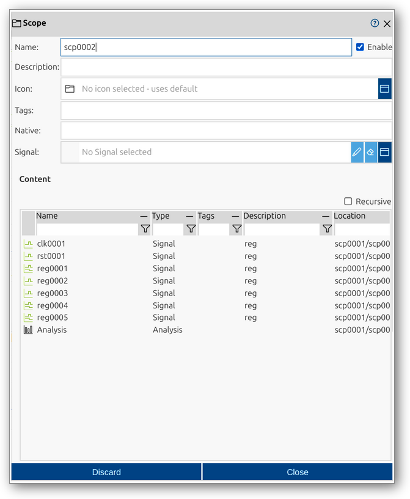

<!--1104-->
# Scope
Scopes are organizational elements in impulse, used to group and structure signals within a record. They provide a hierarchical framework, making it easier to manage, navigate, and analyze large sets of signals. Scopes can contain signals, other scopes, and various record elements, reflecting the logical or physical structure of the system being analyzed.

A scope in impulse is defined by several key components:
- **Native**: (Optional) Original or source name, useful for imported data.
- **Signal**: (Optional) Reference to a signal, used for proxying or linking.

For a comprehensive overview of records and their elements, including scopes, see the [Records manual page](../impulse-manual/7_records.md).

The Scope dialog provides a user interface for viewing and editing the properties of a scope. Through this dialog, you can configure all relevant attributes of a scope, organize signals, and manage the structure of your record.

## Dialog Sections and Fields

### General Section
This section contains the main identification and categorization properties of the scope. These fields help you organize and document the structure of your records, making it easier to manage complex datasets and collaborate with others.

- **Name**: The unique name of the scope as it will appear throughout impulse. Choose a descriptive name to clarify the scope's role in the hierarchy.
- **Enable**: Checkbox to activate or deactivate the scope. Disabling a scope hides its contents from views and analyses but retains its configuration.
- **Description**: Free-form text area for documenting the scope’s purpose, contents, or any relevant notes.
- **Icon**: Select or display an icon for the scope, aiding quick identification in the UI.
- **Tags**: Keywords or labels for categorizing and filtering scopes.
- **Native**: (Optional) The original or source name of the scope, useful for preserving identifiers from imported data.
- **Signal**: (Optional) Reference to a signal, typically used for proxying or linking purposes.

### Content Section
This section provides a tabular overview of the elements contained within the scope. It allows you to inspect and manage the signals and sub-scopes that make up the scope’s contents. The table format makes it easy to review, filter, and analyze the structure of the record.

- **Name**: Name of the contained element (signal or sub-scope).
- **Type**: Type of the element (e.g., Signal, Scope).
- **Tags**: Tags associated with the element.
- **Description**: Description of the element.
- **Location**: Path or location of the element within the record hierarchy.
- **Recursive**: Option to display contents recursively, showing all nested elements.

### Actions
- **Discard**: Cancel changes and close the dialog.
- **Close**: Save changes and close the dialog.

This dialog allows you to fully inspect and modify the structure and content of a scope, ensuring your records are organized for efficient data analysis and navigation.
