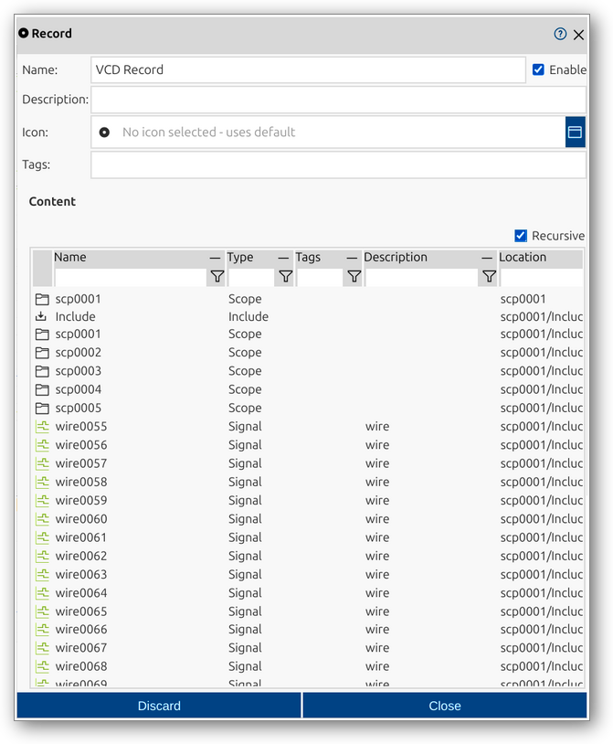

<!--1107-->
# Record
Records are the top-level organizational structures in impulse, used to collect, manage, and analyze sets of signals and related elements. A record provides a hierarchical framework for organizing signals, scopes, proxies, and relations, enabling efficient handling of complex datasets from various sources such as simulations, log files, or measurements.

For a comprehensive overview of records and their elements, including signals, scopes, proxies, and relations, see the [Records manual page](../impulse-manual/7_records.md).

The Record dialog provides a user interface for viewing and editing the properties of a record. Through this dialog, you can configure all relevant attributes, organize the structure, and manage the content of your record.

## Dialog Sections and Fields

### General Section
This section contains the main identification and categorization properties of the record. These fields help you organize and document the structure of your data, making it easier to manage and collaborate on complex projects.

- **Name**: The unique name of the record as it will appear throughout impulse. Choose a descriptive name to clarify the record's role or source.
- **Enable**: Checkbox to activate or deactivate the record. Disabling a record hides its contents from views and analyses but retains its configuration.
- **Description**: Free-form text area for documenting the record’s purpose, contents, or any relevant notes.
- **Icon**: Select or display an icon for the record, aiding quick identification in the UI.
- **Tags**: Keywords or labels for categorizing and filtering records.

### Content Section
This section provides a tabular overview of the elements contained within the record. It allows you to inspect and manage the scopes, signals, and other elements that make up the record’s contents. The table format makes it easy to review, filter, and analyze the structure of the record.

- **Name**: Name of the contained element (scope, signal, etc.).
- **Type**: Type of the element (e.g., Scope, Signal).
- **Tags**: Tags associated with the element.
- **Description**: Description of the element.
- **Location**: Path or location of the element within the record hierarchy.
- **Recursive**: Option to display contents recursively, showing all nested elements.

### Actions
- **Discard**: Cancel changes and close the dialog.
- **Close**: Save changes and close the dialog.

This dialog allows you to fully inspect and modify the structure and content of a record, ensuring your data is organized for efficient analysis and navigation.
