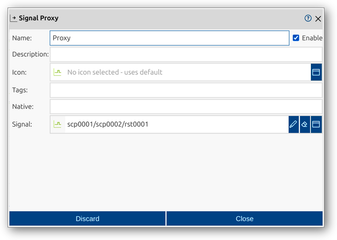

<!--1110-->
# Proxy
Proxies are special elements in impulse that act as references or placeholders for signals within a record. They enable dynamic and flexible interactions by allowing signals to be reused, linked, or presented in multiple locations without duplicating the underlying data. Proxies are essential for creating alternative views, establishing relationships, or organizing complex datasets efficiently.

A proxy in impulse is defined by several key components:
- **Signal**: Reference to the signal being proxied or linked.

For a comprehensive overview of records and their elements, including proxies, see the [Records manual page](../impulse-manual/7_records.md).

The Proxy dialog provides a user interface for viewing and editing the properties of a proxy. Through this dialog, you can configure all relevant attributes, select the referenced signal, and manage how proxies are used within your record.

## Dialog Sections and Fields

### General Section
This section contains the main identification and categorization properties of the proxy. These fields help you organize and document the structure of your records, making it easier to manage complex datasets and collaborate with others.

- **Name**: The unique name of the proxy as it will appear throughout impulse. Choose a descriptive name to clarify the proxy's role or reference.
- **Enable**: Checkbox to activate or deactivate the proxy. Disabling a proxy hides it from views and analyses but retains its configuration.
- **Description**: Free-form text area for documenting the proxy’s purpose, contents, or any relevant notes.
- **Icon**: Select or display an icon for the proxy, aiding quick identification in the UI.
- **Tags**: Keywords or labels for categorizing and filtering proxies.
- **Native**: (Optional) The original or source name of the proxy, useful for preserving identifiers from imported data.
- **Signal**: Reference to the signal being proxied or linked. This field allows you to select the target signal from anywhere in the record structure.

### Actions
- **Discard**: Cancel changes and close the dialog.
- **Close**: Save changes and close the dialog.

This dialog allows you to fully configure and manage proxies, supporting flexible organization, reuse, and analysis of signals within your records.
