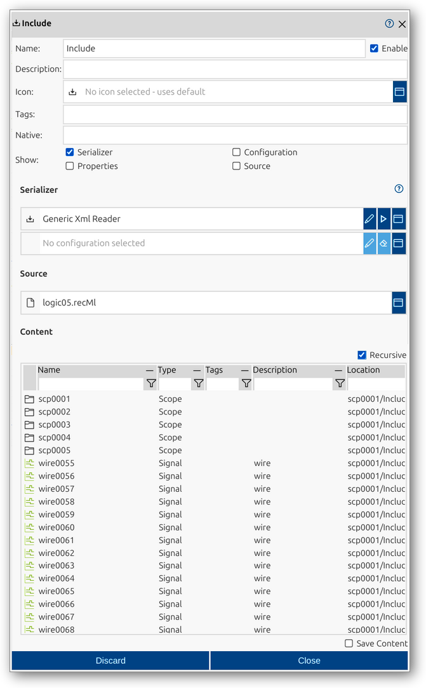
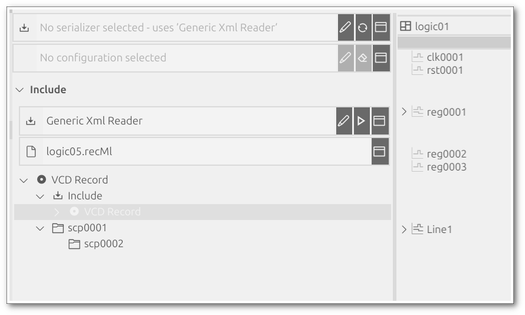

<!--1113-->
# Include
Includes are active record elements in impulse that allow you to import external files or data sources into a record. This feature enables the reuse of data and configurations across multiple records, providing flexibility and consistency in analysis workflows. Includes can bring in signals, scopes, and other record elements from various sources, integrating them seamlessly into the current record structure.

An include in impulse is defined by several key components:
- **Native**: (Optional) Original or source name, useful for imported data.
- **Show flags**: Options to display configuration sections (Serializer, Source, Configuration, Properties) directly in the main viewer for quick access.
- **Serializer**: The reader or serializer used to interpret the included file or data.
- **Configuration**: (Optional) Custom configuration for the selected serializer.
- **Source**: The file or path to be included.

For a comprehensive overview of records and their elements, including includes, see the [Records manual page](../impulse-manual/7_records.md).

The Include dialog provides a user interface for viewing and editing the properties of an include. Through this dialog, you can configure all relevant attributes, select the serializer and source, and control which configuration sections are shown in the main viewer using the Show flags.

## Dialog Sections and Fields

### General Section
This section contains the main identification and categorization properties of the include. These fields help you organize and document the structure of your records, making it easier to manage complex datasets and collaborate with others.

- **Name**: The unique name of the include as it will appear throughout impulse. Choose a descriptive name to clarify the include's role or source.
- **Enable**: Checkbox to activate or deactivate the include. Disabling an include hides its content from views and analyses but retains its configuration.
- **Description**: Free-form text area for documenting the include’s purpose, contents, or any relevant notes.
- **Icon**: Select or display an icon for the include, aiding quick identification in the UI.
- **Tags**: Keywords or labels for categorizing and filtering includes.
- **Native**: (Optional) The original or source name of the include, useful for preserving identifiers from imported data.
- **Show**: Flags to control which configuration sections (Serializer, Source, Configuration, Properties) are displayed directly in the main viewer for quick access and adjustment.

### Serializer Section
This section allows you to select the serializer (reader) used to interpret the included file or data. You can also specify a configuration for the serializer if needed.

- **Serializer**: Choose the serializer appropriate for the data format being included (e.g., Generic Xml Reader).
- **Configuration**: (Optional) Set a custom configuration for the serializer to control how the data is read and interpreted.

### Source Section
This section specifies the file or path to be included. You can select a file using the dialog or manually enter the path.

- **Source**: The file or data source to be included in the record.

### Content Section
This section provides a tabular overview of the elements contained within the included file or data source. It allows you to inspect and manage the signals, scopes, and other elements that are brought into the record by the include. The table format makes it easy to review, filter, and analyze the structure of the included content.

- **Name**: Name of the contained element (signal, scope, etc.).
- **Type**: Type of the element (e.g., Signal, Scope).
- **Tags**: Tags associated with the element.
- **Description**: Description of the element.
- **Location**: Path or location of the element within the record hierarchy.
- **Recursive**: Option to display contents recursively, showing all nested elements.
- **Save Content**: If enabled, the content generated or imported by this include element will be saved together with the main record. This ensures that the included data becomes a permanent part of the record, rather than being dynamically loaded each time.

### Actions
- **Discard**: Cancel changes and close the dialog.
- **Close**: Save changes and close the dialog.

This dialog allows you to fully configure and manage includes, supporting flexible integration and reuse of data across records. The Show flags make it easy to access and adjust key configuration sections directly in the main viewer, streamlining your workflow.

