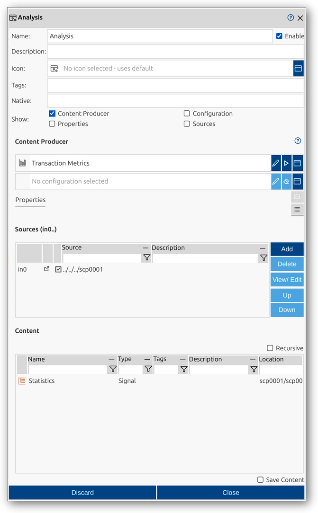

<!--1118-->
# Analysis
Analysis elements are active record components in impulse that calculate new signals or data from existing content within a record. They enable advanced processing, transformation, and interpretation of signal data, supporting workflows such as statistical calculations, mathematical transformations, and protocol decoding. Analysis elements can operate in the background and update record content dynamically as new data becomes available.

An analysis in impulse is defined by several key components:
- **Native**: (Optional) Original or source name, useful for imported data.
- **Show flags**: Options to display configuration sections (Content Producer, Sources, Configuration, Properties) directly in the main viewer for quick access.
- **Content Producer**: The analysis module or transformation to be applied to the input data.
- **Configuration**: (Optional) Custom configuration for the selected analysis module.
- **Sources**: The input signals, scopes, or other elements to be analyzed or transformed.

For a comprehensive overview of records and their elements, including analysis, see the [Records manual page](../impulse-manual/7_records.md).

The Analysis dialog provides a user interface for viewing and editing the properties of an analysis element. Through this dialog, you can configure all relevant attributes, select the analysis module and sources, and control which configuration sections are shown in the main viewer using the Show flags.

## Dialog Sections and Fields

### General Section
This section contains the main identification and categorization properties of the analysis. These fields help you organize and document the structure of your records, making it easier to manage complex datasets and collaborate with others.

- **Name**: The unique name of the analysis as it will appear throughout impulse. Choose a descriptive name to clarify the analysis's role or function.
- **Enable**: Checkbox to activate or deactivate the analysis. Disabling an analysis hides its results from views and analyses but retains its configuration.
- **Description**: Free-form text area for documenting the analysis’s purpose, contents, or any relevant notes.
- **Icon**: Select or display an icon for the analysis, aiding quick identification in the UI.
- **Tags**: Keywords or labels for categorizing and filtering analysis elements.
- **Native**: (Optional) The original or source name of the analysis, useful for preserving identifiers from imported data.
- **Show**: Flags to control which configuration sections (Content Producer, Sources, Configuration, Properties) are displayed directly in the main viewer for quick access and adjustment.

### Content Producer Section
This section allows you to select the analysis module or transformation to be applied to the input data. You can also specify a configuration for the analysis if needed.

- **Content Producer**: Choose the analysis module appropriate for the desired processing (e.g., Transaction Metrics).
- **Configuration**: (Optional) Set a custom configuration for the analysis module to control how the data is processed and interpreted.

### Sources Section
This section specifies the input signals, scopes, or other elements to be analyzed. You can select sources using the dialog or manually enter the path.

- **Sources**: The input data elements (signals, scopes, etc.) to be analyzed or transformed. Multiple sources can be specified and managed in a table.

### Content Section
This section provides a tabular overview of the results or output signals generated by the analysis. It allows you to inspect and manage the new signals or data produced by the analysis element. The table format makes it easy to review, filter, and analyze the structure of the analysis output.

- **Name**: Name of the output element (signal, etc.).
- **Type**: Type of the output element (e.g., Signal).
- **Tags**: Tags associated with the output element.
- **Description**: Description of the output element.
- **Location**: Path or location of the output element within the record hierarchy.
- **Recursive**: Option to display contents recursively, showing all nested elements.
- **Save Content**: If enabled, the content generated or imported by this include element will be saved together with the main record. This ensures that the included data becomes a permanent part of the record, rather than being dynamically loaded each time.

### Actions
- **Discard**: Cancel changes and close the dialog.
- **Close**: Save changes and close the dialog.

This dialog allows you to fully configure and manage analysis elements, supporting advanced processing and transformation of data within your records. The Show flags make it easy to access and adjust key configuration sections directly in the main viewer, streamlining your workflow.
