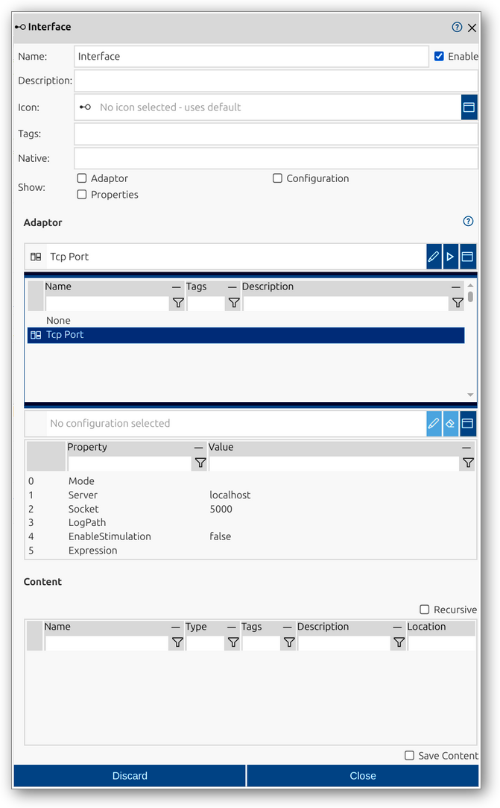

<!--1121-->
# Interface
Interfaces are active record elements in impulse that connect records to external signal sources, such as hardware devices, configurable readers, or external libraries. This feature enables seamless integration with a wide variety of applications and external hardware, allowing you to acquire, process, and analyze live or remote data within your record structure.

An interface in impulse is defined by several key components:
- **Native**: (Optional) Original or source name, useful for imported data.
- **Show flags**: Options to display configuration sections (Adaptor, Configuration, Properties) directly in the main viewer for quick access.
- **Adaptor**: The adapter or driver used to connect to the external source (e.g., TCP port, serial interface, or specific hardware).
- **Configuration**: (Optional) Custom configuration for the selected adapter.
- **Properties**: Additional properties or settings for the adapter.

For a comprehensive overview of records and their elements, including interfaces, see the [Records manual page](../impulse-manual/7_records.md).

The Interface dialog provides a user interface for viewing and editing the properties of an interface element. Through this dialog, you can configure all relevant attributes, select the adapter and configuration, and control which configuration sections are shown in the main viewer using the Show flags.

## Dialog Sections and Fields

### General Section
This section contains the main identification and categorization properties of the interface. These fields help you organize and document the structure of your records, making it easier to manage complex datasets and collaborate with others.

- **Name**: The unique name of the interface as it will appear throughout impulse. Choose a descriptive name to clarify the interface's role or function.
- **Enable**: Checkbox to activate or deactivate the interface. Disabling an interface hides its results from views and analyses but retains its configuration.
- **Description**: Free-form text area for documenting the interface’s purpose, contents, or any relevant notes.
- **Icon**: Select or display an icon for the interface, aiding quick identification in the UI.
- **Tags**: Keywords or labels for categorizing and filtering interface elements.
- **Native**: (Optional) The original or source name of the interface, useful for preserving identifiers from imported data.
- **Show**: Flags to control which configuration sections (Adaptor, Configuration, Properties) are displayed directly in the main viewer for quick access and adjustment.

### Adaptor Section
This section allows you to select the adapter or driver used to connect to the external source. You can also specify a configuration and set properties for the adapter if needed.

- **Adaptor**: Choose the adapter appropriate for the external source (e.g., TCP Port, Serial Interface).
- **Configuration**: (Optional) Set a custom configuration for the adapter to control how the data is acquired and processed.
- **Properties**: Additional properties or settings for the adapter, such as mode, server, socket, log path, and other relevant parameters.

### Content Section
This section provides a tabular overview of the signals or data acquired through the interface. It allows you to inspect and manage the elements brought into the record by the interface. The table format makes it easy to review, filter, and analyze the structure of the acquired content.

- **Name**: Name of the acquired element (signal, etc.).
- **Type**: Type of the element (e.g., Signal).
- **Tags**: Tags associated with the element.
- **Description**: Description of the element.
- **Location**: Path or location of the element within the record hierarchy.
- **Recursive**: Option to display contents recursively, showing all nested elements.
- **Save Content**: If enabled, the content acquired by this interface element will be saved together with the main record. This ensures that the acquired data becomes a permanent part of the record, rather than being dynamically loaded each time.

### Actions
- **Discard**: Cancel changes and close the dialog.
- **Close**: Save changes and close the dialog.

This dialog allows you to fully configure and manage interface elements, supporting flexible integration of external data sources into your records. The Show flags make it easy to access and adjust key configuration sections directly in the main viewer, streamlining your workflow.
