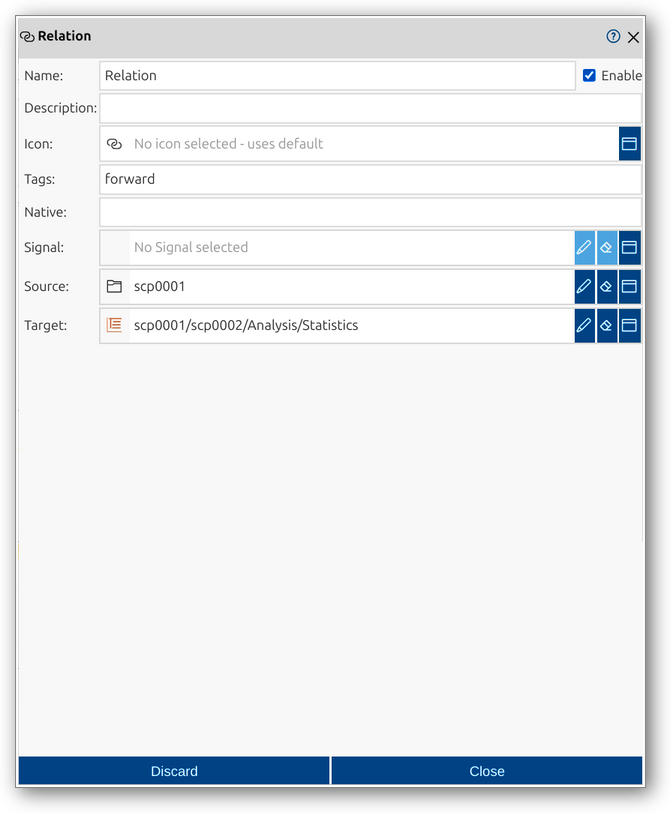

<!--1125-->
# Relation
Relations are record elements in impulse that define connections between signals, proxies, scopes, and other record elements (except other relations). They facilitate structured interactions and dependencies within the record, enabling advanced analysis and visualization workflows. Relations can specify sources and targets, describe the type of relationship, and provide additional metadata for analysis and documentation.

A relation in impulse is defined by several key components:
- **Native**: (Optional) Original or source name, useful for imported data.
- **Show flags**: Options to display configuration sections directly in the main viewer for quick access.
- **Signal**: The signal element involved in the relation (optional).
- **Source**: The source element of the relation (signal, scope, etc.).
- **Target**: The target element of the relation (signal, scope, etc.).

For a comprehensive overview of records and their elements, including relations, see the [Records manual page](../impulse-manual/7_records.md).

The Relation dialog provides a user interface for viewing and editing the properties of a relation. Through this dialog, you can configure all relevant attributes, select the source and target elements, and control which configuration sections are shown in the main viewer using the Show flags.

## Dialog Sections and Fields

### General Section
This section contains the main identification and categorization properties of the relation. These fields help you organize and document the structure of your records, making it easier to manage complex datasets and collaborate with others.

- **Name**: The unique name of the relation as it will appear throughout impulse. Choose a descriptive name to clarify the relation's role or type.
- **Enable**: Checkbox to activate or deactivate the relation. Disabling a relation hides its effect from views and analyses but retains its configuration.
- **Description**: Free-form text area for documenting the relation’s purpose, contents, or any relevant notes.
- **Icon**: Select or display an icon for the relation, aiding quick identification in the UI.
- **Tags**: Keywords or labels for categorizing and filtering relations.
- **Native**: (Optional) The original or source name of the relation, useful for preserving identifiers from imported data.
- **Show**: Flags to control which configuration sections are displayed directly in the main viewer for quick access and adjustment.

### Relation Section
This section allows you to specify the elements involved in the relation.

- **Signal**: (Optional) Select a signal element to associate with the relation.
- **Source**: Select the source element of the relation (signal, scope, etc.).
- **Target**: Select the target element of the relation (signal, scope, etc.).

### Content Section
This section may provide a tabular overview of the elements or metadata associated with the relation, depending on the context and implementation. It allows you to inspect and manage the details of the relation, such as type, description, and location within the record hierarchy.

- **Name**: Name of the related element.
- **Type**: Type of the related element (e.g., Signal, Scope).
- **Tags**: Tags associated with the element.
- **Description**: Description of the element.
- **Location**: Path or location of the element within the record hierarchy.
- **Recursive**: Option to display contents recursively, showing all nested elements.

### Actions
- **Discard**: Cancel changes and close the dialog.
- **Close**: Save changes and close the dialog.

This dialog allows you to fully configure and manage relations, supporting structured connections and dependencies between record elements. The Show flags make it easy to access and adjust key configuration sections directly in the main viewer, streamlining your workflow.
