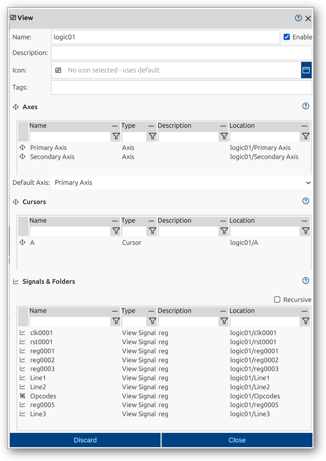

<!--xxx-->
# View
Views in impulse are customizable containers for organizing and visualizing signal data. They consist of View Signals and View Folders arranged hierarchically, along with axes, cursors, and configuration options. Views enable tailored analysis and efficient navigation of complex datasets, supporting advanced visualization workflows.

A view in impulse is defined by several key components:
- **Axes**: Frameworks for visualizing signals across domains (e.g., time, frequency).
- **Cursors**: Tools for measurement and navigation within signals.
- **Signals & Folders**: Hierarchical organization of View Signals and View Folders.
- **Recursive**: Option to display contents recursively, showing all nested elements.

For a comprehensive overview of views and their elements, see the [Views manual page](../impulse-manual/4_views.md).

The View dialog provides a user interface for viewing and editing the properties of a view. You can configure all relevant attributes, organize signals and folders, set up axes and cursors, and control the display of configuration sections.

## Dialog Sections and Fields

### General Section
This section contains the main identification and categorization properties of the view. These fields help you organize and document the structure of your views, making it easier to manage and collaborate.

- **Name**: The unique name of the view as it will appear throughout impulse. Choose a descriptive name to clarify the view's role.
- **Enable**: Checkbox to activate or deactivate the view. Disabling a view hides its effect but retains its configuration.
- **Description**: Free-form text area for documenting the view’s purpose or any relevant notes.
- **Icon**: Select or display an icon for the view.
- **Tags**: Keywords or labels for categorizing and filtering views.

### Axes Section
This section allows you to specify and manage axes for signal visualization. Axes define the domains (e.g., time, frequency) and scales for displaying signals.

- **Name**: Name of the axis.
- **Type**: Type of the axis (e.g., Axis).
- **Description**: Description of the axis.
- **Location**: Path or location of the axis within the view hierarchy.
- **Default Axis**: Select the default axis for the view.

### Cursors Section
Cursors enable precise navigation and measurement within signals. This section lists all defined cursors and their properties.

- **Name**: Name of the cursor.
- **Type**: Type of the cursor (e.g., Cursor).
- **Description**: Description of the cursor.
- **Location**: Path or location of the cursor within the view hierarchy.

### Signals & Folders Section
This section provides a tabular overview of the View Signals and View Folders in the view. It allows you to inspect and manage the hierarchical structure, including recursive display of nested elements.

- **Name**: Name of the signal or folder.
- **Type**: Type (e.g., View Signal, View Folder).
- **Description**: Description of the element.
- **Location**: Path or location within the view hierarchy.
- **Recursive**: Option to display contents recursively.

### Actions
- **Discard**: Cancel changes and close the dialog.
- **Close**: Save changes and close the dialog.

This dialog allows you to fully configure and manage views, supporting structured organization and visualization of signal data. The hierarchical structure, axes, cursors, and flexible configuration options make it easy to tailor views for efficient analysis and interpretation.
