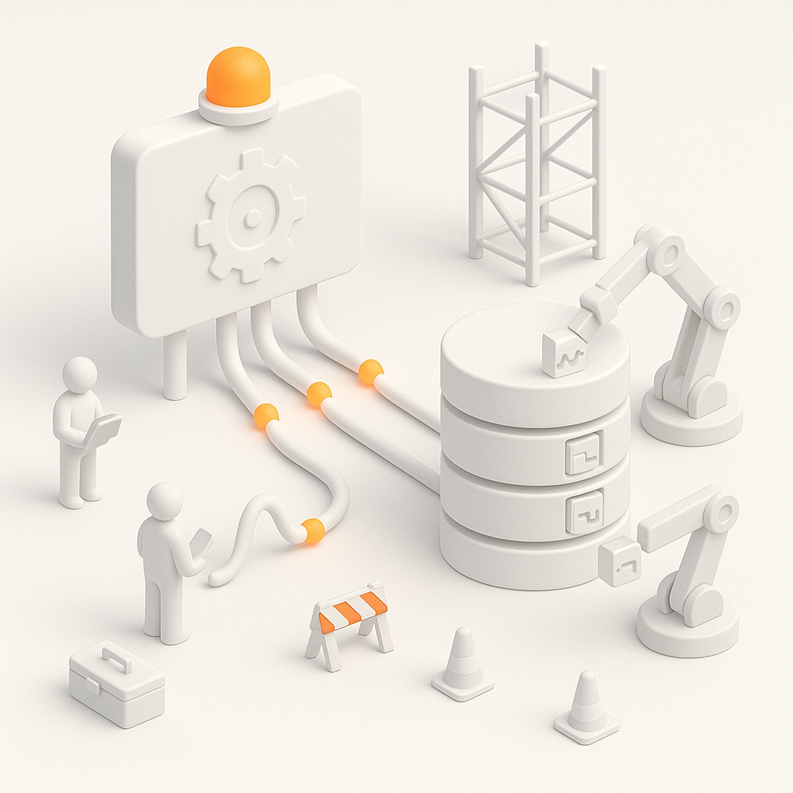

 
# Building Records

This guide provides a comprehensive overview of creating and managing records within the impulse framework. Records are hierarchical containers for signal data, and the framework offers powerful interfaces for building well-structured record hierarchies that support complex analysis and visualization.

## Introduction to Records in Impulse

Records form the foundation of data organization in the impulse framework. They serve as containers that bring structure and meaning to signal data, allowing for efficient navigation, analysis, and visualization of complex datasets. When working with the impulse framework, understanding how to effectively build and manage records is essential for getting the most out of your signal data.

### Key Concepts

Records in impulse are designed around several core concepts:

- **Hierarchical Organization**: Records organize signals and scopes in a tree-like structure, similar to a file system, making it easy to navigate complex datasets.
- **Metadata-Rich Elements**: Every element in a record can carry metadata that enhances its meaning and affects how it's processed and displayed.
- **Domain Independence**: Records can contain signals with different domain bases (time, frequency, etc.) or can be configured for a single shared domain.
- **Writer-Based Population**: Signal data is added to records using specialized writers that handle different data types and formats.
- **Dynamic Manipulation**: Records can be modified, restructured, and enhanced even after their initial creation.

### Record Creation Process

The typical record creation workflow involves:
1. Initializing the record with a name and optional domain base
2. Creating a hierarchy of scopes to organize signals
3. Adding signals with appropriate properties and metadata
4. Obtaining writers for the signals
5. Using the writers to populate the signals with data
6. Applying the changes to update the record

With this foundation, let's explore the specific interfaces and methods used to build records in the impulse framework.

## Core Record Interfaces

The impulse framework provides two main interfaces for creating and managing records:

- **IRecordProducer**: The foundational interface for creating and managing record structures, including signals, scopes, and proxies with different domain bases.
- **ISingleDomainRecordProducer**: A specialized interface for creating records where all signals share the same domain base, simplifying signal creation and management.

Both interfaces provide methods for building record structures, managing signal metadata, and creating writers to populate signals with data. The choice between them depends on whether your signals share a common domain base or use different domain bases.

## Understanding Record Fundamentals

Records are the primary data structures in the impulse framework that organize and contain signal data. Understanding their fundamental components and structure is essential for effective use of the framework.

### Record Structure

A record in impulse is a hierarchical structure that contains:

- **Signals**: The primary data elements representing sequences of samples along a domain (time, frequency, etc.)
- **Scopes**: Containers that organize signals into logical groups (similar to folders)
- **Proxies**: References to existing signals that allow the same signal to appear in multiple locations
- **Relations**: Optional connections between elements that define relationships and dependencies

Records provide a structured way to organize and access signal data, making it easier to manage complex datasets from various sources like simulations, measurements, or log files. The hierarchical organization allows for intuitive navigation and grouping of related signals, while proxies and relations enable sophisticated data relationships.

### Record Building

In most implementations, the record producer is the `this` object inside reader classes or specialized record producers. The typical approach for implementing a record producer follows this pattern:

```java
// Inside a reader implementation or specialized record producer
public class MyRecordProducer implements IRecordProducer {
    // Fields and implementation details
    
    // Method that builds the record structure
    public void buildRecord() {

        // 1. Initialize the record with a name
        this.initRecord("My Simulation Results");
        
        // 2. Create signal hierarchy with scopes
        IRecord.Scope mainScope = this.addScope(null, "Main Signals");
        IRecord.Scope subScope = this.addScope(mainScope, "Control Signals");
        
        // 3. Add signals to appropriate scopes
        IRecord.Signal clockSignal = this.addSignal(subScope, "Clock", "System clock", "state",
            ISample.DATA_TYPE_LOGIC, 1, ISample.FORMAT_BINARY, TimeBase.ns);
        
        // 4. Get writers for the signals
        ISamplesWriter writer = this.getWriter(clockSignal);
        
        // 5. Write data using the writers
        // ...write samples using the writer...
        
        // 6. Apply changes to update signals with writer data
        this.apply();
    }
}
```

**Method Descriptions:**

| Method | Description | Parameters | Return Value | Notes |
|--------|-------------|------------|-------------|-------|
| `initRecord(String)` | Initializes a new record | `String` - Record name | `void` | First step in record creation |
| `addScope(IRecord.Scope, String)` | Creates a new scope | `IRecord.Scope` - Parent scope (or null for root), `String` - Scope name | `IRecord.Scope` - The created scope | Organizes signals into hierarchical groups |
| `addSignal(IRecord.Scope, String, String, String, int, int, int, IDomainBase)` | Creates a signal | `IRecord.Scope` - Container scope, `String` - Name, `String` - Description, `String` - Tags, `int` - Type, `int` - Scale, `int` - Format, `IDomainBase` - Domain base | `IRecord.Signal` - The created signal | Adds a data element to the record |
| `getWriter(IRecord.Signal)` | Gets a writer for a signal | `IRecord.Signal` - Target signal | `ISamplesWriter` - Writer for the signal | Used to add data to the signal |
| `apply()` | Applies changes from writers | None | `void` | Finalizes data writing and updates signals |

This pattern is commonly used in file readers, measurement adapters, and other components that generate or import signal data. The record producer methods are called on the implementing object itself (`this`), creating a fluent and intuitive API for building record structures.

## Creating Record Structure

### Initializing Records

The first step in building a record is initializing it with a name and, optionally, a domain base:

```java
// Initialize a multi-domain record
this.initRecord("Multi-Domain Record");

// Initialize a single-domain record
initRecord("Time-Domain Record", TimeBase.ns);
```

**Method Descriptions:**

| Method | Description | Parameters | Return Value | Notes |
|--------|-------------|------------|-------------|-------|
| `initRecord(String)` | Initializes a multi-domain record | `String` - Record name | `void` | For records with signals using different domain bases |
| `initRecord(String, IDomainBase)` | Initializes a single-domain record | `String` - Record name, `IDomainBase` - Common domain base | `void` | For records where all signals share the same domain base |

### Creating Scopes

Scopes organize signals into a hierarchical structure, making it easier to navigate and manage complex datasets:

```java
// Create a top-level scope
IRecord.Scope inputScope = this.addScope(null, "Input Signals");

// Create a sub-scope with description
IRecord.Scope analogInputs = this.addScope(inputScope, "Analog Inputs", 
    "Analog input signals from external sensors","mytag");

// Create another sub-scope
IRecord.Scope digitalInputs = this.addScope(inputScope, "Digital Inputs",
    "Digital control signals and flags","mytag");
```

**Method Descriptions:**

| Method | Description | Parameters | Return Value | Notes |
|--------|-------------|------------|-------------|-------|
| `addScope(IRecord.Scope, String)` | Creates a basic scope | `IRecord.Scope` - Parent scope (null for root), `String` - Name | `IRecord.Scope` - Created scope | Simple scope creation |
| `addScope(IRecord.Scope, String, String, String)` | Creates a scope with metadata | `IRecord.Scope` - Parent, `String` - Name, `String` - Description, `String` - Tags | `IRecord.Scope` - Created scope | Includes description and categorization |

### Creating Signals

Signals are the primary data elements in a record. They can represent various types of data with different properties:

```java
// Create a logic signal (e.g., a 1-bit digital signal)
IRecord.Signal resetSignal = this.addSignal(digitalInputs, "Reset", "System reset signal",
    "state", ISample.DATA_TYPE_LOGIC, 1, ISample.FORMAT_BINARY, TimeBase.ns);

// Create a multi-bit logic signal (e.g., an 8-bit bus)
IRecord.Signal dataBus = this.addSignal(digitalInputs, "DataBus", "Main data bus",
    "default", ISample.DATA_TYPE_LOGIC, 8, ISample.FORMAT_HEXADECIMAL, TimeBase.ns);

// Create a float signal (e.g., temperature readings)
IRecord.Signal tempSignal = this.addSignal(analogInputs, "Temperature", "CPU temperature",
    "chart", ISample.DATA_TYPE_FLOAT, ISample.SCALE_DEFAULT, ISample.FORMAT_DECIMAL, TimeBase.ms);
```

**Method Descriptions:**

| Method | Description | Parameters | Return Value | Notes |
|--------|-------------|------------|-------------|-------|
| `addSignal(IRecord.Scope, String, String, String, int, int, int, IDomainBase)` | Creates a signal with full metadata | `IRecord.Scope` - Container, `String` - Name, `String` - Description, `String` - Tags, `int` - Type, `int` - Scale, `int` - Format, `IDomainBase` - Domain base | `IRecord.Signal` - Created signal | Complete signal creation with all properties |

### Creating Proxies

Proxies allow you to reference existing signals from different locations in the record hierarchy:

```java
// Create a proxy to the reset signal in another scope
RecordProxy resetProxy = this.addSignalProxy(mainScope, "Reset_Reference", 
    "Reference to the system reset signal", resetSignal);
```

**Method Descriptions:**

| Method | Description | Parameters | Return Value | Notes |
|--------|-------------|------------|-------------|-------|
| `addSignalProxy(IRecord.Scope, String, String, IRecord.Signal)` | Creates a proxy to an existing signal | `IRecord.Scope` - Container, `String` - Name, `String` - Description, `IRecord.Signal` - Target signal | `RecordProxy` - Created proxy | Allows a signal to appear in multiple locations |

## Signal Properties

### Signal Types

The impulse framework supports various signal types, each with its own characteristics:

- **Logic**: Digital signals with 1 to N bits (e.g., reset signals, data buses)
- **Float**: Floating-point values (e.g., analog measurements, calculated values)
- **Integer**: Whole-number values (e.g., counters, IDs, addresses)
- **Event/Enumeration**: Predefined sets of named values (e.g., states, modes)
- **Text**: Textual data (e.g., messages, descriptions)
- **Structure**: Complex data with multiple fields (e.g., transactions, protocol packets)
- **Binary**: Raw binary data (e.g., file contents, images)
- **Arrays**: Collections of elements (e.g., vectors, matrices)

### Signal Metadata

Signals can include metadata that provides context and affects how they're displayed and processed:

```java
// Create a signal with metadata
IRecord.Signal signalWithMetadata = this.addSignal(
    mainScope,                       // Container scope
    "SignalName",                    // Name
    "Detailed description",          // Description
    "state,important",               // Tags for categorization
    ISample.DATA_TYPE_LOGIC,         // Signal type
    8,                               // Scale (8 bits)
    ISample.FORMAT_HEXADECIMAL,      // Format specifier
    TimeBase.ns                      // Domain base
);
```

**Method Descriptions:**

| Method | Description | Parameters | Return Value | Notes |
|--------|-------------|------------|-------------|-------|
| `addSignal(IRecord.Scope, String, String, String, int, int, int, IDomainBase)` | Creates a signal with full metadata | `IRecord.Scope` - Container, `String` - Name, `String` - Description, `String` - Tags, `int` - Type, `int` - Scale, `int` - Format, `IDomainBase` - Domain base | `IRecord.Signal` - Created signal | The tags parameter can include multiple comma-separated tags |

Key metadata elements include:

- **Name**: Unique identifier within its container
- **Description**: Detailed text explaining the signal's purpose
- **Tags**: Categories that affect visualization and processing
- **Scale**: Dimension information (e.g., bit width, array size)
- **Format**: How values are displayed (e.g., binary, hex, decimal)
- **Domain Base**: The fundamental unit of the signal's domain (e.g., ns, ms, Hz)

## Working with Writers

### Getting Writers for Signals

After creating signals, you need writers to add data to them:

```java
// Get the writer created during signal creation
ISamplesWriter writer = this.getWriter(signal);

// Or create a custom writer for special cases
ISamplesWriter customWriter = this.createWriter(signal, 
    ISample.DATA_TYPE_LOGIC, 8, ISample.FORMAT_HEXADECIMAL, TimeBase.ns);
```

**Method Descriptions:**

| Method | Description | Parameters | Return Value | Notes |
|--------|-------------|------------|-------------|-------|
| `getWriter(IRecord.Signal)` | Gets the default writer for a signal | `IRecord.Signal` - Target signal | `ISamplesWriter` - Writer object | Returns the writer created during signal creation |
| `createWriter(IRecord.Signal, int, int, int, IDomainBase)` | Creates a custom writer | `IRecord.Signal` - Target signal, `int` - Type, `int` - Scale, `int` - Format, `IDomainBase` - Domain base | `ISamplesWriter` - Writer object | For cases requiring different properties than the signal |


### Applying Changes

After writing data to signals through writers, you need to apply the changes to update the signals:

```java
// Apply changes from all writers to their respective signals
this.apply();
```

**Method Descriptions:**

| Method | Description | Parameters | Return Value | Notes |
|--------|-------------|------------|-------------|-------|
| `apply()` | Applies changes from writers to signals | None | `void` | Must be called after writing to update signals with new data |

## Working with Single-Domain Records

For records where all signals share the same domain base (such as time-based measurements or simulations), the `ISingleDomainRecordProducer` interface provides simplified methods to streamline record creation and management. This specialized interface reduces repetition and ensures consistency across all signals.

Single-domain records are particularly useful for:
- Time-domain measurements from data acquisition systems
- Simulation results with a consistent time base
- Signal processing results with a common sampling rate
- Frequency-domain analysis with a consistent frequency scale

By using a single domain base, you can:
- Simplify signal creation by eliminating redundant domain base specifications
- Use batch operations for writers with consistent positions
- Ensure all signals maintain the same fundamental units
- Prevent domain mismatches between related signals

```java
ISingleDomainRecordProducer singleDomainProducer = new SingleDomainRecordProducer();

// Initialize with a common domain base
singleDomainthis.initRecord("Time Domain Record", TimeBase.ns);

// Add signals without specifying a domain base
IRecord.Signal signal1 = singleDomainthis.addSignal(null, "Signal1", "First signal",
    "default", ISample.DATA_TYPE_LOGIC, 1, ISample.FORMAT_BINARY);

IRecord.Signal signal2 = singleDomainthis.addSignal(null, "Signal2", "Second signal",
    "default", ISample.DATA_TYPE_INTEGER, ISample.SCALE_DEFAULT, ISample.FORMAT_DECIMAL);

// Open all writers with a common start position
singleDomainthis.open(0);

// Open all writers in continuous mode with a common rate
singleDomainthis.open(0, 10);

// Close all writers at a common end position
singleDomainthis.close(1000);
```

**Method Descriptions:**

| Method | Description | Parameters | Return Value | Notes |
|--------|-------------|------------|-------------|-------|
| `initRecord(String, IDomainBase)` | Initializes single-domain record | `String` - Name, `IDomainBase` - Common domain base | `void` | Sets up record with shared domain base |
| `addSignal(IRecord.Scope, String, String, String, int, int, int)` | Adds a signal with implicit domain | `IRecord.Scope` - Container, `String` - Name, `String` - Description, `String` - Tags, `int` - Type, `int` - Scale, `int` - Format | `IRecord.Signal` - Created signal | No need to specify domain base for each signal |
| `open(long)` | Opens all writers at once | `long` - Start position | `void` | Simplifies writer initialization for discrete signals |
| `open(long, long)` | Opens all writers in continuous mode | `long` - Start position, `long` - Rate | `void` | Sets up all signals with the same sampling rate |
| `close(long)` | Closes all writers at once | `long` - End position | `void` | Finalizes all signals with the same end position |

## Record Manipulation

The impulse framework provides powerful capabilities for manipulating record structures even after their initial creation. This allows for dynamic adjustment of record hierarchies, finding elements, and managing the overall organization of your signal data.

Record manipulation features enable you to:
- Navigate complex record hierarchies using path-based lookups
- Clean up record structures by removing unnecessary elements
- Access signals and scopes throughout the record structure
- Build complex relationships between record elements
- Optimize record organization for specific analysis needs

### Finding Record Elements

Records provide methods for finding elements by path, allowing you to navigate the record hierarchy efficiently. Path-based lookups use forward slashes as separators, similar to file system paths, making it intuitive to access nested elements.

```java
// Find a scope by path
IRecord.Scope scope = this.getScope("Main Signals/Control Signals");

// Find a signal by path
IRecord.Signal signal = this.getSignal("Main Signals/Control Signals/Clock");
```

**Method Descriptions:**

| Method | Description | Parameters | Return Value | Notes |
|--------|-------------|------------|-------------|-------|
| `getScope(String)` | Finds a scope by path | `String` - Path to the scope | `IRecord.Scope` - Found scope or null | Path uses forward slashes as separators |
| `getSignal(String)` | Finds a signal by path | `String` - Path to the signal | `IRecord.Signal` - Found signal or null | Paths are relative to the record root |

### Managing the Record Structure

After creating the initial record structure, you may need to refine it by removing unnecessary elements or accessing all components for batch operations. The record producer interface provides methods to help maintain clean and efficient record hierarchies.

```java
// Remove empty scopes to clean up the record
this.removeEmptyScopes(this.getBase(), true);

// Get all signals created by this producer
List<IRecord.Signal> allSignals = this.getAllSignals();
```

**Method Descriptions:**

| Method | Description | Parameters | Return Value | Notes |
|--------|-------------|------------|-------------|-------|
| `removeEmptyScopes(IRecord.Scope, boolean)` | Removes scopes with no signals | `IRecord.Scope` - Starting scope, `boolean` - Recursive flag | `void` | Cleans up empty containers in the record structure |
| `getBase()` | Gets the root scope of the record | None | `IRecord.Scope` - Root scope | Entry point to the record hierarchy |
| `getAllSignals()` | Gets all signals created by this producer | None | `List<IRecord.Signal>` - All signals | Useful for bulk operations on signals |

## Advanced Record Features

### Working with Proxies and References

Proxies provide alternative ways to access signals in different parts of the record hierarchy without duplicating the underlying data. This is particularly useful for creating different views of the same signal or for organizing signals in multiple logical groupings.

```java
// Create a proxy in a different scope
IRecord.Proxy proxy = this.addSignalProxy(targetScope, "ClockRef", 
    "Reference to the main clock", clockSignal);

// Access the original signal through the proxy
IRecord.Signal originalSignal = proxy.getSignal();
```

**Method Descriptions:**

| Method | Description | Parameters | Return Value | Notes |
|--------|-------------|------------|-------------|-------|
| `addSignalProxy(IRecord.Scope, String, String, IRecord.Signal)` | Creates a proxy to a signal | `IRecord.Scope` - Container, `String` - Name, `String` - Description, `IRecord.Signal` - Target | `IRecord.Proxy` - Created proxy | Creates a reference to a signal in another location |
| `proxy.getSignal()` | Retrieves the original signal | None | `IRecord.Signal` - Original signal | Accesses the signal referenced by the proxy |

## Best Practices

### Record Organization

1. **Plan Your Hierarchy**: Design a logical structure that reflects the nature of your data
2. **Use Meaningful Names**: Choose clear, descriptive names for scopes and signals
3. **Add Descriptions**: Include detailed descriptions for complex elements
4. **Use Tags Consistently**: Apply tags to categorize signals for filtering and visualization
5. **Group Related Signals**: Place related signals in the same scope

### Signal Creation

1. **Choose Appropriate Types**: Select the signal type that best matches the data
2. **Set Correct Scales**: Specify scales that accurately represent dimensions
3. **Select Proper Formats**: Use format specifiers that make values easy to interpret
4. **Consider Domain Bases**: Choose domain bases that match the natural units of your data
5. **Apply Suitable Metadata**: Add tags and descriptions that enhance understanding

### Writer Management

1. **Efficiently Handle Multiple Writers**: Group writer operations when possible
2. **Apply Changes at Appropriate Times**: Balance between frequent updates and performance
3. **Close Writers When Done****: Always close writers to finalize the signal range
4. **Handle Resources Properly**: Clean up resources when they're no longer needed

## Practical Examples

The following examples demonstrate how to build complete record structures for common use cases. These examples illustrate best practices for organizing signals, creating appropriate hierarchies, and managing writers to generate signal data effectively.

### Creating a Simulation Record

This example shows how to build a record structure for CPU simulation data, organizing signals into logical groups that reflect the system architecture.

```java
// Create a producer for simulation results
this.initRecord("CPU Simulation");

// Create main scopes
IRecord.Scope cpuScope = this.addScope(null, "CPU");
IRecord.Scope controlScope = this.addScope(cpuScope, "Control Signals");
IRecord.Scope dataScope = this.addScope(cpuScope, "Data Signals");
IRecord.Scope memoryScope = this.addScope(null, "Memory");

// Add control signals
IRecord.Signal clockSignal = this.addSignal(controlScope, "Clock", "System clock",
    "state", ISample.DATA_TYPE_LOGIC, 1, ISample.FORMAT_BINARY, TimeBase.ns);
IRecord.Signal resetSignal = this.addSignal(controlScope, "Reset", "System reset",
    "state", ISample.DATA_TYPE_LOGIC, 1, ISample.FORMAT_BINARY, TimeBase.ns);
IRecord.Signal interruptSignal = this.addSignal(controlScope, "IRQ", "Interrupt request",
    "state", ISample.DATA_TYPE_LOGIC, 1, ISample.FORMAT_BINARY, TimeBase.ns);

// Add data signals
IRecord.Signal addressBus = this.addSignal(dataScope, "Address", "Address bus",
    "default", ISample.DATA_TYPE_LOGIC, 16, ISample.FORMAT_HEXADECIMAL, TimeBase.ns);
IRecord.Signal dataBus = this.addSignal(dataScope, "Data", "Data bus",
    "default", ISample.DATA_TYPE_LOGIC, 8, ISample.FORMAT_HEXADECIMAL, TimeBase.ns);

// Add memory signals
IRecord.Signal memRead = this.addSignal(memoryScope, "MemRead", "Memory read operations",
    "event", ISample.DATA_TYPE_STRUCT, ISample.SCALE_DEFAULT, ISample.FORMAT_DEFAULT, TimeBase.ns);
IRecord.Signal memWrite = this.addSignal(memoryScope, "MemWrite", "Memory write operations",
    "event", ISample.DATA_TYPE_STRUCT, ISample.SCALE_DEFAULT, ISample.FORMAT_DEFAULT, TimeBase.ns);

// Get writers and generate signal data
ILogicSamplesWriter clockWriter = (ILogicSamplesWriter)this.getWriter(clockSignal);
// ...open / write clock pattern / close ...

ILogicSamplesWriter addrWriter = (ILogicSamplesWriter)this.getWriter(addressBus);
// ...open/ write address values / close ...

// Apply changes to update all signals
this.apply();
```

**Method Descriptions:**

| Method | Description | Parameters | Return Value | Notes |
|--------|-------------|------------|-------------|-------|
| `initRecord(String)` | Initializes a record | `String` - Record name | `void` | Sets up the record container |
| `addScope(IRecord.Scope, String)` | Creates a scope | `IRecord.Scope` - Parent scope, `String` - Name | `IRecord.Scope` - Created scope | Organizes signals into logical groups |
| `addSignal(IRecord.Scope, String, String, String, int, int, int, IDomainBase)` | Creates a signal | Various signal parameters | `IRecord.Signal` - Created signal | Adds a data element to the record |
| `getWriter(IRecord.Signal)` | Gets a writer | `IRecord.Signal` - Target signal | `ISamplesWriter` - Writer | For writing data to the signal |
| `apply()` | Applies changes | None | `void` | Updates signals with writer data |

### Creating a Measurement Record

This example demonstrates building a record for physical measurements from a power supply monitoring system, using a single-domain approach since all signals share the same time base.

```java
// Create a single-domain producer for measurement data
this.initRecord("Power Supply Measurements", TimeBase.ms);

// Create scope structure
IRecord.Scope voltageScope = this.addScope(null, "Voltage Measurements");
IRecord.Scope currentScope = this.addScope(null, "Current Measurements");
IRecord.Scope powerScope = this.addScope(null, "Power Calculations");

// Add voltage signals
IRecord.Signal v3_3 = this.addSignal(voltageScope, "3.3V Rail", "3.3V supply voltage",
    "chart", ISample.DATA_TYPE_FLOAT, ISample.SCALE_DEFAULT, ISample.FORMAT_DECIMAL);
IRecord.Signal v5_0 = this.addSignal(voltageScope, "5V Rail", "5V supply voltage",
    "chart", ISample.DATA_TYPE_FLOAT, ISample.SCALE_DEFAULT, ISample.FORMAT_DECIMAL);

// Add current signals
IRecord.Signal i3_3 = this.addSignal(currentScope, "3.3V Current", "Current draw on 3.3V rail",
    "chart", ISample.DATA_TYPE_FLOAT, ISample.SCALE_DEFAULT, ISample.FORMAT_DECIMAL);
IRecord.Signal i5_0 = this.addSignal(currentScope, "5V Current", "Current draw on 5V rail",
    "chart", ISample.DATA_TYPE_FLOAT, ISample.SCALE_DEFAULT, ISample.FORMAT_DECIMAL);

// Add power signals
IRecord.Signal p3_3 = this.addSignal(powerScope, "3.3V Power", "Power consumption on 3.3V rail",
    "chart", ISample.DATA_TYPE_FLOAT, ISample.SCALE_DEFAULT, ISample.FORMAT_DECIMAL);
IRecord.Signal p5_0 = this.addSignal(powerScope, "5V Power", "Power consumption on 5V rail",
    "chart", ISample.DATA_TYPE_FLOAT, ISample.SCALE_DEFAULT, ISample.FORMAT_DECIMAL);
IRecord.Signal pTotal = this.addSignal(powerScope, "Total Power", "Total power consumption",
    "chart", ISample.DATA_TYPE_FLOAT, ISample.SCALE_DEFAULT, ISample.FORMAT_DECIMAL);

// Open all writers at once (continuous mode with 10ms sample rate)
this.open(0, 10);

// Get writers for signals
IFloatSamplesWriter v3_3Writer = (IFloatSamplesWriter)this.getWriter(v3_3);
IFloatSamplesWriter i3_3Writer = (IFloatSamplesWriter)this.getWriter(i3_3);
// ...other writers...

// Write measurement data
for (int i = 0; i < 100; i++) {
    double v3_3Value = 3.3 + (Math.random() - 0.5) * 0.1;
    double i3_3Value = 0.5 + (Math.random() - 0.5) * 0.2;
    
    v3_3Writer.write(ISamplesWriter.NEXT_POSITION, false, v3_3Value);
    i3_3Writer.write(ISamplesWriter.NEXT_POSITION, false, i3_3Value);
    // ...write other values...
}

// Close all writers
this.close(1000);

// Apply changes
this.apply();
```

**Method Descriptions:**

| Method | Description | Parameters | Return Value | Notes |
|--------|-------------|------------|-------------|-------|
| `initRecord(String, IDomainBase)` | Initializes a single-domain record | `String` - Name, `IDomainBase` - Domain base | `void` | Sets up record with all signals sharing the same domain |
| `addSignal(IRecord.Scope, String, String, String, int, int, int)` | Adds a signal with implicit domain | Various signal parameters | `IRecord.Signal` - Created signal | Domain base is inherited from the record |
| `open(long, long)` | Opens all writers in continuous mode | `long` - Start position, `long` - Rate | `void` | Sets up all signals with the same sampling rate |
| `getWriter(IRecord.Signal)` | Gets a writer for a signal | `IRecord.Signal` - Target signal | `ISamplesWriter` - Writer | Casting to specific writer type enables type-specific methods |
| `write(long, boolean, double)` | Writes a value to a signal | `long` - Position, `boolean` - Invalid flag, `double` - Value | `void` | ISamplesWriter.NEXT_POSITION uses the configured rate |
| `close(long)` | Closes all writers | `long` - End position | `void` | Finalizes all signals with the same end position |
| `apply()` | Applies changes | None | `void` | Updates all signals with their writer data |

## Conclusion

The impulse framework's record producers provide a powerful system for creating and managing hierarchical signal data structures. By understanding the concepts of records, scopes, signals, and writers, you can efficiently organize, generate, and manipulate signal data for analysis and visualization within the impulse environment.

Key benefits of the record building system include:

- **Hierarchical Organization**: Create structured signal hierarchies that match your data's logical organization
- **Flexible Signal Creation**: Define signals with precise metadata that affects visualization and analysis
- **Domain Independence**: Support for different domain bases or unified domains to match your data model
- **Efficient Writer System**: Streamlined mechanisms for generating and populating signal data
- **Powerful Manipulation**: Tools for finding, referencing, and managing record elements

Records serve as the foundation for signal analysis and visualization, providing a structured approach to managing complex datasets from various sources. By following the best practices outlined in this guide, you can create well-organized records that enhance the analysis and understanding of your signal data.

For more information about working with records, refer to:
- Reading: [Reading Samples](../impulse-api/1_reading-samples.md) and [Iterating Samples](../impulse-api/2_iterating-samples.md)
- Writing: [Writing Samples](../impulse-api/3_writing-samples.md)

