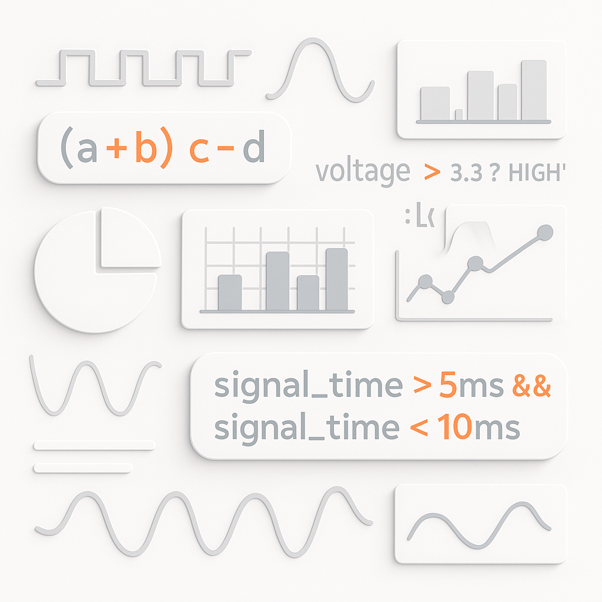

  
# Expressions

The **impulse** system features a powerful expression language that allows users to perform a wide variety of operations on signals, samples, and other data. Expressions can be used throughout the application, particularly in column filters, signal processors, and search operations. This document outlines the syntax, capabilities, and usage of expressions in **impulse**.

## Introduction to Expressions

Expressions in **impulse** are text-based formulas that combine variables, literals, operators, and functions to produce a result. They can range from simple mathematical calculations to complex conditional logic and signal manipulations.

Expressions are used throughout impulse in various contexts. Column filters use expressions to filter signals based on specific value criteria. Signal processors leverage expressions to transform signals through mathematical operations and conditional logic. Search expressions help locate specific sample patterns or values within signal data.

## Expression Syntax

### Basic Literals

Expressions support various types of literals:

- **Numeric Literals**: `5`, `-3.14`, `0x4A` (hexadecimal)
- **Boolean Literals**: `true`, `false`
- **String Literals**: `"Hello"` or `'Hello'`
- **Null**: `null`

### Domain-Specific Literals

- **Time Values**: `5ms`, `6000us`, `1.2ns`
- **Logic Values**: `0b111000zx` (binary with logic states)

### Variables

Variables can be referenced by name and used in expressions. Available variables depend on the context where the expression is used.

```
signalA + 5
cursor1 - cursor2
```

### Operators

#### Arithmetic Operators

| Operator | Description | Example |
|----------|-------------|---------|
| `+` | Addition | `a + b` |
| `-` | Subtraction | `a - b` |
| `*` | Multiplication | `a * b` |
| `/` | Division | `a / b` |
| `%` | Modulus | `a % b` |
| `-` | Unary minus | `-a` |

#### Comparison Operators

| Operator | Description | Example |
|----------|-------------|---------|
| `<` | Less than | `a < b` |
| `<=` | Less than or equal | `a <= b` |
| `>` | Greater than | `a > b` |
| `>=` | Greater than or equal | `a >= b` |
| `==` | Equal | `a == b` |
| `!=` | Not equal | `a != b` |

#### Logical Operators

| Operator | Description | Example |
|----------|-------------|---------|
| `&&` | Logical AND | `a && b` |
| `\|\|` | Logical OR | `a \|\| b` | 
| `!` | Logical NOT | `!a` |


#### Bitwise Operators

| Operator | Description | Example |
|----------|-------------|---------|
| `&` | Bitwise AND | `a & b` |
| `\|` | Bitwise OR | `a \| b` |
| `^` | Bitwise XOR | `a ^ b` |
| `~` | Bitwise NOT | `~a` |
| `<<` | Left shift | `a << 2` |
| `>>` | Right shift | `a >> 2` |
| `>>>` | Unsigned right shift | `a >>> 2` |

#### Assignment Operators

| Operator | Description | Example |
|----------|-------------|---------|
| `=` | Assignment | `a = b + 5` |

#### Ternary Operator

The ternary operator allows conditional expressions:

```
condition ? valueIfTrue : valueIfFalse
```

Example:
```
signal > 0.5 ? "HIGH" : "LOW"
```

#### Operator Precedence

When expressions contain multiple operators, they are evaluated according to operator precedence. Operators with higher precedence are evaluated before operators with lower precedence. The table below lists operators from highest to lowest precedence:

| Precedence | Operators | Description |
|------------|-----------|-------------|
| 1 (highest) | `.` `[]` `()` | Member access, array indexing, function calls |
| 2 | `-` (unary) `!` `~` Type casts | Unary operations, type casting |
| 3 | `*` `/` `%` | Multiplication, division, modulus |
| 4 | `+` `-` | Addition, subtraction |
| 5 | `<<` `>>` `>>>` | Bit shifts |
| 6 | `<` `<=` `>` `>=` | Relational operators |
| 7 | `==` `!=` | Equality operators |
| 8 | `&` | Bitwise AND |
| 9 | `^` | Bitwise XOR |
| 10 | `\|` | Bitwise OR |
| 11 | `&&` | Logical AND |
| 12 | `\|\|` | Logical OR |
| 13 | `? :` | Ternary conditional |
| 14 (lowest) | `=` | Assignment |

Operators with the same precedence are evaluated from left to right, except for unary operators, type casts, and assignment, which are evaluated from right to left.

You can override the default precedence using parentheses. Expressions inside parentheses are always evaluated first.

Examples:
```
a + b * c         // Equivalent to: a + (b * c)
(a + b) * c       // Parentheses change the order of operations
a || b && c       // Equivalent to: a || (b && c)
a = b = c         // Equivalent to: a = (b = c)
```

### Type Casting

You can convert values from one type to another using type casting:

```
(int)3.75      // Results in 3
(double)5      // Results in 5.0
(logic)34      // Converts to logic value
```

Supported casts: `(long)`, `(int)`, `(short)`, `(byte)`, `(double)`, `(float)`, `(string)`, `(logic)`

### Property and Method Access

- **Properties**: Access properties using dot notation: `signal.multiple`, `domain.base`
- **Methods**: Call methods using parentheses: `"text".length()`, `"text".charAt(1)`

### Special Operations for Samples

- **Value Access**: Use the `*` operator to get the value of a sample: `*sample`
- **Member Access**: Access sample members with dot notation: `sample.domain`

## Domain-Specific Features

### Time Domain Operations

Time values can be compared and manipulated:

```
5ms < t      // True if t is greater than 5 milliseconds
cursor2 - cursor1    // Time difference between cursors
```

Time values have properties you can access:
- `multiple`: The numeric value (e.g., 5 for 5ms)
- `base`: The time unit (e.g., ms, us, ns)

### Logic Operations

Logic values support digital logic operations:

```
logic1 & logic2    // Bitwise AND of logic values
~logic1            // Bitwise NOT of logic value
(int)0b111000zx    // Convert logic value to integer
```
## Implementation Details

The **impulse** expression interpreter works directly with Java objects behind the scenes, offering several powerful capabilities:

- **Java Method Access**: You can call methods on objects using reflection. For example, if a variable contains a string, you can use standard Java string methods: `myString.toLowerCase()`, `myString.substring(1, 3)`.

- **Type-Dependent Operations**: In binary operations, the type of the first argument determines the operation behavior and result type:
  ```
  1.5 + 5      // Result is 6.5 (double), as 1.5 is double
  1 + 1.5      // Result is 2 (integer), as 1 is integer
  "abc" + 123  // Result is "abc123" (string), as "abc" is string
  ```

- **Type Coercion**: The system attempts to convert types when needed, but follows strict rules based on the first operand's type.

- **Object Identity**: The expression system maintains object identity, meaning that operations on the same object reference will affect that object in all places it's used.

## Expression Examples

```
// Mathematical calculations
(a + b) * c - d

// Conditional logic
voltage > 3.3 ? "HIGH" : "LOW"

// Time domain comparison
signal_time > 5ms && signal_time < 10ms

// Logic operations
(logic)data & 0x0F

// String manipulation
"Signal " + signalName + " = " + signalValue

// Multiple operations (separated by semicolons)
temp = a + b; temp * 2
```

## Best Practices

1. Use parentheses to clarify operation order when combining multiple operators
2. For complex expressions, break them down into simpler parts using intermediate variables
3. When filtering signals, use specific constraints to reduce the result set
4. Test complex expressions on small data sets before applying them to large signals

## Conclusion

The expression language in **impulse** provides a powerful and flexible way to work with signals and samples. By mastering expressions, you can effectively filter, process, and analyze your data to gain deeper insights into your systems.
