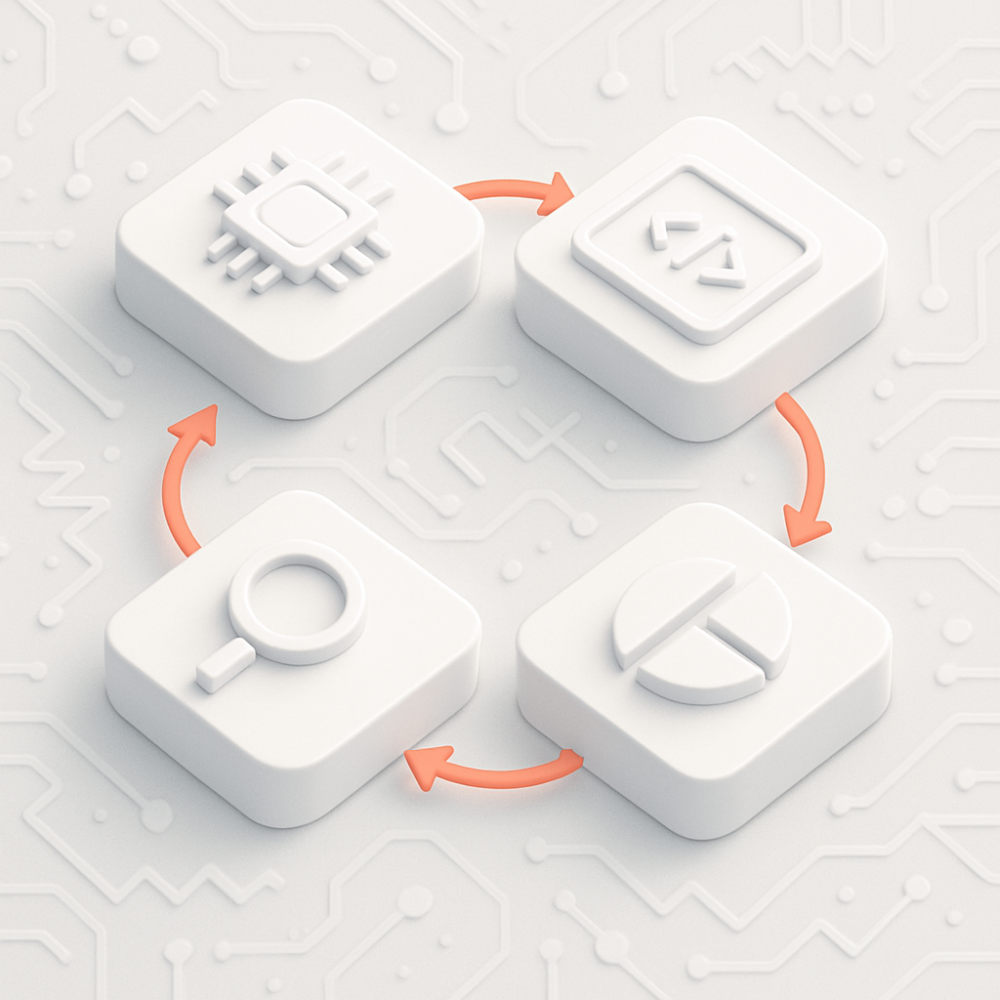
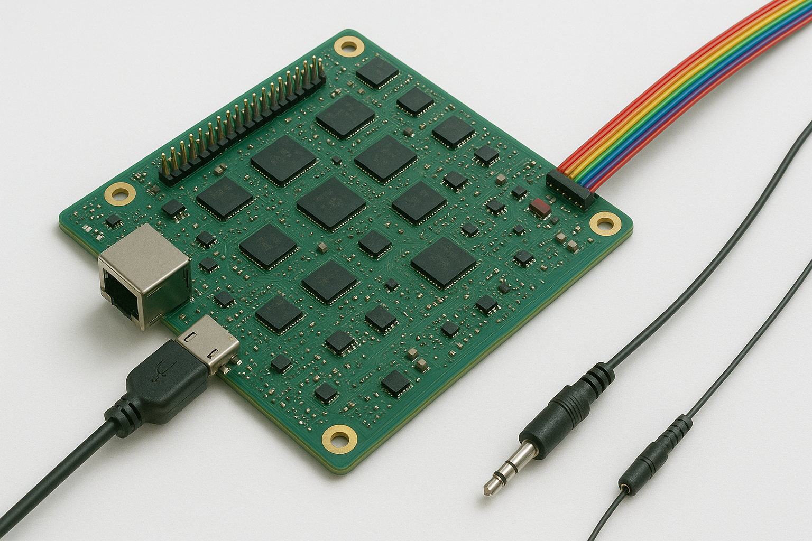
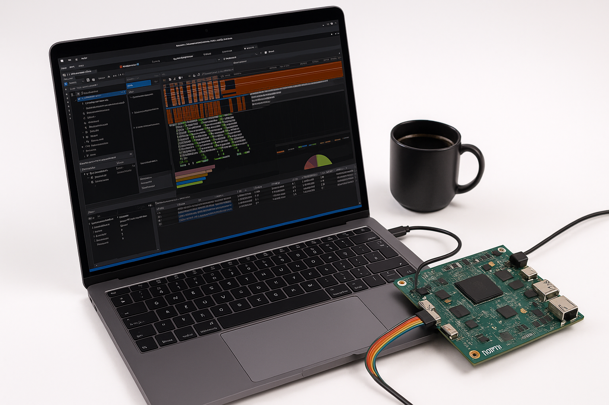

 
# Complexity of Embedded Systems

Embedded systems have evolved far beyond their original scope of handling simple control tasks. They now power smart devices, vehicles, industrial systems, and critical infrastructure, acting as intelligent, interconnected platforms. This growth in functionality is largely driven by advances in processing capabilities, connectivity, and intelligent computing.

## Drivers of Complexity

**Increased Processing Power**  
Modern embedded systems incorporate powerful multi-core processors. This allows them to perform more demanding tasks but also requires more advanced software architectures and efficient power management to maintain system reliability and efficiency.

**Advanced Connectivity**  
Technologies such as Wi-Fi, Bluetooth, 5G, and various IoT communication protocols are increasingly embedded. This connectivity introduces complexity in terms of network security, real-time data management, and seamless communication between devices.

**AI and Machine Learning**  
The integration of artificial intelligence in embedded devices requires specialized hardware accelerators (e.g., TPUs, NPUs) and optimized algorithms for real-time decision-making. This adds another layer of complexity in design and performance tuning.

**Edge Computing Integration**  
Edge computing allows data to be processed locally on the device, reducing latency and dependence on the cloud. However, this shift demands more computational power at the edge, along with efficient handling of real-time data processing and limited resources.

**Cybersecurity Challenges**  
As embedded systems become more connected, they also become more vulnerable. Robust encryption, authentication, and real-time threat detection mechanisms are now essential components of modern designs.

**Heterogeneous Architectures**  
Many embedded platforms now combine CPUs, GPUs, FPGAs, and ASICs. Coordinating these different components requires highly optimized software frameworks and a deep understanding of each architecture's role.

**Software-Defined Functionality**  
Features are increasingly delivered and updated through software, requiring secure and reliable over-the-air (OTA) update mechanisms, version management, and lifecycle tracking.

**Stringent Compliance and Safety Standards**  
Industries like automotive, healthcare, and aerospace require compliance with strict safety and regulatory standards, making design, validation, and testing more complex and time-consuming.

---

## Working with embedded systems

If you have an embedded system on your desk and need to work with it, you can try the following approaches:

- **Read the Documentation**: This is often a good starting point, but documentation may be unavailable or targeted at a different layer of the system.
- **Examine the Implementation**: Attempting to read and understand the entire implementation is usually impractical due to its complexity.
- **Run the System and Analyze Outputs**: Observing the system's behavior and outputs can help identify issues or areas that require further investigation.

However, working with embedded systems often introduces additional challenges:

- **Multiple Input Sources**: Data is collected from various sensors, logs, and communication interfaces, requiring synchronization and aggregation.
- **Diverse Data Formats**: Information comes in different formats (binary logs, structured text, real-time streams), demanding complex parsing and interpretation.
- **Large Data Volumes**: Debugging may involve analyzing huge log files and continuous data streams, requiring efficient storage and processing.
- **Timing and Synchronization Issues**: Logs and signals from different sources may have mismatched timestamps, complicating debugging.
- **Limited System Access**: Some embedded systems operate in constrained environments, restricting real-time debugging and data extraction.
- **Performance Impact**: Extracting debug data can introduce overhead, affecting system performance and real-time operation.

---

## Impact

As embedded systems grow more powerful and interconnected, the impact is felt across every level of development and deployment. From individual engineers to project managers and business leaders, everyone must adapt to new expectations and challenges.

### Challenges for Engineers and Developers

- **Increased Learning Curve**: Engineers must be proficient not only in embedded programming but also in areas like AI, networking, and cybersecurity.
- **Toolchain Complexity**: Development requires a wider range of tools and frameworks, often specific to hardware platforms and operating systems.
- **Debugging and Testing**: Real-time constraints, concurrency, and heterogeneous hardware make testing and debugging significantly more difficult.
- **Security Considerations**: Developers must integrate security early in the design process, often requiring cryptographic knowledge and secure coding practices.

### Challenges for Project Teams

- **Longer Development Cycles**: The complexity of systems extends development and testing phases, impacting time-to-market.
- **Cross-Disciplinary Coordination**: Projects increasingly require collaboration between software, hardware, AI, and networking teams.
- **Resource Management**: Managing processing power, memory, and energy consumption across diverse use cases becomes a significant design constraint.

### Challenges for Management

- **Increased Risk and Cost**: More complex systems mean higher development costs, greater potential for failure, and more demanding maintenance.
- **Compliance Oversight**: Managers must ensure that products meet industry standards and pass rigorous certification processes.
- **Talent Requirements**: Recruiting and retaining engineers with the necessary breadth of expertise is becoming more difficult and competitive.

In conclusion, while modern embedded systems offer unprecedented capabilities, they also introduce a range of new challenges. Addressing these effectively requires not only technical innovation but also evolved workflows, collaborative practices, and strategic planning across all levels of a project.

---

## Introduction to Key Capabilities

To address these challenges, **impulse** provides engineers with powerful tools to understand, analyze, and debug system behavior effectively. By leveraging visualization, signal calculation, and debugging techniques, **impulse** empowers engineers to gain deeper insights, streamline workflows, and enhance overall system performance.

### Understand
Understanding the architecture of embedded systems is essential for effective troubleshooting and performance optimization. Engineers must grasp the intricate interactions between hardware and software to identify potential issues. Visualization plays a key role in this process by offering clear, intuitive insights into system behavior. With visual tools, engineers can:
- Pinpoint problems.
- Monitor real-time performance.
- Analyze complex data. 

By enhancing system understanding through visualization, engineers can resolve issues more quickly, optimize performance, and improve overall system efficiency and reliability.

### Analyze
Signal calculation tools are vital for improving debugging and system understanding. These tools enable engineers to:
- Combine signals using mathematical operations to uncover hidden relationships and errors.
- Generate reference signals for comparison.
- Implement protocol parsers to decode data exchanges.
- Extract statistical information for performance analysis.
- Automatically detect conflicts or inconsistencies in signals.

This accelerates the debugging process and provides deeper insights into system behavior, enhancing overall system performance and reliability

### Debug
Debugging complex embedded systems requires a deep understanding of both hardware and software interactions, as issues often arise from their integration. Visualization tools greatly enhance this process by:
- Presenting system data in a clear, intuitive format.
- Transforming complex data into visual representations.
- Allowing engineers to quickly identify patterns, anomalies, and root causes of issues.

With visual insights, engineers can streamline troubleshooting, reduce downtime, and optimize system performance more effectively.

---

## Conclusion
The increasing complexity of embedded systems demands a structured approach to understanding, analyzing, and debugging. By utilizing visualization tools and signal calculation techniques, engineers can gain critical insights into system behavior, streamline troubleshooting, and enhance performance. These practices are essential for addressing the challenges posed by modern embedded systems, ensuring reliability, and driving innovation in this rapidly evolving field.
 
[2 Introduction](../impulse-manual/2_introduction.md)