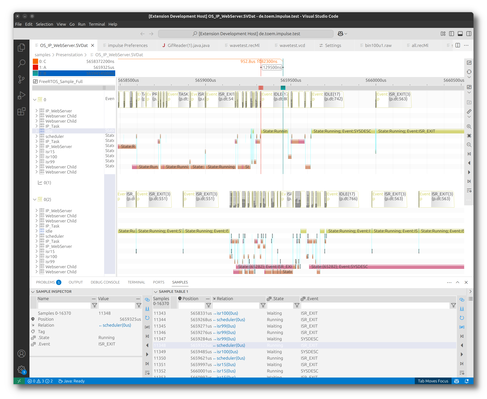

 
# Introduction

**impulse** is a powerful visualization and analysis workbench designed to help engineers understand, analyze, and debug complex semiconductor and multi-core software systems. It provides seamless integration into IDE frameworks and enables interoperability with a growing set of extensions, such as language IDEs and reporting tools.

With its client-server architecture, **impulse** divides workloads between signal-providing tasks (on a simulation or application server) and local analysis tools, ensuring efficient performance. Engineers can use their favorite web IDE to analyze logs, traces, and simulation data without transferring large amounts of data or relying on local tools.

**impulse**’s open extension mechanisms allow users to adapt it to their specific needs. Whether defining custom data formats, implementing acquisition interfaces, creating specialized diagrams, **impulse** offers unparalleled flexibility. Its lightweight frontend and powerful Java backend enable the creation of high-performance, complex analysis applications.

---

## Features

impulse offers a wide range of data formats and external interfaces through signal adaptors, providing a unified view of various data sources. Whether reading signals from log, wave, or trace files, or accessing live data streams, users can seamlessly integrate data from multiple channels. Signal adaptors allow direct connections to sources such as TCP streams, pipes, applications, external networks, serial interfaces, and data acquisition units. When dealing with multiple signal sources—such as log data from a serial interface and trace data over TCP—impulse can merge and synchronize them, ensuring accurate, comprehensive analysis across diverse systems and interfaces.

### Data Integration
- Supports log, wave, trace files, and live data streams.
- Enables connections to diverse data sources via signal adaptors including TCP streams, pipes, serial interfaces, and hardware.
- Synchronizes multiple signal sources for unified analysis.

### Customizable Views
- Create tailored views with structured navigation.
- Switch between views for efficient signal interpretation.
- Use diagrams to visualize signals across domains like time and frequency.

### Signal Processing
- Combine signals using mathematical operations.
- Decode data with protocol parsers.
- Generate reference signals and extract statistical insights.

### Sample Tables
- Tabular representation synchronized with viewers.
- Real-time updates for streaming data.
- Configurable columns for custom value representation.

### Automation
- Background processing of large datasets.
- Automatic conflict detection and pattern identification.
- Statistical extraction for performance insights.

---

## Understanding Key Terminology

When working with the impulse Viewer, it is essential to understand the key terms used throughout this manual. Below, we define the terms Sample, Signal, Record, and View, which form the foundation of the impulse Viewer.

### Sample
A **sample** is a value or an event uniquely positioned on an axis that describes a domain, such as time or frequency. Examples of samples include:

- A log event.
- An analog value change.
- A digital transition (e.g., 0 → 1).

In the context of **impulse**, each of these events or values is considered a sample.

### Signal
A **signal** is a sequence of samples organized along a rising domain, such as time. While two samples may share the same position on the axis, the direction of the axis always increases. Examples of signals include:

- A log or trace over time.
- A simulated analog voltage over frequency.
- A digital simulation of a semiconductor.

In **impulse**, signals represent the progression of data or events over a specific domain.

### Record
A **record** is a collection of signals organized in a hierarchical structure (e.g. scopes), such as a tree with folders. Records may also include additional supporting elements, such as analysis or imported data. Examples of records include:

- The content of a wave file.
- A log file.
- A trace file.

In addition to signals, a record can contain:

- **Scopes**: These act like folders, organizing signals and other elements into a structured hierarchy.
- **Includes**: These allow the import of other files, enabling the reuse of data and configurations across records.
- **Analysis**: These can calculate new signals from existing content, providing insights or derived information.
- **Interfaces**: **impulse**’s flexible signal adaptors enable connections to any signal source, whether through simple data interfaces, configurable readers, external libraries, or complex hardware setups. This adaptability ensures that users can easily integrate and analyze data from a wide variety of applications and external hardware, enhancing overall system versatility.
- **Proxies**: These act as proxies for signals, enabling dynamic and flexible interactions within the record structure.
- **Relations**: These build up connections between signals, proxies, and scopes, facilitating structured interactions and dependencies within the record.

Records provide a structured way to manage, analyze, and extend signals within the **impulse** Viewer.

### View
A **view** provides a presentation for a set of signals. Views are not bound to a specific file or input, allowing flexibility in reusing them for different signal sets. Users can switch between these presentations to analyze data effectively. 

Inside a view, you will find:

- **View Signals**: These use a specific type of diagram to display signal data.
- **View Folders**: These organize the presentation in a hierarchical structure, enabling users to hide or show parts of the presentation as needed.

This structure ensures that users can manage and customize the visualization of signal data efficiently.

### Functional Blocks

Each developer’s workflow and challenges are unique, requiring customized setups for data capturing, visualization, and analysis. **impulse** uses extendable and configurable functional blocks (e.g., serializers, signal processors, diagrams, views, producers, adaptors, search engines, formatters, etc.) to enable seamless integration of all required components.

#### Serializer
A **serializer** allows for reading and writing external content. It facilitates the import and export of data in various formats, enabling integration with external tools and workflows.

#### Signal Processor
A **signal processor** creates new signals from existing ones or from scratch. It combines signals using mathematical operations, extracts meaningful patterns, and implements protocol parsers to decode data. By generating reference signals and transforming raw inputs, signal processors enhance analysis, debugging, and overall system performance. These tools are essential for deriving insights and tailoring data to meet specific analysis requirements.

#### Diagram
A **diagram** provides a specific visualization for signals. It represents signal data in various forms, such as time-domain plots, frequency-domain charts, or custom visual representations.

#### Producer
A **producer** transforms existing content into new data elements like signals or records by applying predefined rules and processing algorithms, enabling automated content generation within the impulse system.

#### Adaptor
An **adaptor** serves as an interface to external systems. It connects **impulse** to hardware devices, libraries, or data sources, enabling seamless data acquisition and interaction.

#### Search Engine
A **search engine** helps locate samples within signals. It enables users to efficiently find specific events, patterns, or values, even in large datasets.

#### Formatter
A **formatter** converts signal values into text. It is used to represent signal data in a human-readable format, such as for logs, tables, or reports.

---

## Conclusion

**impulse** is a versatile and powerful tool designed to meet the needs of engineers working with complex systems. Its flexible architecture, extensive features, and customizable components make it an essential workbench for visualization, analysis, and debugging. By leveraging its capabilities, users can streamline their workflows, gain deeper insights, and enhance productivity in their projects.
