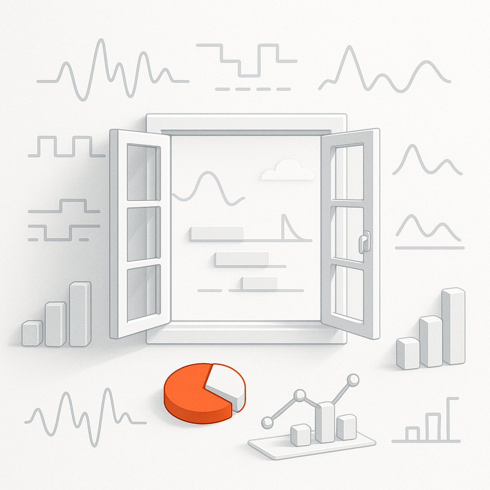
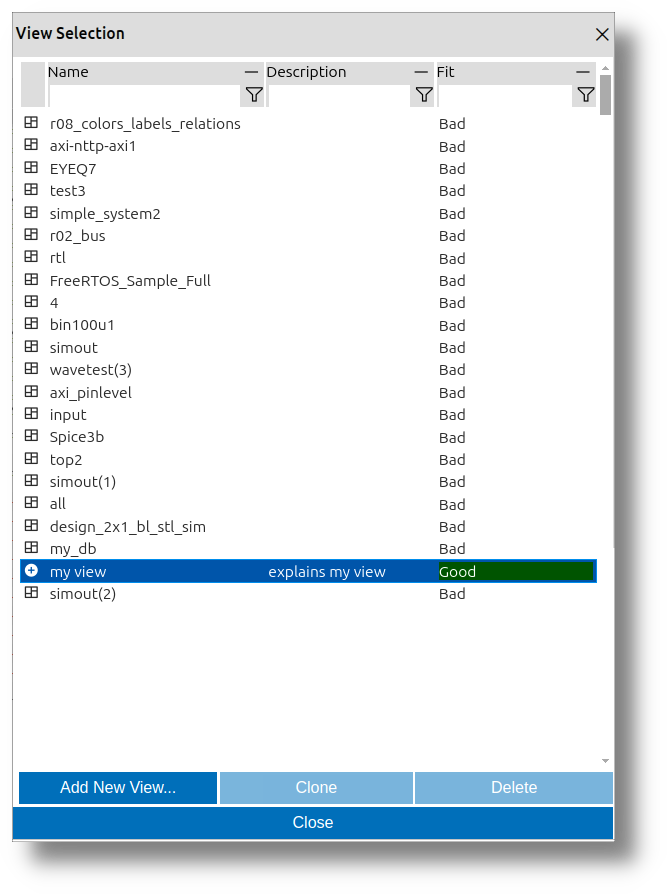
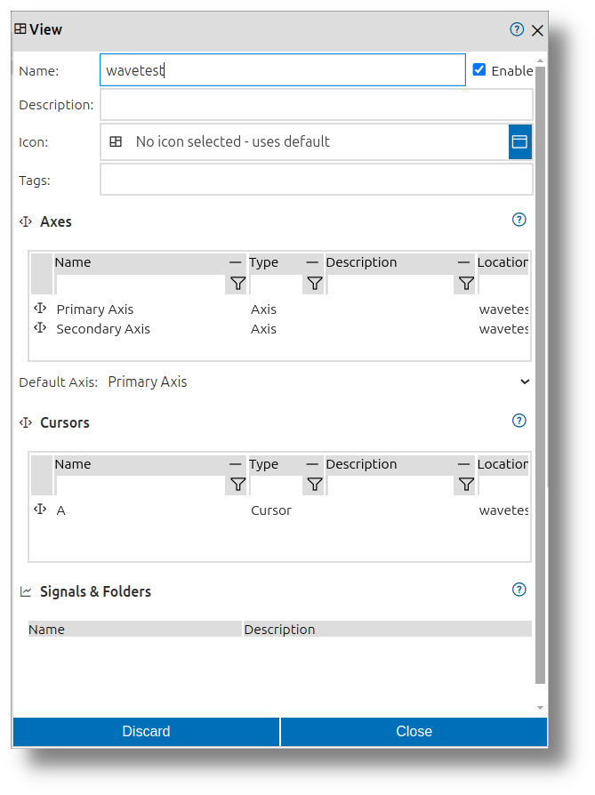

 
# Views

Every development process is unique, and every developer has a distinct workflow. With impulse, users can customize their views to match their specific needs, ensuring an efficient and intuitive experience. The user-friendly interface keeps the focus on signal data rather than the tool itself. Powerful visualization elements enable the creation of informative, tailored displays. Choose from various diagram types to represent signals across different domains, such as time and frequency, or use charts to present statistical insights. This flexibility allows for clear, precise data interpretation, enhancing analysis, debugging, and overall system understanding with a personalized approach.

## What are views?

A view is a customizable collection of **View Signals** and **View Folders**, organized in a hierarchical tree for easy navigation. Users can create multiple views tailored to their specific needs and switch between them seamlessly. This flexibility ensures quick access to relevant information, improving efficiency in signal analysis and visualization.

### View Signals

**View Signals** are configurable representations of signal data within a view. They do not store signal data themselves but provide the necessary information on which signal to use or how to generate it. They include settings such as:  
- **Color**: Defines the visual appearance of the signal.  
- **Name**: Identifies the signal for easy recognition.  
- **Diagram Type**: Specifies how the signal is visualized (e.g., line graph, vector diagram).  
- **Textual Representation**: Determines how the signal values are displayed (e.g., decimal, hexadecimal, binary).

View Signals in a view can represent:  
- **Direct Mapping**: A 1:1 mapping to a signal from a loaded file or interface.  
- **Derived Signals**: Signals created by combining or transforming existing signals.  
- **Newly Created Signals**: Custom signals that can serve as sources for further combinations.

View Signals can use a common zoomable and scrollable axis (e.g., time for traces) or adjust to the window size (e.g., charts). The view organizes these signals and their associated folders, where each element corresponds to a diagram on the right-hand side. This structure provides flexibility in visualizing and managing signal data effectively, enabling users to tailor their views to specific analysis needs.

### View Folders

**View Folders** are used to group and organize **View Signals** into a hierarchical structure. This allows users to manage the presentation by hiding or showing specific sections as needed. By organizing signals into folders, users can create a clean and structured view, making it easier to navigate and analyze data.

### Cursors

Cursors enable precise navigation and measurement within signals. Users can define multiple cursors, and a dedicated details area displays the current cursor position and delta distances. This feature simplifies signal analysis and measurement.

With cursors, users can easily measure distances in both domain and value dimensions, enabling quick and precise analysis. This functionality enhances the ability to interpret and debug signal data effectively.

### Axes and Domains

**impulse** supports signal visualization across multiple domains (e.g., time and frequency) within a single view. Axes provide a framework for visualizing signals across these domains. Signals using the same domain can be displayed on multiple axes, enabling clear and organized data representation.

Users can specify multiple axes for signals, allowing flexibility in how data is analyzed and visualized. For each **View Signal**, users can select one of the configured axes, ensuring that signals are displayed in the most appropriate context. This structure ensures that signals from different domains or scales can coexist within the same view, enhancing the overall analysis experience.

### Value Formats

Textual values can be displayed in various formats, such as Decimal, Hexadecimal, Octal, Binary, ASCII, or user-defined decimal formats, providing flexibility in data interpretation.

---

### How to create or select a new view

If you open a record (wave, trace, log,...) file with **impulse** and there is no suitable view available that has been used previously, the viewer automatically opens a dialogue to create or select a new one. The same dialogue can be opened with the "Open Views" button of the toolbar.

 

After you click the "Open Views" button, a dialog named **View Selection** opens. Inside this dialog, you will find a table listing all the existing views. This table includes the following columns:  
- **Name**: Displays the name of each view.  
- **Fit**: Indicates how well each view fits the record that has been opened.

Below the table, there are three buttons:  
- **Add New View**: Allows you to create a completely new view.  
- **Clone**: Enables you to clone an existing view.  
- **Delete**: Lets you delete one of the existing views.

If you click on one of the views in the **View Selection** dialog, that view will be selected as the view for the current viewer.

---

### Create a New View

To create a new view, follow these steps:

1. Open the **View Selection** dialog by clicking the "Open Views" button in the toolbar.
2. In the dialog, click the **Add New View** button below the table.
3. A new **View Dialog** will appear, allowing you to configure the new view.
4. Click **OK** to create the new view.

 

The newly created view will be selected for use and can now be extended with content.

#### How to Add Content (View Signals and View Folders)

You can add **View Signals** and **View Folders** to a new view using the following methods:

1. **Context Menu in the View**:  
   - Right-click on the view or an existing element (e.g., a folder) in the hierarchical structure.  
   - Select **Insert** or **Add** from the context menu, then choose the type of content to add (e.g., View Signal or View Folder).

2. **Drag and Drop**:  
   - Drag any signal or scope from the record area into the desired location in the hierarchical structure of the view.

3. **Context Menu in the Record Area**:  
   - Right-click on any signal or scope in the record area (multiple selections are allowed).  
   - Select **Add to Active View** to add the selected signals or scopes to the currently active view.

#### Remove

To remove elements, you open the context menu, click delete or mark the elements that you want to remove and press the delete key.

#### Reorder

You can reorder all elements by marking and moving them with the mouse.

#### Resize

To resize elements, select one of the elements in the tree. At the bottom of the selection, there is a small bar. You can drag this bar to resize the element and its illustration within the diagram.

---

## Signal Processing in Views

In **impulse**, signal processing within views operates on an on-demand basis, optimizing performance while visualizing and analyzing signals.

### On-Demand Processing in Views

View Signals don't permanently store signal data. Instead, when a view is displayed:
- Signal data is calculated only when needed for visualization in the current view
- Processing occurs when you scroll to a new area 

This approach ensures that the view system remains responsive even with complex signals and large datasets.

### Efficient Visualization

The view-based processing model provides several benefits:
- Only visible signals in the current view consume processing resources
- Collapsed folders in the view hierarchy don't trigger signal processing

### Working with Derived Signals in Views

Views support working with derived signals by:
- Automatically tracking dependencies between signals within the view
- Recalculating derived signals when their source signals change
- Updating visualizations when processing parameters are modified

This integration of on-demand processing with the view system allows users to create sophisticated signal visualizations without manual management of the processing workflow.
