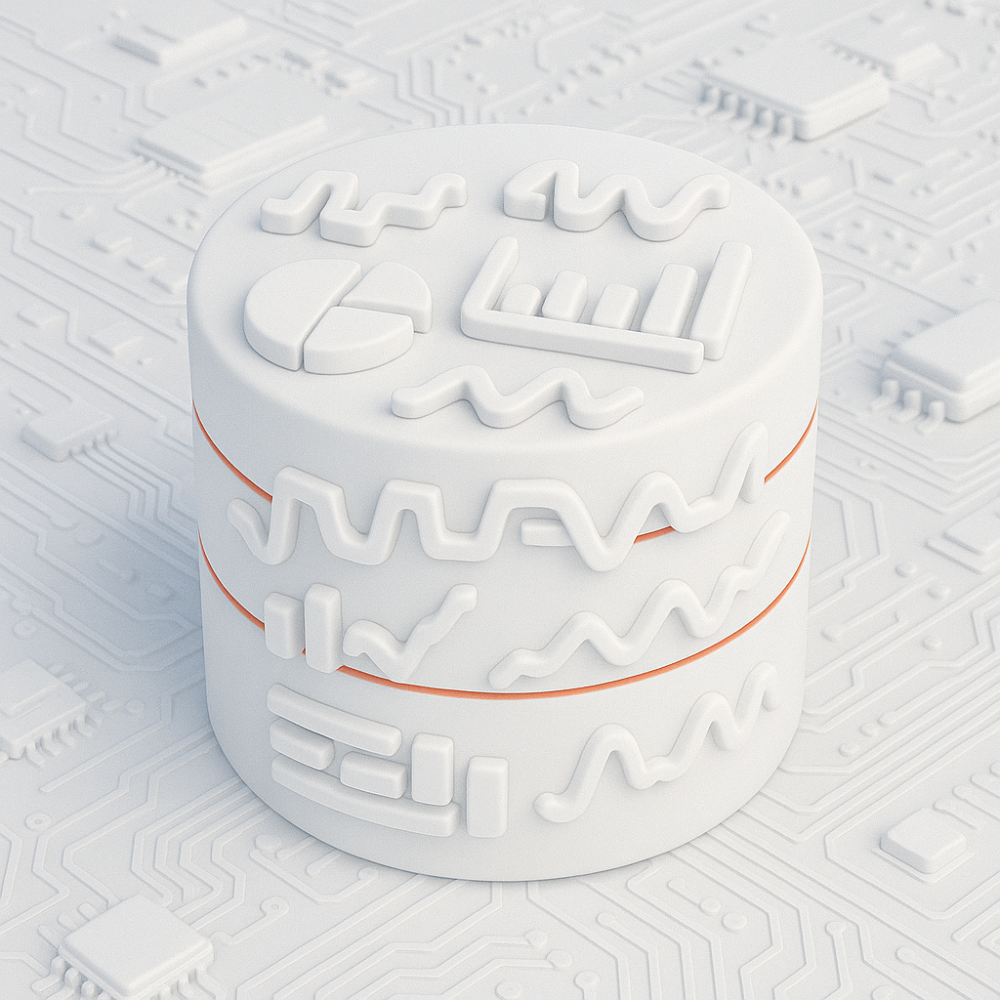
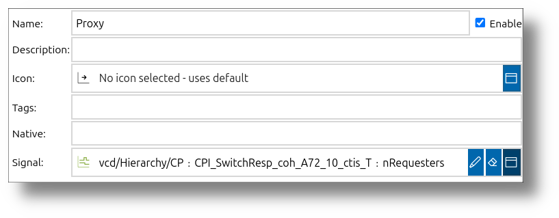
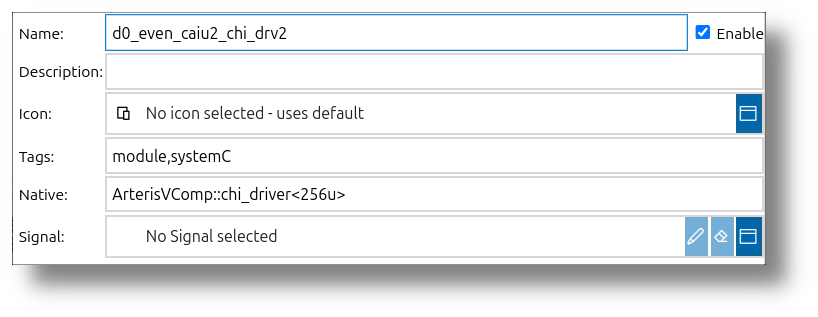
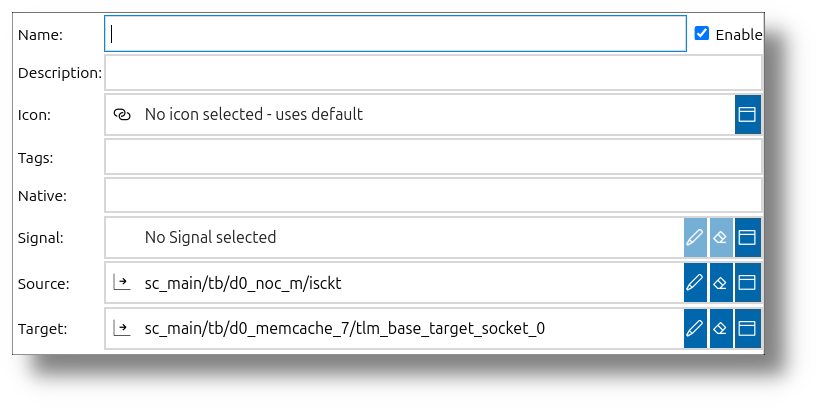
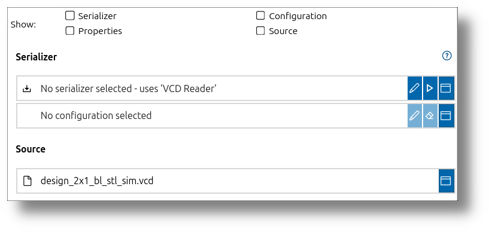
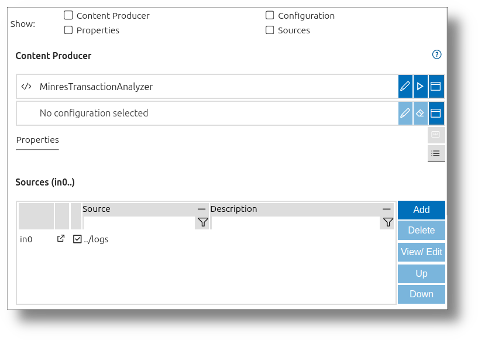
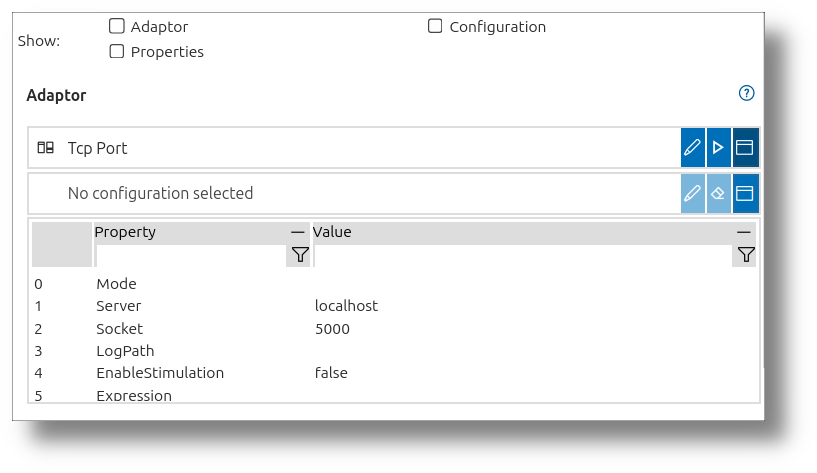

 
# Records

A **record** primarily consists of signals and scopes, which are organized in a hierarchical structure, such as a tree with folders. Signals represent the data, while scopes act as containers to organize these signals into a structured hierarchy.

In addition to signals and scopes, records can include other elements that enhance their functionality, such as imported data, calculated signals, or interfaces to external sources. These elements provide flexibility for managing, analyzing, and extending signal data.

- **Waveform File**: A record containing analog and digital signals from a simulation, organized into scopes for different modules or subsystems.
- **Log File**: A record with log events grouped by categories or threads, allowing for efficient debugging and analysis.
- **Trace File**: A record capturing execution traces of a multi-core system, with signals representing CPU activity, memory access, or I/O operations.
- **Combined Data Sources**: A record that integrates signals from multiple sources, such as hardware measurements and simulation outputs, into a unified structure for analysis.

---

## Elements of a Record

A **record** in the **impulse** Viewer is a structured collection of elements that enable efficient management, analysis, and extension of signal data. Below are the possible elements that can exist inside a record:

### **Signals**
Signals are the primary data elements in a record. They represent sequences of samples organized along a rising domain, such as time or frequency. Examples include:
- Analog signals, such as voltage over time.
- Digital signals, such as binary transitions.
- Log or trace signals representing events over time.

 

The Signal dialog allows you to view and modify signal properties. The dialog is divided into several sections:
- **General section**: Contains editable fields such as Name, Description, Tags, and Icon. These fields can be freely modified to help organize and identify signals. The Native field can preserve original relationship identifiers when importing from external systems that support relation concepts.
- **Signal section**: Contains readonly fields displaying technical properties like Sample type, Scale, Format specifier, Domain base, Start, End, and Count. These fields are informational and cannot be modified directly as they represent the intrinsic characteristics of the signal data.
- **Content section**: Displays a tabular view of the signal's samples, showing their position, value, and other attributes. This provides a detailed view of the signal's raw data.

For more details about signals, refer to the manual page [8 Signals](../impulse-manual/8_signals.md).

### **Proxies**
Proxies act as placeholders or references for signals. They enable dynamic and flexible interactions within the record structure, allowing signals to be reused or manipulated without duplicating data.

 

The Proxy dialog contains general fields such as Name, Description, Tags, and Icon, similar to other record elements. The key distinguishing feature of proxies is their ability to reference existing signals from anywhere in the record structure, making the same signal data accessible from multiple locations without data duplication.

This referencing capability is particularly useful when you need to:
- Access the same signal from different parts of a complex record structure
- Create alternative views of a signal with different metadata (such as name or description)
- Establish signal relationships for analysis without altering the original hierarchical organization

Proxies help maintain a more flexible approach to signal analysis while preserving the original record structure created by scopes.

### **Scopes**
Scopes act as containers for organizing signals into a hierarchical structure, such as a tree with folders. They help group related signals, making it easier to navigate and manage complex datasets.

 

The Scope dialog primarily contains general fields such as Name, Description, Tags, and Icon, similar to other record elements. Scopes can reference signals like proxies do, but what distinguishes scopes is their unique ability to organize the record's structure. Scopes can create and maintain the hierarchical organization of the record, containing other scopes, signals, and record elements.

This organizational capability is essential when working with complex systems that contain hundreds or thousands of signals, as it provides a logical structure that reflects the design of the system being analyzed and makes navigation more intuitive.

### **Relations**
Relations define connections between signals, proxies, scopes, and other record elements (except other relations). They facilitate structured interactions and dependencies within the record, enabling advanced analysis and visualization workflows.

 

The Relations dialog starts again with the General section similar to other record elements. Like proxies, relations can also refer to signals, but what makes relations unique is their ability to establish connections between different elements in the record structure. Relations create links between elements, defining how they interact or relate to each other. Relations can link virtually any record element type except other relations.

Relations specify a source and a target element, along with additional information (descrition and native fields) such as:
- The type of relationship between the elements
- The visual representation of the relationship in diagrams
- Timing information about how the related elements interact

These connections are valuable for tracing dependencies, visualizing cause-effect relationships, and understanding how different parts of a system interact. Relations can help identify timing correlations, data flow patterns, and system behavior sequences that might not be obvious when examining elements in isolation.

When viewing the record structure in the Graph presentation of the impulse viewer, relations become particularly powerful as they are visually represented as connections between elements. In this view, you can see how signals, scopes, and other record elements are interconnected through relation links. 

---

## **Active Record Elements**

Active record elements operate in the background and continuously process data or interact with external systems. Unlike static elements, these components can be controlled through user interface buttons to start, stop, and pause their operations.

Key characteristics of active record elements include:
- **Background Processing**: They perform tasks independently while users interact with other parts of the record.
- **Runtime Control**: Start, stop, and pause functionality allows users to manage when and how these elements operate.
- **Dynamic Updates**: They can update record content in real-time as new data becomes available.
- **Dependency Management**: Active elements can have dependencies on other elements. When starting all active elements, the system checks for dependencies and prioritizes elements without active dependencies first, ensuring proper initialization sequence.

When using active record elements, you will find a set of show flags at the top of the dialog. These show flags allow you to display configuration elements—such as source or serializer—directly in the viewer below the source section. The show flags control the visibility of configuration sections like Source, Serializer, Configuration, and Properties. Enabling these flags displays the corresponding configuration elements in the viewer, making key settings quickly accessible and adjustable without leaving the dialog.

Additionally, below the content table, there is a safe flag. This flag controls whether content generated by active record elements will be saved or not.

The following elements are active record elements:

#### **Includes**
Includes allow the import of other files into a record. This feature enables the reuse of data and configurations across multiple records, providing flexibility and consistency in analysis workflows.

 

The Includes dialog contains two important sections (after the General section and the Show flags): the Serializer section and the Source section. In the Serializer section, you can select a serializer, similar to how you choose a reader in the source section of the viewer. Additionally, you can set a configuration to further customize the behavior of the selected reader. The Source section allows you to select a file or manually enter a file path, providing flexibility in specifying the data source for inclusion. It's also possible to select the file using the in-place dialog, which you can activate with the button at the end of the line.

#### **Analysis**
Analysis elements calculate new signals from existing content. These derived signals can provide insights or additional information, such as:
- Statistical calculations.
- Mathematical transformations.
- Protocol decoding.

 

The Analysis dialog contains two important sections (after the General section and the Show flags): the Content Producer section and the Source section. The Content Producer section allows you to select and configure the analysis or transformation to be applied to the input data, including choosing from available analysis modules, setting properties, and defining how output signals are generated. The Source section lets you specify the input data for the analysis. In this section, you can select not only signals, but also scopes or other active record elements as input sources. 

#### **Interfaces**
Interfaces connect records to external signal sources, such as hardware devices, configurable readers, or external libraries. This adaptability ensures seamless integration with a wide variety of applications and external hardware.

The Interfaces dialog lets you configure an adapter (beside the typical field allready described above), which can be, for example, a TCP port, serial interface, or specific hardware. The user interface allows you to select an adapter from a list of available options. You can set a configuration for the adapter; if no configuration is used, you can directly set the properties in a table below.

