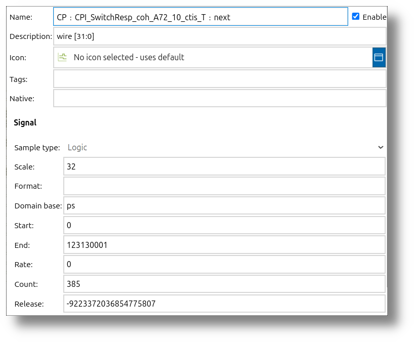

 
# Understanding Signals

Signals are a core concept in impulse, representing data streams with various attributes and behaviors. This document provides a comprehensive overview of signals, their types, tags, scale, and format specifiers. Whether you're working with discrete or continuous signals, this guide will help you understand their structure and usage in impulse.

---

## Overview of Signals

A signal in impulse can contain up to 2^31 samples. The key components of a signal include:

- **Name**: The unique identifier for the signal, which helps in distinguishing it from others.
- **Description**: Detailed comments or notes that provide additional context or information about the signal.
- **Process Type**: Specifies whether the signal is discrete or continuous, defining its behavior and characteristics.
- **Signal Type**: Categorizes the signal into one of the predefined types, such as logic, float, integer, event, text, structure, or binary.
- **Tags**: Metadata that adds context to the signal, describing its purpose or meaning.
- **Scale**: Represents the dimension of the signal, such as the size of a bit vector or an array.
- **Format Specifier**: Defines how the signal's values are represented textually, ensuring clarity and consistency in visualization.
- **Domain Base**: Indicates the minimum distance between two samples, typically measured in units like nanoseconds (ns) or picoseconds (ps).
- **Start**: Marks the starting point of the signal, establishing its initial position.
- **End**: Denotes the ending point of the signal, defining its range.
- **Rate**: Specifies the rate at which the signal progresses, crucial for continuous signals.
- **Samples**: Represents up to 2^31 value changes, capturing the dynamic nature of the signal.
- **Attachments**: Includes relations and labels for each sample, enhancing the signal's descriptive power.

 

---

## Signal Characteristics

### Process Type

Signals can be:

- **Discrete**: Samples can occur at any domain base position, with the restriction:  
  `position(sample(idx)) <= position(sample(idx+1))`. The process type is discrete when the rate is set to zero.
- **Continuous**: Defined by start, end, and rate indicators, ensuring definite sample positions. Discrete signals only have start and end indicators, with each sample containing the delta position to its predecessor.

The position of a signal is represented as a 64-bit signed integer value, which is a multiple of the domain base.

### Signal Type

Supported signal types:

- **Logic**: Represents digital signals with 1 to N bits. These can be stored as 2-state (e.g., 0 and 1), 4-state (e.g., 0, 1, Z, X), or 16-state data, making them suitable for representing binary states in digital circuits.
- **Float**: Represents floating-point numbers, typically 32-bit or 64-bit. These are used for continuous data like sensor readings or mathematical computations.
- **Integer**: Represents whole numbers of any length. Useful for counters, IDs, or any data requiring precise integer values.
- **Enumeration**: Represents a predefined set of named values, making it ideal for states or categories (e.g., `ON`, `OFF`, `IDLE`).
- **Text**: Represents textual data. Useful for labels, descriptions, or any string-based information.
- **Array**: Represents collections of elements of a specific type, such as Text, Binary, Integer, Float, or Enumeration. Arrays are useful for structured data like matrices or lists.
- **Structure**: Represents complex data types with unlimited members. Each member can be of type Text, Binary, Integer, Float, Enumeration, or Arrays. Structures are used for logs, transactions, charts, Gantt events, and more.
- **Binary**: Represents binary data, which can include images, files, or other non-textual data. Useful for handling raw or encoded data formats.

---

## Signal Metadata

### Tags

Tags provide additional context for signals, describing their meaning or purpose. Examples include:

- `default`
- `state`
- `event`
- `transaction`
- `log`
- `chart`
- `image`

Tags can be used for presentation purposes, such as generating Gantt plots or creating templates for specific signal types.

### Scale

The scale of a signal defines its dimension, such as the size of a bit vector or an array. Examples include:

- `bits=16` (for a 16-bit logic signal)
- `dim=2` (for a 2-dimensional array)

### Format Specifier

The format specifier defines the textual representation of signal values in plots and tables. Examples include:

- `default`: Use default value.
- `none`: No textual representation.
- `binary`: Binary representation.
- `octal`: Octal representation.
- `hex`: Hexadecimal representation.
- `ascii`: ASCII representation.
- `decimal`: Decimal representation.
- `label`: Textual representation.
- `boolean`: Boolean representation.

For arrays and structs, the format specifier also defines how multiple values are represented:

- `values`: Show values only.
- `keyValues`: Show key-value pairs.

---

## Signal Data

### Samples

Each sample can be a none or non-none value of a signal type, optionally tagged.

The sample tag can vary:
- It can be **tagged** or **non-tagged**.
- It can also be an **enumeration**, which can be used to describe a sample as "narrower," "warning," or "information."

> **Note**: The sample tag is different from the tag of a signal. While the signal tag provides metadata about the signal itself (e.g., `state`, `event`), the sample tag describes individual samples within the signal and their specific characteristics.  

### Attachments

Attachments in impulse provide additional context and metadata for signals, enhancing their descriptive and analytical power. They are used to associate supplementary information with specific samples or signals. The two primary types of attachments are:

- **Relation**: Relations create a link between a sample in one signal and another signal or sample. This is particularly useful for:
  - Representing dependencies or interactions between signals.
  - Visualizing relationships, such as cause-and-effect or parent-child hierarchies.
  - Adding curves or annotations that connect samples across different signals.
  - Example: Linking a request signal to its corresponding response signal in a transaction.

- **Label**: Labels add textual or symbolic annotations to a sample. These annotations can:
  - Provide descriptive information about the sample.
  - Highlight specific events or states within the signal.
  - Serve as markers for debugging or analysis purposes.
  - Example: Adding a label "Error Detected" to a sample where an anomaly occurs.

---

## Advanced Signal Structures

### Members (Arrays and Struct Signal Type)

Struct signals consist of members, each with the following attributes:

- **Name**: The unique identifier for the member, which helps in distinguishing it from other members within the struct. A clear and descriptive name improves readability and usability.
- **Description**: Detailed comments or notes that provide additional context or information about the member. This is particularly useful for documentation and collaboration.
- **Member Type**: Specifies the data type of the member. Supported types include:
  - **Text**: For string-based information, such as labels or descriptions.
  - **Binary**: For raw or encoded data, such as images or files.
  - **Integer**: For whole numbers, such as counters or IDs.
  - **Float**: For continuous data, such as measurements or sensor readings.
  - **Enumeration**: For predefined sets of named values, such as states or categories.
  - **Arrays**: For collections of elements of a specific type, such as lists or matrices.
  - **Struct**: For nested structs.
- **Tags**: Metadata that adds context to the member, describing its purpose or meaning. Tags can be used for filtering, categorization, or visualization.
- **Scale**: Represents the dimension of the member, such as the size of a bit vector or an array. Examples include:
  - `dim=2` for a 2-dimensional array.
- **Format Specifier**: Defines how the member's values are represented textually. Examples include:
  - `binary` for binary representation.
  - `decimal` for decimal representation.
  - `label` for textual representation.

Arrays may also have members, which are optional and informative but lack type information. These are useful for representing grouped or hierarchical data.

### Grouped Samples

Samples can be grouped. This is, for instance, a solution if you want to represent transactions. A group can consist of a starting sample, one or more intermediate samples, and an ending sample. All samples in a group share the same group index, a layer index, and an individual order descriptor (e.g., first, intermediate, last).

> **Example**: In a SystemC TLM (Transaction-Level Modeling) simulation, a grouped sample could represent a transaction with the following stages:  
> - **Start**: Transaction begins with a `BEGIN_REQ` phase.  
> - **Intermediate**: Transaction progresses with a `END_REQ` and `BEGIN_RESP` phase.  
> - **End**: Transaction completes with an `END_RESP` phase.

---

## Examples of Signal Types

Here are examples of different signal types, including their metadata and use cases:

### Logic Signal Example

- **Name**: LogicSignal  
- **Type**: Logic  
- **Tags**: state, default  
- **Scale**: 8 bits  
- **Format Specifier**: binary  
- **Process Type**: Discrete  
- **Domain Base**: ns  
- **Start**: 0  
- **End**: 100  
- **Samples**: 00000001 at position 0, 00000010 at position 10  
- **Use Case**: Representing binary states in a digital circuit.

### Float Signal Example

- **Name**: FloatSignal  
- **Type**: Float  
- **Tags**: chart  
- **Scale**: 1-dimensional  
- **Format Specifier**: decimal  
- **Process Type**: Continuous  
- **Domain Base**: ms  
- **Start**: 0  
- **End**: 1000  
- **Rate**: 10  
- **Samples**: 1.23 at position 0, 2.34 at position 10  
- **Use Case**: Representing sensor data, such as temperature readings over time.

### Struct Signal Example

- **Name**: TransactionLog  
- **Type**: Structure  
- **Tags**: transaction, log  
- **Members**:  
  - **ID**: Integer, 32 bits  
  - **Status**: Text  
  - **Timestamp**: Float, decimal format  
- **Samples**:  
  - At position 0: ID=1, Status=Start, Timestamp=0.0  
  - At position 50: ID=1, Status=End, Timestamp=50.0  
- **Use Case**: Logging transactions in a system with detailed metadata.

---

## Best Practices

To effectively define and manage signals in impulse, consider the following best practices:

1. **Use Descriptive Names**: Choose clear and descriptive names for signals and their members to improve readability.
2. **Apply Consistent Tags**: Use tags consistently to categorize signals and samples for easier filtering and visualization.
3. **Choose Appropriate Scales**: Define scales that accurately represent the signal's dimension (e.g., bit width or array size).
4. **Leverage Format Specifiers**: Use format specifiers to ensure values are displayed in a meaningful way (e.g., binary for logic signals, decimal for floats).
5. **Group Samples When Necessary**: Use grouped samples to represent complex events, such as transactions or multi-stage processes.
6. **Document Metadata**: Include comments or documentation for signals and their metadata to aid future users or developers.

