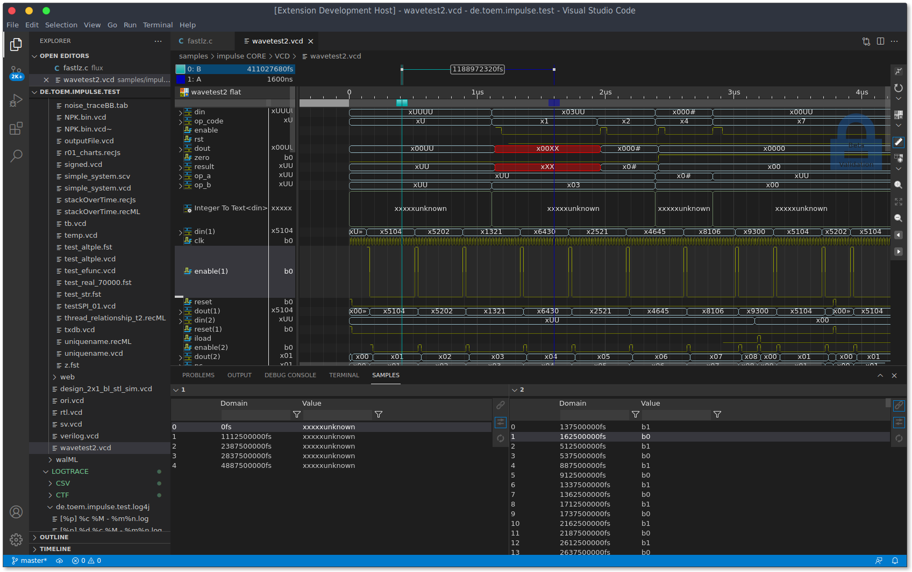

<!--974-->
# impulse for VScode

[**impulse**](https://toem.io/index.php/products/impulse) is a powerful visualization and analysis workbench designed to help engineers understand, analyze, and debug complex semiconductor and multi-core software systems. It provides a seamless integration into IDE frameworks and supports a growing set of extensions, such as IoT, language IDEs, and reporting tools. 

With its client-server architecture, **impulse** divides workloads between signal-providing tasks (on a simulation or application server) and local analysis tools, ensuring efficient performance. Engineers can use their favorite web IDE to analyze logs, traces, and simulation data without transferring large amounts of data or relying on local tools.

**impulse**’s open extension mechanisms allow users to adapt it to their specific needs. Whether defining custom data formats, implementing acquisition interfaces, creating specialized diagrams, or integrating a 3D chart engine, **impulse** offers unparalleled flexibility. Its lightweight frontend and powerful Java backend enable the creation of high-performance, complex analysis applications.

> ## Beta Notice
> - This VS Code extension is a beta release with core features.
> - It may be unstable and contain defects.
> - Not intended for production use.
> - Back up important data and use with caution.
> - Do not rely on correct functioning or performance.

## Scope and Add-ons

- Includes core features and VS Code integration only.
- Domain-specific use cases (e.g., EDA, RTOS) requiring additional readers, adaptors, processors, or diagrams are not included.
- These capabilities are delivered as separate companion extensions (available now or coming soon).

### Add more features
- Open the Extensions view in VS Code and search for "impulse".
- Install the desired companion extensions (for example, a VCD reader).
- Reload the window if the backend is already running.

## Features

impulse offers a wide range of data formats and external interfaces through signal adaptors, providing a unified view of various data sources. Whether reading signals from log, wave, or trace files, or accessing live data streams, users can seamlessly integrate data from multiple channels. Signal adaptors allow direct connections to sources such as TCP streams, pipes, applications, external networks, serial interfaces, and data acquisition units. When dealing with multiple signal sources—such as log data from a serial interface and trace data over TCP—impulse can merge and synchronize them, ensuring accurate, comprehensive analysis across diverse systems and interfaces.

### Data Integration
- Supports log, wave, trace files, and live data streams.
- Enables connections to diverse data sources via signal adaptors including TCP streams, pipes, serial interfaces, and hardware.
- Synchronizes multiple signal sources for unified analysis.

### Customizable Views
- Create tailored views with structured navigation.
- Switch between views for efficient signal interpretation.
- Use diagrams to visualize signals across domains like time and frequency.

### Signal Processing
- Combine signals using mathematical operations.
- Decode data with protocol parsers.
- Generate reference signals and extract statistical insights.

### Sample Tables
- Tabular representation synchronized with viewers.
- Real-time updates for streaming data.
- Configurable columns for custom value representation.

### Automation
- Background processing of large datasets.
- Automatic conflict detection and pattern identification.
- Statistical extraction for performance insights.

## Quick Start

* Select a file to view.
* Use the context menus 'Open with' and select the impulse Viewer (You may select the impulse Viewer as the default option at this point).
* On activation, it may take a while (a few secs) to load the backend java server. The OS may ask you for approval.
* Create a new view.
* DnD signals into the view. 
* Have fun !

## License

**Our guiding principle for this and all subsequent versions is:**

* Non-commercial use is free.
* Commercial use requires a commercial license key.
* This beta version does not require an license keys.

see [Licensing options](https://toem.io/index.php/pricing)

## Requirements

- impulse requires a java Runtime environment (at least JRE8). For communication to the osgi impulse server, a socket interface is used.
- vscode >= 1.95.0

## Documentation
 
Enter [https://toem.io/index.php/resources](https://toem.io/index.php/resources) for more information about impulse. 

## Preferences

The **Preferences** section allows users to configure various aspects of the impulse extension to suit their needs. These include server settings, debugging options, and preference storage locations. Users can modify these settings through the VS Code settings interface or by directly editing the `settings.json` file. Below are some key preferences:

- **`impulse.java`**: Command to start the Java OSGi backend. Default: `"java -Xms128m -Xmx2048m"`.
- **`impulse.port`**: Communication port for the backend. Default: `"0"` (random port).
- **`impulse.xdebugger`**: Enables Java extension debugging. Default: `false`.
- **`impulse.preferences`**: Format for storing preferences. Default: `"XML"`.

### Preference location and format

Impulse provides flexibility in storing preferences by allowing users to choose between different storage locations. These locations can be configured for various preference categories, such as serializers, adaptors, views, and more. The available storage options are:

- **User**: Stores preferences globally for all workspaces.
- **Workspace**: Stores preferences specific to the current workspace.
- **Workspace Folder**: Stores preferences in a folder named `./impulse` within the workspace.

### Default Locations for Preference Categories

- **Serializers**: Default: `User`
- **Adaptors**: Default: `User`
- **Producers**: Default: `User`
- **Views**: Default: `Workspace`
- **Processors**: Default: `User`
- **Diagrams**: Default: `User`
- **Search**: Default: `Workspace`
- **Formatters**: Default: `User`
- **Templates**: Default: `User`
- **Licenses**: Default: `User`
- **Colors**: Default: `User`
- **Parts**: Default: `Workspace`
- **Commands**: Default: `Workspace`

To modify these preferences, use the [impulse Preference editor](command:de.toem.impulse.commands.preferences). Changes to some settings, such as the backend server configuration, may require a restart to take effect.

## Sources

Find the source code of the vscode extension at [https://github.com/toem/impulse.vscode](https://github.com/toem/impulse.vscode/issues). 

## Issues and Proposals

Use [https://github.com/toem/impulse.vscode/issues](https://github.com/toem/impulse.vscode/issues) for issues and proposals.

You may use [support@toem.de](mailto:support@toem.de) for further information.

